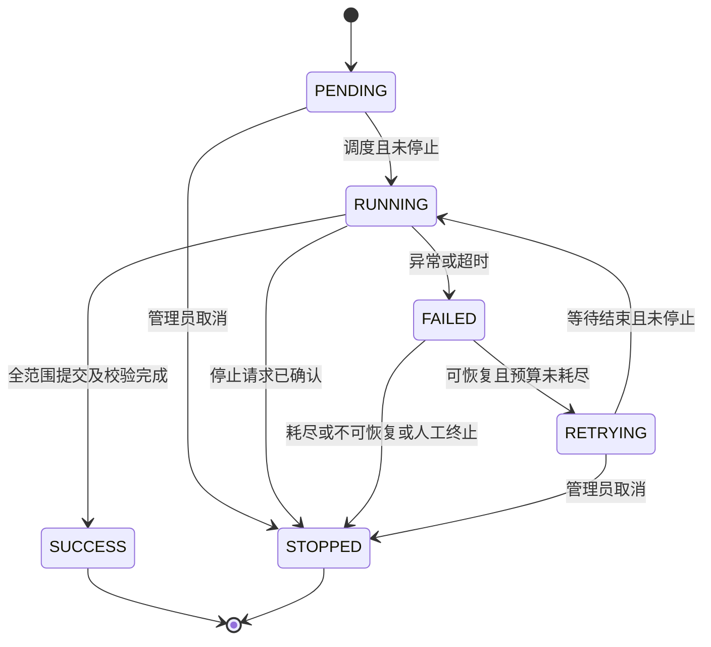
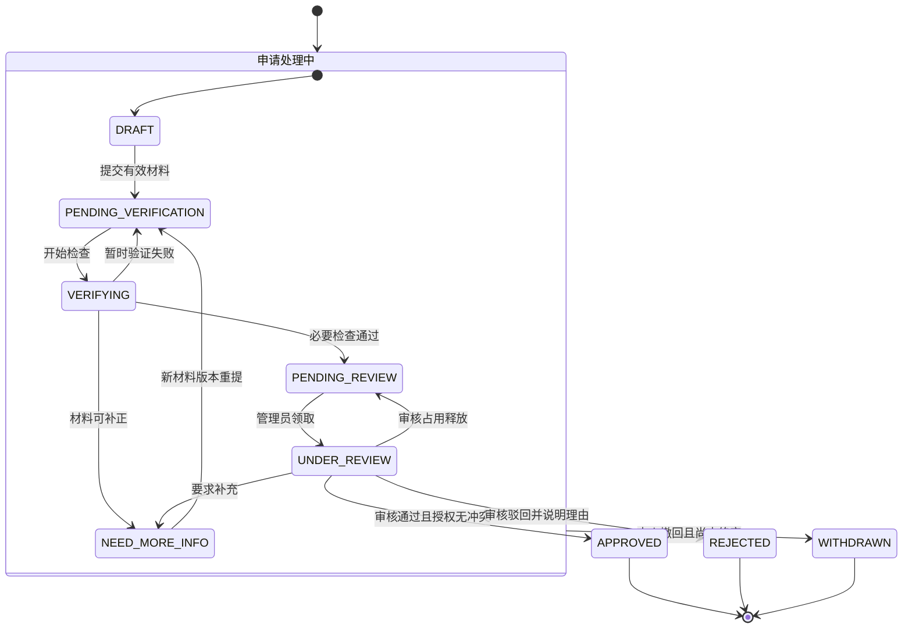

# 学术成果检索与分享平台需求规格说明书

**版本：v0.3｜日期：2026-10-02｜状态：设计基线草案**

本文件规定系统范围、功能、权限、数据规则、用例和验收要求。业务论证、两次数据实测及协作者材料审阅见配套的[《调研报告 v0.4》](学术成果检索与分享平台_需求调研报告_v0.4.md)；本文件不重复实验过程、访谈计划或平台比较。

本版保留 v0.2 及原 SRS v0.1 的全部 FR 编号，依据实测修正分类与来源假设，补充统一展示契约、认领及采集生命周期。协作者 SPEC 与图示只作为设计输入；本版新增要求不表示甲方已签署、会议已形成决议或系统已经实现。模块契约、处理规则及验收追踪由根目录[《核心模块开发规范 SPEC v0.2》](学术成果检索与分享平台_核心模块开发规范_SPEC_v0.2.md)承接；产品选型和最终算法参数继续在设计／SPEC 中记录。

## 1. 系统目标与范围

### 1.1 系统名称与目标

暂定名称为 ScholarIndex 学术成果检索与分享平台。系统以公开学术资料为基础，建立成果目录和人员门户，支持资料发现、归属确认、公开分享、持续治理与统计分析。

### 1.2 一期范围

- 论文、专利、科研项目和获奖四类成果的收录／导入、分类、检索、详情及基础管理；论文承担主要真实数据链路。
- 学者检索与公开门户；账号注册、科研人员身份审核、门户认领及具体成果认领。
- 补录、纠错、撤销错误关联、个人附加信息维护与管理员治理。
- 平台概览、年度趋势、机构分类排名、领域热点、基础共著网络、个人成果及管理统计。
- Crossref 采集与增量更新，DOI 出版社入口，OA 状态、可获得的引用信息及相关论文推荐。
- 机构注册与管理、采集任务、申请状态、审计、索引一致性和统计更新。

### 1.3 一期范围外

成果或专利交易、支付结算、未经授权的全文托管、付费墙绕过、完整商业引文数据库替代、正式科研综合评价。复杂合作路径、热点预测、机构 SSO 等按后续扩展处理。

### 1.4 名词与关键边界

“认领”表示平台认可的门户管理权或学术贡献关联，不直接确认法律权属。来源作者、平台账号、学者门户是不同对象。身份审核、门户认领和成果认领分别决定不同权限。

## 2. 参与者与权限概况

| 角色 | 公开能力 | 本人／后台能力 |
|---|---|---|
| 访客／普通用户 | 成果与人员检索、公开详情、门户、公开统计及外部访问入口 | 登录用户可提出科研人员身份及缺失机构注册申请 |
| 科研人员 | 继承普通用户的公开能力 | 可申请认领门户；获得指定门户管理权后，才能管理该门户成果及查看本人申请 |
| 已认领门户科研人员 | 同上 | 认领、补录／纠错、撤销申请、维护本人附加信息、查看本人管理统计 |
| 管理员 | 可访问公开页面 | 机构、身份、门户及成果审核；元数据治理；采集、质量、统计更新及审计 |

“已认领门户科研人员”是 `RESEARCHER` 角色与指定门户授权关系共同决定的业务身份，不要求新增独立账号角色。管理员不能通过普通公开接口获得他人的私有材料；后台访问必须经过相应权限校验。

## 3. 核心业务对象

| 对象 | 职责 |
|---|---|
| User | 平台账号与角色 |
| Scholar / ResearcherProfile | 来源形成或审核建立的学者记录、候选／已认领门户 |
| Institution / Domain | 机构及版本化学科分类 |
| AcademicOutcome | 四类成果的统一业务标识和公共属性 |
| Paper / Patent / ResearchProject / Award | 各类型成果的专属属性 |
| OutcomeContributor / OutcomeInstitution | 人员贡献角色、成果发生时机构关系及来源依据 |
| PortalClaim | 账号申请管理候选门户的材料、状态及审核结果 |
| ResearcherOutcomeClaim | 通用成果认领／撤销申请及审核结果，承接原 ResearcherPaperClaim |
| PersonalOutcomeAnnotation | 本人已确认关联下的标签、说明和展示顺序 |
| OutcomeCorrectionRequest | 非论文补录、资料纠错和后续治理记录 |
| InstitutionApplication / InstitutionVerification | 机构注册与科研人员身份审核 |
| IndexUpdateRequest / CrawlTask / CrawlTaskLog | 论文补采申请、采集任务及执行日志 |
| Venue / Author / PaperAuthor / ReferenceRelation | 论文出版来源、来源作者、署名和参考关系 |
| SearchIndexRecord / StatisticsSnapshot | 检索索引同步状态、统计数据版本 |
| AuditLog | 申请审核及关键变更的可追溯记录 |

## 4. 功能需求

### 4.1 用户与认证模块

#### FR-AUTH-001 用户注册

系统应允许用户使用用户名/邮箱和密码注册账号。

#### FR-AUTH-002 用户登录

系统应支持账号密码登录，并建立登录会话或 JWT Token。

#### FR-AUTH-003 角色权限

系统应支持至少 `USER`、`RESEARCHER`、`ADMIN` 三类角色，并基于角色进行 API 权限控制。

#### FR-AUTH-004 科研人员身份申请

普通用户可以申请成为科研人员，并选择一个已注册机构。

#### FR-AUTH-005 身份审核

管理员可以通过或驳回科研人员身份申请，并记录审核意见。

---

### 4.2 论文检索模块

#### FR-SEARCH-001 关键词检索

用户可以输入关键词检索论文。

检索字段至少包括：

- 标题；
- 作者姓名；
- abstract；
- 期刊/会议名称；
- DOI；
- 平台学科／主题标签（附分类来源；不依赖 Crossref 已停用的 subject）。

#### FR-SEARCH-002 字段检索

系统应支持按 DOI、作者、期刊/会议名称进行定向检索。

#### FR-SEARCH-003 条件过滤

系统至少支持以下过滤条件：

- 年份；
- 平台规范学科／有来源的主题标签及未分类状态；
- 期刊/会议；
- 作者；
- 出版商；
- OA 状态；
- 成果类型。

#### FR-SEARCH-004 排序

至少支持：

- 相关度；
- 出版时间升序/降序；
- Crossref 引用次数降序。

#### FR-SEARCH-005 分页

搜索结果应支持分页，默认每页 20 条，可选 20/50/100 条。

#### FR-SEARCH-006 搜索结果信息

每条搜索结果至少展示：

- 标题；
- 作者；
- 年份；
- 期刊/会议；
- DOI；
- OA 状态；
- 引用次数（若有）；
- 简短摘要或匹配片段（若有）。

---

### 4.3 论文详情模块

#### FR-PAPER-001 基本元数据展示

论文详情页应展示：

- 标题；
- DOI；
- 作者及作者顺序；
- 作者机构（若有）；
- 期刊/会议；
- publisher；
- 年卷期页；
- 出版日期；
- abstract；
- 平台学科／主题标签及分类来源；
- license；
- Crossref 引用次数；
- 数据最近更新时间；
- 数据来源。

#### FR-PAPER-002 出版社跳转

存在 DOI 时，系统应展示“Full Text at Publisher / 出版社页面”按钮，并跳转到 DOI Resolver。

#### FR-PAPER-003 OA 状态

系统应展示论文的开放获取状态及 OA 状态数据来源。

#### FR-PAPER-004 OA 访问入口

若存在公开 OA landing page 或 PDF，可展示“Open Access”辅助入口。

#### FR-PAPER-005 参考文献

若 Crossref 提供 reference 数据，详情页应展示参考文献列表；若 reference 中 DOI 已存在于本地系统，应建立可点击内部链接。

#### FR-PAPER-006 引用次数

若存在 `is-referenced-by-count`，系统应展示当前 Crossref 引用次数，并标记最后同步时间。

#### FR-PAPER-007 相关推荐

详情页侧边栏默认展示 8 篇相关论文，有效候选不足时按实际数量展示；推荐服务最多返回 20 篇，并给出基础推荐理由，例如：

- 同一领域；
- 同一期刊/会议；
- 标题/摘要相似；
- 发表时间相近。

---

### 4.4 科研人员门户与成果管理

#### FR-PORTAL-001 个人门户

门户展示姓名、机构、简介、研究领域、可选 ORCID 和四类成果。来源形成的候选成果与本人审核确认的成果分区或显式标识；个人确认统计仅使用有效确认关系。

#### FR-PORTAL-002 搜索待认领成果

具有目标门户管理权的科研人员可按姓名、标题、DOI 或非论文专属标识查找待认领成果；论文能力兼容 v0.1。

#### FR-PORTAL-003 成果认领申请

科研人员针对有效成果提交贡献角色与证据。系统检查门户权限、本人既有关联及同类在审申请；不同合著者可以分别认领。

#### FR-PORTAL-004 成果认领审核

管理员核验并通过、驳回或要求补充资料；通过后建立门户与成果的有效贡献关联。不得因门户认领而批量确认其中全部候选成果。

#### FR-PORTAL-005 认领撤销

科研人员可申请撤销本人错误关联；管理员核验后取消该关联并留痕，不删除共享成果或其他人的有效关系。管理员也可在治理权限下纠正关联并记录依据。

#### FR-PORTAL-006 成果信息维护边界

科研人员只能直接维护本人已确认关联下的个人标签、成果说明和排序。外部原始字段不可直接覆盖；公共题录错误通过纠错申请处理。

#### FR-PORTAL-007 门户认领申请

已完成科研人员身份审核的用户可查询候选门户，提交认领依据。无对应门户时可申请新建。机构认证通过不自动授予任意门户管理权。

#### FR-PORTAL-008 门户认领审核

管理员核验身份、机构及其他支持信息，处理同名和竞争认领；通过后建立账号与门户的管理授权。角色授权和门户对象授权必须同时成立。

认领通过不重复执行身份授权，不自动确认全部候选成果；审核提交时重新校验申请版本、当前状态及门户是否已被绑定。具体迁移见 §6.8。

#### FR-PORTAL-009 候选资料标识

未经本人确认的来源关联明确标注为候选或来源记录；不能显示为已通过平台审核的成果归属。自动作者匹配不能替代账号授权。

#### FR-PORTAL-010 补录与纠错

科研人员可提交四类成果的补录／纠错申请。缺失论文优先进入 FR-INDEXREQ 流程；非论文按类型录入并审核；所有类型均可反馈已有公共资料错误。

#### FR-PORTAL-011 本人申请查询

科研人员可查询本人门户认领、成果认领、撤销、补录和纠错申请的状态、审核意见与补充要求。用户不能查询他人的非公开申请材料。

#### FR-PORTAL-012 补充、撤回与再次申请

门户认领支持草稿、提交、验证、人工审核、补充材料及终审前撤回。补充材料保留各次版本；已驳回或已撤回后重新申请使用新申请编号并关联历史，不能覆盖原终审结果。门户认领通过后的解绑，以及成果关联的撤销，分别走相应治理流程，不使用“撤回已通过申请”代替。

#### FR-PORTAL-013 审核并发与状态反馈

同一申请同一版本的终审、撤回及材料更新最多一个操作成功；冲突操作提示刷新状态。审核占用可超时释放，不得因管理员关闭页面长期锁死申请。状态变更记录操作者、时间、原因和版本，申请人可以在站内查询结果；邮件／短信不是本期完成流程的前提。网络验证失败不得直接解释为身份不合法。

---

### 4.5 机构管理与机构注册申请

#### FR-INST-001 机构查询

用户可以搜索平台已注册机构。

#### FR-INST-002 机构注册申请

若所需机构不存在，登录用户可提交机构注册申请；此操作不以科研人员认证完成为前提，避免认证所需机构缺失造成流程阻塞。

申请字段至少包括：

- 机构名称；
- 英文名称（可选）；
- 国家/地区；
- 官方网站；
- 官方邮箱域名（可选）；
- ROR ID（可选）；
- 申请理由/备注。

#### FR-INST-003 机构审核

管理员可以审核机构注册申请并执行通过、驳回、要求补充信息操作。

#### FR-INST-004 机构去重

创建机构前系统应基于名称、域名、ROR ID 进行重复检查。

---

### 4.6 论文索引更新申请

#### FR-INDEXREQ-001 提交索引更新申请

科研人员可提交数据库缺失论文、期刊、会议或期次的索引更新申请。

申请字段至少包括：

- 申请类型：单篇论文 / 期次 / 期刊 / 会议；
- DOI（如有）；
- ISSN（如有）；
- 论文标题（单篇时）；
- 期刊/会议名称；
- 年份、卷、期（如适用）；
- 源站 URL；
- 出版社；
- 说明。

#### FR-INDEXREQ-002 自动预检查

提交时系统应执行：

- DOI 格式校验；
- URL 格式校验；
- 本地数据库重复检查；
- Crossref DOI/ISSN 快速查询（如可用）。

#### FR-INDEXREQ-003 管理员审核

管理员审核后可：

- 通过并生成定向采集任务；
- 驳回；
- 标记为“Crossref 暂无数据”；
- 要求补充信息。

#### FR-INDEXREQ-004 定向采集

审核通过后系统应支持按 DOI、ISSN、期刊/会议条件创建采集任务。

#### FR-INDEXREQ-005 申请状态追踪

申请人可查看：

- 待审核；
- 待采集；
- 采集中；
- 已完成；
- 已驳回；
- 无可用数据；
- 失败。

---

### 4.7 数据采集与 ETL

#### FR-CRAWL-001 初始采集

管理员可以创建初始数据采集任务。

#### FR-CRAWL-002 采集范围

任务可按以下范围配置：

- DOI；
- ISSN；
- publisher/member；
- publication date；
- update/index date；
- work type。

任务须记录来源、入口、范围、时间边界、关键词及期刊清单版本（如使用）。Crossref 支持按 DOI、ISSN、类型和日期形成候选；不提供以其已停用 `subject` 为依据的学科采集选项。期刊范围或标题关键词不自动赋予正式学科标签。

#### FR-CRAWL-003 Cursor 分页

Crossref 列表型采集必须支持 cursor 分页，不得依赖传统深分页批量扫描。

#### FR-CRAWL-004 数据清洗

ETL 至少完成：

- DOI 标准化；
- 标题文本清洗；
- 作者字段标准化；
- ISSN 标准化；
- 日期解析；
- HTML abstract 清洗；
- URL 规范化；
- 空字段处理；
- 原始数据保留。

#### FR-CRAWL-005 去重

论文主去重键采用规范化 DOI。

无 DOI 的成果若未来需要支持，应单独设计“标题 + 作者 + 年份 + venue”的模糊去重规则，但一期论文主链路优先限定 DOI 论文。

#### FR-CRAWL-006 Upsert

重复 DOI 进入 ETL 时执行幂等 Upsert，而非重复插入。

#### FR-CRAWL-007 原始数据留存

系统应保留必要的 Crossref 原始 JSON，以及非论文来源的原网页／附件或等价快照，并关联来源 URL、请求状态、采集时间、文件哈希和必要的行号／页码，以支持问题追踪和重新处理。审核材料与公开成果快照采用不同访问权限。

#### FR-CRAWL-008 失败重试

网络异常、429、5xx 等可恢复错误应支持有限次数重试和指数退避。

重试上限、等待上限、访问频率与并发度按来源配置并留版本。401／403、验证码、登录要求或本次遇到的 412 应进入访问条件核查，不盲目重试或绕过；遵守来源明确返回的等待要求。状态与停止语义见 §6.9。

#### FR-CRAWL-009 来源响应与接入验证

启用来源前核验入口、响应格式、必要字段和访问条件。HTTP 200 的登录页／JavaScript 外壳不是成果数据；只有可解析的有效响应才能判断“确无记录”。访问失败、解析失败、有效空结果、字段不足分别记录；替代来源单独命名，不能伪称原来源采集成功。

#### FR-CRAWL-010 文献体裁与候选数据质量

不得仅凭 Crossref `journal-article` 将记录判为研究论文。对明确的编委会、目录、更正等条目执行可追溯的排除或单独分类；不确定条目保留待核验状态，不承诺关键词命中均为目标学科。记录排除规则版本、理由与原始证据，标题／摘要缺失不能用生成内容冒充来源原文。

---

### 4.8 增量更新任务

#### FR-SYNC-001 定时任务

管理员可配置每日增量更新任务。

#### FR-SYNC-002 Checkpoint

系统必须记录每个同步任务最后成功完成的时间窗口和 checkpoint。

区分任务执行中的分页断点与已成功同步水位。失败、人工停止或仅完成部分页面不得推进整窗成功水位；已提交数据保留，重试通过幂等更新处理。索引与统计的待更新记录需可靠保存，不能因采集水位已推进而丢失后续处理。

#### FR-SYNC-003 有界时间窗口

增量任务必须使用 from/until 双边界时间范围，避免未完成扫描与不断变化的数据集产生冲突。

#### FR-SYNC-004 任务状态机

采集任务采用以下状态集合；完整迁移和成功判定见 §6.9。统一使用 `SUCCESS`，协作者图中的 `SUCCEEDED` 仅作为历史同义标记，不新增第二个业务状态。

```text
PENDING -> RUNNING -> SUCCESS
                 \-> FAILED -> RETRYING -> RUNNING
                 \-> STOPPED
```

`PENDING`、`RETRYING` 可直接取消；`RUNNING` 先记录停止请求，执行器确认停止后进入 `STOPPED`。失败后的重试耗尽或不可恢复终止须保存停止原因，不能把它们统计成管理员主动取消。

#### FR-SYNC-005 手动补采

管理员可指定 DOI/ISSN 手动创建高优先级补采任务。

---

### 4.9 搜索索引模块

#### FR-ES-001 索引构建

ETL 完成后，应将可检索字段同步至 Elasticsearch/OpenSearch。

#### FR-ES-002 关键检索字段

索引至少包含：

- doi.keyword；
- title；
- abstract；
- author_names；
- institution_names；
- venue_name；
- publisher；
- discipline_labels／topic_labels（含来源、版本、确认状态）；
- published_year；
- oa_status；
- citation_count。

#### FR-ES-003 搜索排序

一期相关度采用 BM25 为基础，可对 title、author、DOI 等字段设置不同 boost。

建议初始权重：

```text
title^4
DOI^6
author_names^2.5
venue_name^2
abstract^1
discipline_labels^2
```

最终权重应通过固定测试集调参，而不是作为固定业务规则。测试集区分 DOI 精确查找、作者同名、主题查询、标签缺失与跨领域结果，并记录参数版本；未评测前不宣称该权重最优。标签为空时不伪造分类来补齐索引。

#### FR-ES-004 数据一致性

关系数据库作为业务真值源；搜索引擎作为可重建索引。索引失败时记录待重建状态，并支持后台重试。

---

### 4.10 相关推荐模块

#### FR-REC-001 推荐候选集

候选论文可由搜索引擎 More Like This、已确认的平台学科／有来源的主题匹配和 venue 匹配产生。刊物相同只能解释为“同一期刊／会议”，不得据此给出“同一学科已确认”的理由。

#### FR-REC-002 排除当前论文

推荐结果不得包含当前论文自身。

#### FR-REC-003 去重

按 DOI 去重。

#### FR-REC-004 推荐数量

默认返回 8 篇，最多 20 篇。

#### FR-REC-005 可解释性

系统至少能返回一个推荐原因标签。

#### FR-REC-006 降级策略

缺少摘要或可信学科／主题标签时，退化为 title + venue + year 计算，不影响详情页正常展示。没有有效候选时返回实际数量或空列表，不补造论文和推荐理由。

---

### 4.11 统计分析模块

#### FR-STAT-001 平台概览

展示四类成果数量、来源作者／已识别学者数量、机构及出版来源数量、论文 OA 状态分布。不同人员数量口径分别命名，不能将作者记录数称为实名认证人数。

#### FR-STAT-002 时间统计

按年份、成果类型与领域分析成果数量。类型专属时间口径见 §6.4；未知日期单列，未结束年度显示截至时间。

#### FR-STAT-003 机构统计与分类排名

按机构、类型、领域和年份显示成果数量及并列排名，默认使用成果发生时的机构归属。当前成员视图另行标识，不能混入默认排名。

#### FR-STAT-004 学科统计

按规范学科／来源主题统计去重成果数，标明分类体系；多标签和未分类分别解释。

#### FR-STAT-005 科研人员统计

公开门户展示有效确认成果的类型、年度分布和同源引用汇总，并注明引用覆盖率。未经确认的候选集合不混入本人确认统计。

#### FR-STAT-006 领域热点分析

按指定语料、学科和时间范围展示主题／关键词频次、占比及趋势。一个成果内同词重复出现不重复计数，不把频次分析表述为预测。

#### FR-STAT-007 专家合作网络

以可识别作者及论文共同署名建立基础共著网络，展示共同论文数并可查看证据成果。支持学者及机构／领域／年份范围，明确缺失与截断；引用不作为共著。

#### FR-STAT-008 本人管理统计

仅本人查看其已确认成果和申请状态分布；待审核、已驳回和撤销信息不作为公开学术产出指标。

#### FR-STAT-009 数据质量统计

管理员查看来源字段完整率、疑似重复、未分类、机构未匹配和同步异常。质量计数与公开成果计数分别命名。

#### FR-STAT-010 统计更新

管理员可提交统计更新任务并查询完成／失败状态。认领、撤销和修订标记受影响统计待更新。快照有数据版本与生成时间，失败保留上一成功版本，重试不得重复累加。

---

### 4.12 管理后台

#### FR-ADMIN-001 Dashboard

展示：

- 数据总量；
- 最近采集任务；
- 失败任务；
- 待审核机构申请；
- 待审核认证申请；
- 待审核成果认领；
- 待处理索引更新请求。

#### FR-ADMIN-002 机构管理

支持机构新增、编辑、禁用、合并重复机构。

#### FR-ADMIN-003 审核中心

支持统一查看和处理各类审核申请。

#### FR-ADMIN-004 采集任务管理

支持创建、启动、停止、重试、查看任务日志。

#### FR-ADMIN-005 审计日志

管理员的重要操作必须进入 AuditLog。

### 4.13 四类成果统一管理

#### FR-OUTCOME-001 类型与有效记录

系统支持 PAPER、PATENT、PROJECT、AWARD 四类成果，具备共同标识、来源、状态和类型专属属性；各类型均提供可检索、可展示、可维护和可统计的演示数据。

#### FR-OUTCOME-002 非论文录入与导入

管理员可导入允许使用的公开或模拟样本，科研人员可提交非论文补录草稿。草稿通过重复与来源核验后才公开；模拟记录显式标记并可独立筛选。

#### FR-OUTCOME-003 多类型检索与详情

用户可按标题、贡献人、机构、领域、年份、类型及类型专属标识查找成果。详情展示贡献角色与来源，不能把所有人员统一解释为论文作者。

#### FR-OUTCOME-004 类型专属校验

专利区分发明人和申请人／权利人；项目区分负责人和依托单位；获奖区分完成人、完成单位和提名者。具体逻辑字段见 §5.5。

#### FR-OUTCOME-005 元数据治理

管理员可建立有依据的规范化修订、合并重复记录、维护类型与领域，软删除异常记录。保留原始快照、变更前后值、操作者和理由。

#### FR-OUTCOME-006 治理后的传播

成果及有效关系变更后标记检索索引和统计待更新；失败保留可查询的处理状态，重复执行不得产生重复成果和关联。

#### FR-OUTCOME-007 贡献角色与成果时间

四类成果采用共同展示结构，同时保存真实贡献角色、成果时间的业务含义与精度。论文作者、专利发明人、项目负责人、获奖主要完成人不可混同；网页发布日期和采集时间与成果时间独立。只有年份时不补造月日，缺失申请／授权日期不能用公告发布日期填充。字段及统计约束见 §5.5、§6.10。

#### FR-OUTCOME-008 来源完整性与展示样本校验

用于统一展示验收的每条样本必须具有标题、至少一名有来源的贡献人员、含义明确的成果时间以及可追溯来源。缺失项保留为待补资料并记录原因，不混入“字段完整样本”计数；若经审核允许单独展示不完整记录，应显示缺失状态，不能伪造人员或日期。原来源与高校等补充来源必须分别标识，不把补充组完整率算成原来源完整率。

### 4.14 科研人员检索

#### FR-SCHOLAR-001 人员查询

普通用户可按姓名、机构、研究领域查询公开学者记录，并进入候选／已认领门户。相同姓名不默认指向同一个人。

#### FR-SCHOLAR-002 人员与成果导航

成果详情可导航至有明确关联依据的人员资料；人员门户可返回公开成果。无法确认的关联保留来源标识或不建立确定性跳转。


## 5. 数据需求

### 5.1 Paper 建议字段

```text
id
canonical_doi
title
subtitle
abstract
publisher
venue_id
published_date
published_year
volume
issue
page
article_number
type
language
crossref_url
doi_url
crossref_member_id
crossref_reference_count
crossref_is_referenced_by_count
license_json
raw_subject_json          可空，仅保留历史来源原值，不作为平台学科事实
discipline_labels
topic_labels
classification_source
classification_version
classification_status
raw_crossref_json
source_created_at
source_updated_at
source_indexed_at
last_synced_at
created_at
updated_at
```

### 5.2 OA 字段

```text
oa_status            OPEN / CLOSED / UNKNOWN
oa_source            UNPAYWALL / OPENALEX / CROSSREF / UNKNOWN
oa_landing_page
oa_pdf_url
oa_license
oa_checked_at
```

### 5.3 Author 字段

```text
id
given_name
family_name
display_name
orcid
normalized_name
```

注意：Crossref 作者对象与平台 ResearcherProfile 不能直接等同。一个是来源元数据中的作者记录，一个是平台认证用户身份，两者应通过认领关系连接。

### 5.4 Institution 字段

```text
id
name
official_name_en
country
website
official_domain
ror_id
status
created_at
updated_at
```

### 5.5 多类型成果逻辑数据模型

建议统一成果对象 `AcademicOutcome`，至少包含：成果 ID、类型、标题、成果时间及其含义／精度、来源发布日期、来源记录 ID 及标识类型、有效状态、领域关系、人员贡献关系、机构关系、更新时间和模拟标志。具体类型字段如下：

| 类型 | 主要专属字段 | 去重／核验依据 |
|---|---|---|
| Paper | DOI、期刊／会议、署名顺序、卷期页、摘要、引用数 | 规范化 DOI；无 DOI 时来源键与人工复核 |
| Patent | 申请号、公开号、授权公告号、申请日、授权日、发明人、申请人／权利人、IPC及权利状态核验时间 | 司法辖区＋规范化申请号作为归并依据；专利号与公告号分开；获奖或曾授权不证明当前有效 |
| ResearchProject | 项目批准号（如有）、科学部编号／来源编号及其类型、资助机构、资助年度、负责人、依托单位、类别、起止时间 | 有批准号时按资助机构＋批准号；仅有科学部编号时保留来源键并复核，不能假称批准号；项目与产出论文分开 |
| Award | 奖项名称、年度、等级、项目编号、完成人、完成单位 | 奖励体系＋年度＋项目编号；无编号时建立复核组合键 |

科研人员与成果为多对多关系，建议 `ResearcherOutcomeClaim` 取代仅限论文的 `ResearcherPaperClaim`。成果的“作者／发明人／负责人／完成人”属于贡献角色；机构属性也按成果类型区分，不能将专利申请人当作发明人，或将获奖提名者当作完成单位。

用于统一展示的逻辑契约如下，物理表结构由设计文档确定：

| 逻辑字段 | 要求 |
|---|---|
| title、contributors | 标题；人员姓名、角色、顺序、已知机构及对应来源；不根据网站归属推断人员机构 |
| authors | 可提供兼容展示的姓名数组；前端角色名称以 contributors 为准 |
| date、date_kind、date_precision | 时间值可为 YYYY、YYYY-MM、YYYY-MM-DD；含义至少区分 publication_date、application_date、grant_date、funding_year、award_year；精度为 year／month／day，缺失为 null |
| source_published_date、fetched_at | 来源发布日、采集时刻独立保存，不作为成果时间的默认值 |
| source_name、source_url、source_record_id、identifier_type | 指明原来源、补充来源和原编号的实际类型 |
| evidence、missing_fields | 原始快照位置、哈希、必要行号／页码、缺失字段及原因 |
| collection_scope、classification_* | 采集范围与平台学科分类分开；后者记录来源、版本、确认状态 |

实验 JSON 使用小写 `patent/project/award`，系统成果类型使用 `PATENT/PROJECT/AWARD`；接入映射须显式转换，不能将实验字段直接视为已实现的数据库契约。

### 5.6 门户、关联与申请数据

门户必须分别记录候选来源、管理授权和具体成果确认关系。每类申请至少保留申请人、目标对象、申请类型、证据／来源、状态、版本、提交及处理时间、处理人、意见。

门户认领还记录材料版本、验证结果／失败原因、审核占用及到期时间、撤回时间、历史申请关联。再申请的新编号不能覆盖旧申请；补充材料在同一申请内形成新版本。采集任务记录固定范围、执行尝试号、重试计数、分页断点、已提交水位、停止请求／停止原因，以及索引和统计的独立处理状态。

多人共同贡献采用多对多关系。唯一性约束分别覆盖“同一人员对同一成果的有效关联”和“同类在审申请”；不能用全局单人所有权限制真实合著者。

### 5.7 来源与模拟标识

成果、规范化修订及必要关联保存来源标识、来源 URL、采集或录入时间和模拟标志。公开检索与统计默认区分真实与模拟资料；含模拟数据的演示视图显式标注。


## 6. 数据完整性与消歧规则

### 6.1 DOI 规范化

入库前：

1. trim；
2. 转小写；
3. 去除 `https://doi.org/`、`http://dx.doi.org/`、`doi:` 前缀；
4. 规范化后作为唯一键。

### 6.2 作者消歧

优先级：

1. 具有可核查来源、格式有效且无冲突的 ORCID 精确匹配；
2. 姓名 + affiliation，形成候选；
3. 姓名 + 合作者 + venue／研究领域，形成候选；
4. 无法确定时不得自动合并。

一期仅对有可信依据的 ORCID 进行来源作者匹配；冲突或证据不足时保留来源级记录并进入复核。用户自行填写一个有效 ORCID 不能证明控制该身份；缺少 ORCID 也不是认领必然失败的理由。姓名及关系相似度不能自动合并，来源作者匹配不能授予平台账号或门户管理权。

### 6.3 机构消歧

优先级：

1. 有来源且无冲突的 ROR ID 精确识别；
2. 官方域名，作为候选；
3. 规范化机构名称，作为候选；
4. 管理员人工合并。

同一域名可能服务多个院系／机构，名称相同也不保证同一实体；候选匹配不直接合并。合并保留原标识、别名、依据与审计，不据当前机构信息改写历史成果机构。

### 6.4 统计计算口径

| 指标 | 建议口径 | 必须展示／处理的边界 |
|---|---|---|
| 成果总量 | 同一数据集、筛选条件及快照下，按规范化成果 ID 去重计数；排除软删除、重复合并旧记录及未审核新草稿 | 真实与模拟数据可分别查看；不能用同一成果的多个作者关联增加总量 |
| 作者／科研人员数 | 区分来源作者实体数、已识别学者数、已认证账号数、已认领门户数 | 不按作者姓名字符串去重；无法消歧时称“来源作者记录数” |
| 年度分布 | 论文按选定出版日期；授权专利按授权年；项目默认按资助年度；获奖按奖励年度 | 项目另有明确立项／起止日期时建立独立维度，不与资助年度混用；论文优先 print、再 online、再源 issued；保留日期含义与精度，缺失进入未知桶 |
| 机构分类排名 | 默认按成果发生时的已核实／可靠来源机构关联计数；同一成果在同一机构只计一次 | 多机构合作成果可分别计入各机构；不得将各机构数量相加当作全库总量；按数量降序，数量相同并列，稳定次序用机构 ID |
| 机构的当前成员视图 | 可单独按已认领人员当前机构展示其成果集合 | 与发表时机构归属不同，必须使用不同视图名称，不能混入默认机构排名 |
| 领域数量 | 某领域内按成果 ID 去重；保留多标签关系 | 未分类单列；多标签领域和不保证等于平台总数 |
| 引用汇总 | 对统计集合内去重后的论文汇总同一来源的有效 citation count | Crossref 与其他来源不相加；缺失不当作 0；同时显示有值论文数／论文总数及同步时间 |
| OA 占比 | 展示开放、未发现开放版本、未知三类数量；开放占比默认是开放论文数／论文总数 | 请求失败为未知；如使用“已知状态内占比”，须另标分母；分母为 0 显示不适用 |
| 热点趋势 | 每个时间桶内按含该主题／关键词的不同成果计频次；占比＝频次／该桶有效分析成果数 | 同一成果内重复出现关键词不重复计数；显示参与文本分析的样本量与覆盖率；不将简单频次称为预测 |
| 共著网络 | 节点为可识别作者；两作者共同署名至少一篇有效论文形成无向边；权重为共同论文去重数 | 同名作者不自动合并；不把引用关系当共著；仅反映所选数据集；机构筛选及节点截断规则需显示 |

统计页面统一附带数据集范围、筛选条件、指标说明、缺失覆盖率、快照生成时间。真实数据默认不与模拟数据混排；课程演示使用混合数据时，页面明确标注“含模拟数据”。年度计数为 0 与该年份采集不完整应可区分。当前未结束年度需标注截至日期，不能直接按全年同比解释。

**计算样例（人工构造，用于后续验收）：**

- P1 属于机构 A、B，领域 X、Y；P2 属于机构 A，领域 X。平台论文总数为 2，A 为 2、B 为 1，X 为 2、Y 为 1。
- P1 的 Crossref 引用次数为 5，P2 缺失，则汇总为 5、覆盖率为 1/2，不将 P2 显示成 0 引用。
- P1 开放、P2 状态未知，则开放占全部论文比例为 50%，未知为 50%；不能标成“已确定非开放占比 50%”。
- 学者甲、乙共同署名 P1、P2，且两篇各被重复采集一次，边权仍为 2。

### 6.5 字段维护权限

| 数据类别 | 科研人员 | 管理员 |
|---|---|---|
| 外部原始题录及快照 | 查看；通过纠错申请反馈 | 不改写原始快照；可重新采集或建立带依据的规范化修订 |
| 规范化展示字段、学科映射 | 提出修改申请 | 审核并修订，保留变更前后值、依据与操作者 |
| 本人标签、成果说明、门户展示顺序 | 仅维护本人已确认关联下的附加信息 | 在治理权限内处理异常；记录原因 |
| 本人与成果关联 | 提交认领或撤销申请 | 通过、驳回或纠正；不影响其他人员的有效关联 |
| 新增非论文成果 | 提交草稿及来源／证据，审核前不公开计数 | 校验重复与来源，通过后发布或关联已有记录 |

成果记录的软删除／合并属于管理员数据治理；科研人员移除个人关联不会删除公共库成果。只有通过审核的新增记录及有效关联进入相应公开展示。

### 6.6 成果管理规则

1. 同一科研人员对同一成果只能保留一条有效确认关系；不允许重复在审的同类认领。不同真实合著者可分别认领同一成果。
2. 对同一门户的竞争认领需人工处理，不能因机构认证通过而自动接管他人门户。
3. 成果认领仅建立平台贡献关联，不改变源数据中的作者顺序、专利权利人等信息。
4. 补录论文有 DOI 时优先查重与补采；只有有效响应确认没有记录时才标“无可用数据”。访问受限、超时、非数据网页或解析失败不能视为查无数据。
5. 非论文补录需使用类型专属字段，审核发现已有记录时关联已有成果，不重复创建。
6. 审核提交带申请版本，重复点击及并发审核不得产生重复关系；审核人与操作时间必须记录。
7. 认领、撤销、修订、合并、软删除、附加信息编辑均记录必要日志；管理员处理不改写原始来源快照。
8. 成果数据变更后同步检索索引并标记相关统计待刷新；失败记录重试状态，不能在页面声称已经实时一致。
9. 科研人员提交的 URL 用于来源说明；后端若要访问，须通过采集模块受控处理，不能直接抓取任意用户输入地址。

### 6.7 申请状态

| 对象 | 建议状态及转换 | 注意事项 |
|---|---|---|
| 门户认领申请 | 使用 §6.8 的完整状态模型 | 与账号身份和成果认领分开，不套用旧简图的角色自动授权 |
| 成果认领／关联撤销申请 | 待审核 → 通过／驳回／待补充；待补充 → 待审核；终审前可撤回 | 保留意见与版本；已通过后的关系撤销另起申请，不回退原终审结果 |
| 非论文补录／纠错 | 待审核 → 待补充／驳回／已完成 | 通过且数据成功发布或修订后才为已完成 |
| 论文索引补采 | 待审核 → 待采集 → 采集中 → 已完成／失败／无可用数据；也可在审核时驳回 | 延续 SRS；失败重试应保留原任务历史 |

### 6.8 门户认领生命周期

本节吸收协作者完整状态图，修正其与身份授权、重复申请及历史保留有关的歧义。适用对象仅为 `PortalClaim`；科研人员身份必须已通过 FR-AUTH-005。

| 状态 | 含义及处理边界 |
|---|---|
| DRAFT | 未提交草稿，可编辑；缺必填项仍停留草稿，不作为审核驳回 |
| PENDING_VERIFICATION | 已提交某一材料版本，等待系统检查 |
| VERIFYING | 检查材料、对象权限与重复；可用的邮箱／ORCID 等仅作支持证据 |
| PENDING_REVIEW | 必要检查通过，等待管理员 |
| UNDER_REVIEW | 管理员处理当前材料版本；占用可超时释放 |
| NEED_MORE_INFO | 需补充材料，必须列明补充项和原因 |
| APPROVED | 已终审通过，并成功建立指定门户管理关系 |
| REJECTED | 已终审驳回，保存明确业务理由 |
| WITHDRAWN | 申请人在终审前撤回，不产生授权 |

| 当前状态 | 事件及条件 | 目标状态／结果 |
|---|---|---|
| DRAFT | 本人提交，材料基本完整，身份及对象权限有效 | PENDING_VERIFICATION；保存材料版本 |
| PENDING_VERIFICATION | 开始检查当前版本 | VERIFYING |
| VERIFYING | 必要检查通过 | PENDING_REVIEW |
| VERIFYING | 材料可补正 | NEED_MORE_INFO；不以字段缺失自动判定冒领 |
| VERIFYING | 外部服务暂不可用 | 回 PENDING_VERIFICATION，记录待重试或转人工核验原因；不自动 REJECTED |
| PENDING_REVIEW | 管理员取得有效审核占用 | UNDER_REVIEW |
| UNDER_REVIEW | 业务审核通过，申请版本及门户授权仍无冲突 | APPROVED；状态、授权和审计原子提交 |
| UNDER_REVIEW | 业务审核不通过／需要补充 | REJECTED／NEED_MORE_INFO，填写理由 |
| UNDER_REVIEW | 审核占用超时或释放，尚未终审 | PENDING_REVIEW；不丢失已保存意见 |
| NEED_MORE_INFO | 本人补充并重提 | PENDING_VERIFICATION；材料版本递增 |
| 所有非终审状态 | 本人撤回，版本校验成功 | WITHDRAWN；并发终审只能有一方提交成功 |
| REJECTED／WITHDRAWN | 用户再次申请 | 新建 DRAFT 并关联旧申请；原记录保持终态 |
| APPROVED | 用户要求解除门户绑定 | 进入独立的管理员核验／解绑治理，不回退为草稿 |

本人对同一门户的重复在审提交返回本人已有申请；他人竞争认领不得泄露其材料，也不能直接返回他人私有申请。管理员结合证据处理竞争，任何路径都不能使同一门户同时出现相互冲突的有效管理授权。材料验证完成不等于人工终审通过，门户终审通过不等于全部候选成果已认领。

### 6.9 采集任务、停止与成功水位

本版将 `CrawlTask` 定义为“读取来源 → 解析清洗 → 去重入库 → 数据校验”的一次有界实例。`SUCCESS` 表示范围内数据处理完成，且待索引／统计更新工作已可靠登记；检索可见性和统计快照另记状态。索引补采申请仅在满足其检索可见条件后显示“已完成”。

| 当前状态 | 事件及条件 | 结果与约束 |
|---|---|---|
| PENDING | 调度，执行器可用且无停止请求 | RUNNING；记录执行尝试号和开始时间 |
| PENDING／RETRYING | 管理员取消 | STOPPED；原因 ADMIN_CANCELLED，不再调度 |
| RUNNING | 全范围处理及校验完成，数据及后续更新任务可靠提交 | SUCCESS；才可推进已成功同步水位 |
| RUNNING | 异常、超时、心跳失效或校验失败 | FAILED；保留已提交批次、断点和错误 |
| FAILED | 可恢复且未停止，重试预算未耗尽 | RETRYING；增加重试计数，保存下次执行时间 |
| RETRYING | 等待到期，仍未停止 | RUNNING；从有效断点继续或幂等重跑固定窗口 |
| FAILED | 耗尽／不可恢复／人工终止 | STOPPED；分别记录 RETRY_EXHAUSTED、NON_RETRYABLE_ERROR、ADMIN_CANCELLED |
| RUNNING | 管理员请求停止 | 先保存停止请求；执行器在安全边界确认停止后进入 STOPPED |

停止后不得再推进水位或接收该失效执行尝试的成功回调；已完成提交保留，不能假称已回滚所有批次。失败任务保留首次失败及各次重试历史。成功或停止后的新一轮采集创建新任务并关联前序任务，不把旧终态直接改回待执行。

分页断点用于当前任务恢复，已成功水位用于下次时间窗口，两者不可混用。网络成功但解析失败不能推进水位；有效空结果只有在确认响应与扫描完整后才可结束任务。零入库量必须说明是有效空结果、全被去重还是全部被规则排除。异常排除需有记录，不能静默丢失页面。

### 6.10 时间精度及来源日期

1. 保存实际提供的年、年月或年月日及其精度，不补造 1 月 1 日或月末。排序可按已知时间部分和稳定成果 ID，内部排序键不得展示成真实日期。
2. 专利统一展示优先授权日期；仅有申请日期时标为申请日期，不进入授权年度计数。目录／奖励公告发布日期不是授权日期。
3. 项目资助年度与立项、开始、结束日期分开；2019 年资助清单即使 2020 年发布，也不能计入 2020 资助年度。
4. 2023 年度奖项即使于 2024 年公布，奖励年度仍是 2023。提名公示与正式获奖名单应保留不同状态。
5. 月／日统计只纳入对应精度的数据，明确排除数量；按年统计可以使用年精度。未知保留未知，不用网页发布日期替代。
6. 来源更正日期时保留前后值与依据，并更新受影响的检索和统计。未经核实的当前法律状态、项目执行状态不得根据历史名单推断。

### 6.11 分类来源与采集范围

`collection_scope` 表示来源清单、ISSN 或查询任务的范围；`discipline_labels/topic_labels` 表示有依据的分类。后者应保存分类体系、来源、版本、确认状态和必要置信依据，不由前者自动覆盖。

Crossref 原 `subject` 已停用，不能作为默认分类输入、必填源字段或学科筛选参数；历史原值仅留在来源快照。关键词命中、期刊学科映射及文本推断属于候选，未经确认不得混入“已确认学科”统计。辅助分类未启用或不可得时维持未分类，不影响其他元数据正常展示。

### 6.12 来源冲突与质量记录

原值、规范化值、审核修订分别保存。来源间值不一致时记录冲突与字段来源；未经评审的覆盖顺序不能静默覆盖管理员有依据的修订。接入高校清单不代表国家知识产权局接口成功，也不代表全量权利状态已验证。

论文体裁排除、非论文缺失字段、解析失败和疑似重复分别记录数量与原因；在数据质量页面提供来源和样本范围。实验样本可以作为固定回归输入，不能据其完整率宣布整个来源字段完整。

## 7. 关键业务流程

### 7.1 论文查询流程

```text
用户输入查询
  -> API 参数校验
  -> Elasticsearch/OpenSearch 查询
  -> 获取 DOI/数据库主键列表
  -> 聚合必要展示字段
  -> 返回检索结果、facet、分页信息
```

### 7.2 论文详情流程

```text
用户访问论文详情
  -> 按 DOI/ID 查询关系数据库
  -> 查询作者、venue、reference
  -> 查询/计算相关推荐
  -> 生成 DOI Resolver 外链
  -> 返回详情
```

### 7.3 成果认领流程

```text
科研人员在已获管理权的门户中选择成果
  -> 提交认领申请
  -> 系统检查是否已认领/重复申请
  -> 管理员审核
  -> 通过：建立 ResearcherProfile-AcademicOutcome 有效关系
  -> 待补充：保留原材料版本，补充后重审
  -> 驳回／终审前撤回：保留理由和历史，不产生有效关系
```

### 7.4 索引更新申请流程

```text
科研人员提交 DOI/ISSN/源站
  -> 自动校验
  -> 管理员审核
  -> 创建定向采集任务
  -> Crossref 拉取
  -> ETL 清洗/去重/入库
  -> 可靠登记索引更新工作
  -> 更新搜索索引；失败显示待重试，不能提前宣称检索可见
  -> 索引可查询后完成补采申请；统计另记更新状态
```

### 7.5 增量采集流程

```text
Scheduler
  -> 读取 last_success_checkpoint
  -> 生成固定时间窗口
  -> Crossref cursor 分页
  -> Raw Staging
  -> ETL
  -> DB 幂等 Upsert，可靠登记索引／统计更新工作
  -> 完成固定范围并校验，标记采集 SUCCESS，推进已成功水位
  -> 独立执行索引更新和统计快照任务
  -> 索引／统计失败保留状态及重试入口，不丢失后续任务
```

### 7.6 身份与门户认领流程

```text
注册登录
  -> 必要时申请缺失机构注册
  -> 科研人员身份／机构认证
  -> 查找候选门户或申请新建
  -> 提交门户认领依据与材料版本
  -> 系统检查；服务异常保留待验证，缺材料转补充
  -> 管理员核验身份、同名与竞争认领
  -> 版本与对象授权复核后通过：仅授予指定门户管理权
  -> 驳回／待补充：反馈理由，不授予管理权
  -> 终审前撤回：保留历史；终审后再申请另建记录
```

### 7.7 补录与纠错流程

```text
科研人员检索已有资料
  -> 提交补录／纠错及来源依据
  -> 校验类型专属字段及重复情况
  -> 管理员通过／驳回／要求补充
  -> 非论文：发布新记录、关联已有成果或建立修订
  -> 论文缺失：转定向采集，保留采集结果状态
  -> 更新公开展示、检索索引及统计
```

未审核草稿不进入公开成果统计；“审核通过”与“采集完成”必须分别记录。


## 8. 非功能需求

### 8.1 性能

在课程验收规模（1～10 万条成果，以论文为主）下，以下为待实测的目标：

- 常规搜索 P95 响应时间建议不高于 2 秒；
- 论文详情 P95 建议不高于 1 秒；
- 推荐模块建议不阻塞主详情，可设置 1 秒级超时并降级为空。

基础预聚合统计暂定在 10,000 条成果、20 并发条件下 P95 不超过 3 秒。以上均为目标值；实施时固定硬件、查询集及冷热缓存条件开展测试并记录结果，不能表述为已达成性能。

### 8.2 可扩展性

- 论文数据规模应至少支持 10 万级无架构变化运行；
- 学术成果模型一期支持 Patent、ResearchProject、Award，并允许增加新的成果类型；
- 数据源适配层应允许后续增加 OpenAlex、DBLP 等来源。

### 8.3 可靠性

- 采集任务必须幂等；
- 同一 DOI 重复采集不得产生重复论文；
- 外部 API 故障不得影响现有本地检索服务；
- 搜索索引可通过数据库全量重建。

### 8.4 安全性

- 密码必须加密哈希存储；
- 管理员接口必须鉴权；
- 所有用户输入进行参数校验；
- 防止 SQL 注入、XSS、越权访问；
- 外部 URL 不直接在服务器端无限制抓取，防止 SSRF；
- 管理操作留审计日志。

### 8.5 合规性

- 仅采集公开允许访问的元数据；
- 不绕过登录、验证码、付费墙；
- 不在平台托管未获授权的论文全文；
- 对 Crossref abstract 等可能存在权利限制的内容应保留来源信息，并根据课程/部署要求控制使用方式；
- 所有外部数据记录来源及同步时间。

### 8.6 可观测性

至少记录：

- API 请求错误率；
- 采集成功/失败数；
- ETL 异常数；
- ES 索引失败数；
- 每个任务耗时；
- Crossref 429/5xx 次数。

### 8.7 一致性、可解释性与易用性

关系数据库是业务真值源；索引可重建，统计有快照版本。页面区分未知、无数据、处理失败和有效的零值。排名、热点、引用和网络结果显示范围、来源、覆盖情况及生成时间，并能在适用范围内追溯至成果。

### 8.8 工程交付约束

依甲方任务书采用 CodeArts 支撑需求、代码、检查、构建、测试及部署；核心模块先编写 SPEC。保存规范—代码对应、AI 使用日志和不少于 3 个 AI 生成后人工修正案例；至少 3 个核心模块行覆盖率不低于 80%，答辩演示至少 2 项 Agentic Coding 实践。这些为课程交付要求，不是本轮已完成的测试结论。

本版参考协作者五模块划分，优先将清洗去重与消歧、检索与排序、统计计算列为三个核心验证模块。固定测试集应覆盖本版来源和状态异常；排序参数、推荐评分及技术选型保留版本与评审依据。性能目标需同时记录数据量、并发、环境和参数，不能以本轮几十条采集样本声称达到 10 万级运行能力或 P95 目标。


## 9. 统计分析与成果管理用例

### 9.1 统计分析角色与用例清单

公开统计面向访客／普通用户；科研人员继承公开查看能力，并能查看本人门户的管理统计；管理员可查看全平台数据质量并更新统计结果。管理统计、审核材料、个人账号信息和运行异常明细不对普通用户开放。管理员也可访问公开页面，其后台权限在图中单独表示。

| 用例编号 | 用例名称 | 参与者 | 主要输入／结果 | 本版关联需求 |
|---|---|---|---|---|
| UC-ST-01 | 查看平台成果概览 | 访客／普通用户 | 四类成果数量、已识别作者数、机构数、论文 OA 状态分布 | FR-STAT-001 |
| UC-ST-02 | 分析成果年度趋势 | 访客／普通用户 | 年份范围、成果类型、领域；年度计数及变化 | FR-STAT-002 |
| UC-ST-03 | 查看机构成果分类排名 | 访客／普通用户 | 机构范围、成果类型、领域、年份；排名、数量及口径 | FR-STAT-003 |
| UC-ST-04 | 分析领域热点 | 访客／普通用户 | 学科、时间窗口；主题／关键词频次、占比和年度趋势 | FR-STAT-004/006 |
| UC-ST-05 | 查看专家合作网络 | 访客／普通用户 | 学者、机构／领域／年份筛选；节点、共著边、合作次数及证据成果 | FR-STAT-007 |
| UC-ST-06 | 查看科研人员成果统计 | 访客／普通用户 | 公开门户；四类成果数量、年度分布、论文引用汇总及覆盖率 | FR-STAT-005、FR-PORTAL-001 |
| UC-ST-07 | 查看本人管理统计 | 已认领门户科研人员 | 本人已确认成果与待审／驳回／撤销申请数，分开展示 | FR-STAT-008 |
| UC-ST-08 | 查看数据质量统计 | 管理员 | 来源完整率、重复疑似项、未分类量、机构未匹配量、同步异常 | FR-STAT-009 |
| UC-ST-09 | 更新统计快照 | 管理员 | 选择更新范围，查看完成／失败状态和生成时间 | FR-STAT-010 |

本图只绘制一期建议基线，P1 导出和 P2 预测／复杂网络算法未画入。筛选、鉴权、读取数据库属于场景步骤或前置条件，不为丰富图面而全部独立成用例。

### 9.2 统计分析重点用例

**UC-ST-03 查看机构成果分类排名**

- 前置条件：存在可用统计快照；访客可访问公开数据集。
- 主流程：用户进入机构排名 → 选择年份、成果类型、领域和机构范围 → 系统展示当前归属规则与快照时间 → 按机构内成果去重计算或读取聚合结果 → 展示并列排名、数量、覆盖率 → 用户查看对应公开成果列表。
- 异常：未关联机构的成果记入未匹配量；无数据时给出空结果及条件；超大范围请求采用缓存或异步计算并显示状态。
- 后置条件：展示列表与计数使用同一筛选条件和数据版本，不修改业务成果。
- 验收：使用上述 P1/P2 样例得出 A=2、B=1；加入同一 DOI 的重复记录不改变结果。

**UC-ST-04 分析领域热点**

- 前置条件：已指定可解释的主题／关键词提取方式和分析语料范围。
- 主流程：选择学科与年份 → 读取规范化关键词／主题 → 计算每年含该主题的不同成果数 → 展示 Top-N 与趋势 → 展示样本覆盖率。
- 异常：摘要缺失时可用标题及主题标签；完全无分析文本则不参与分母，并记录剔除数量。分母为 0 时不显示误导性百分比。
- 验收：对固定小样本手算结果与系统一致；同一成果重复词和重复采集都不增加频次。

**UC-ST-05 查看专家合作网络**

- 前置条件：数据中存在可区分的作者标识和署名关系。
- 主流程：选择学者／领域／机构和时间范围 → 根据共同论文生成节点及边 → 展示边权 → 点击边查看其证据论文。
- 异常：未确认的同名作者保留不同节点；孤立作者显示无已知共著；结果过大时限制节点并说明截断。
- 验收：两个作者共同拥有两篇不同论文时边权为 2；引用一篇论文不会自动形成共著边。

**UC-ST-09 更新统计快照**

- 前置条件：管理员登录，具备统计维护权限。
- 主流程：提交更新任务 → 固定数据版本与范围 → 重新聚合 → 校验结果 → 原子切换至新快照并记录时间。
- 异常：失败保留旧快照并标注其时间；成果审核或撤销后标记受影响统计待更新；重复触发不得重复累加。
- 验收：更新失败仍可访问上一成功版本；更新成功后同条件计数与公开有效成果一致。自动调度属于实现细节，在本模块图中不将系统自己画成参与者。

### 9.3 成果管理用例清单

| 用例编号 | 用例名称 | 参与者 | 主要规则 | 本版关联需求 |
|---|---|---|---|---|
| UC-AM-01 | 查看个人成果列表 | 已认领门户科研人员 | 按类型、年份及关联状态查看本人有权管理的数据 | FR-PORTAL-001、FR-OUTCOME-003 |
| UC-AM-02 | 搜索并申请认领成果 | 已认领门户科研人员 | 检索库内成果、选定记录、填写贡献角色与证据、提交申请 | FR-PORTAL-002/003 |
| UC-AM-03 | 维护成果附加信息 | 已认领门户科研人员 | 只改本人附加信息，不直接覆盖外部权威字段 | FR-PORTAL-006 |
| UC-AM-04 | 申请撤销成果关联 | 已认领门户科研人员 | 申请针对本人的有效关系，待审时保持当前有效性 | FR-PORTAL-005 |
| UC-AM-05 | 提交补录／数据纠错申请 | 已认领门户科研人员 | 缺失论文转索引补采；非论文可提交结构化补录；已存在记录提交纠错 | FR-PORTAL-010、FR-INDEXREQ-001、FR-OUTCOME-002 |
| UC-AM-06 | 查看本人申请状态 | 已认领门户科研人员 | 查看本人认领、撤销、补录、纠错进度和审核意见；补充与终审前撤回按相应申请规则执行 | FR-PORTAL-011～013 |
| UC-AM-07 | 审核成果认领／撤销 | 管理员 | 核验身份与证据，通过／驳回；记录意见并更新有效关联 | FR-PORTAL-004/005 |
| UC-AM-08 | 审核补录／数据纠错 | 管理员 | 处理重复、来源和字段冲突；通过后发布修订或转交采集 | FR-PORTAL-010、FR-INDEXREQ-003、FR-OUTCOME-005 |
| UC-AM-09 | 维护成果元数据 | 管理员 | 规范化修订、类型／领域维护、合并重复、软删除异常项 | FR-OUTCOME-005 |
| UC-AM-10 | 查看审计记录 | 管理员 | 按成果、申请、人、时间查看审核及变更历史 | FR-ADMIN-005 |
| UC-AM-11 | 校验认领资格与重复申请 | 被包含用例 | 提交认领时必做；检查门户管理权、目标有效性、本人关联／在审重复 | FR-PORTAL-003 |
| UC-AM-12 | 校验补录／纠错信息 | 被包含用例 | 校验对应类型必填项、标识、来源和疑似重复 | FR-INDEXREQ-002、FR-OUTCOME-004 |

### 9.4 成果管理重点用例

**UC-AM-02 搜索并申请认领成果**

- 前置条件：已登录，具有科研人员身份和目标门户管理权。
- 主流程：按 DOI／标题／姓名或类型专属标识检索 → 选定有效成果 → 填写本人贡献角色及证据 → 执行 UC-AM-11 → 创建待审核申请 → 返回申请编号与状态。
- 异常：已有本人有效关联时提示已认领；已有同类待审申请时返回原申请；多人同名不能仅凭姓名自动通过；检索无结果时可另行发起 UC-AM-05。
- 后置条件：申请待审核；公开成果关联与统计暂不改变。
- 验收：重复提交不产生第二条待审记录；不具备门户管理权的账号不能提交；另一位真实合著者可独立提交。

**UC-AM-03 维护成果附加信息**

- 前置条件：当前用户对目标成果有有效关联，且门户在其管理范围内。
- 主流程：打开个人成果 → 修改个人标签／说明／排序 → 系统校验字段与权限 → 保存并记录变更。
- 异常：请求包含 DOI、原始题名、作者顺序等不可直接修改字段时拒绝相应越权修改；页面提示通过纠错申请处理。
- 后置条件：仅本人门户附加信息更新，共享源记录及他人附加信息不变。
- 验收：甲编辑说明后，乙的个人说明及论文原始标题不变；构造越权请求也被拒绝。

**UC-AM-07 审核成果认领／撤销**

- 前置条件：管理员有审核权限，目标申请仍可处理。
- 主流程：查看申请、人员／门户与证据 → 核验贡献角色及冲突 → 通过或驳回并填写意见 → 在同一事务内更新状态与对应关系 → 留审计记录 → 标记公开列表和统计待更新。
- 异常：申请已处理、撤回或版本变更时拒绝重复执行；证据不足时转待补充；数据关联异常时回滚。补充、审核、撤回并发时以版本校验保证只提交一个合法结果。
- 后置条件：认领通过产生一条有效关系；撤销通过仅取消该申请人的关系；驳回保持原关系。
- 验收：一篇多人合著成果撤销甲的关联后，乙的关联和共享成果仍存在；所有结果可查审核意见。

**UC-AM-08 审核补录／数据纠错**

- 前置条件：存在经过 UC-AM-12 的有效申请；管理员具有治理权限。
- 主流程：检查原始来源与证据 → 比对已有记录 → 决定补充资料、驳回或通过 → 非论文新记录审核发布／既有记录建立修订；需要论文补采时建立采集任务 → 查询后续状态 → 完成后触发索引和统计更新。
- 异常：采集失败、无可用数据、重复成果、来源冲突各自保留原因；审核通过不自动等于采集完成。
- 验收：同一批准号项目的重复补录不产生两项成果；论文补采失败时申请显示失败或无数据，而非已完成。

## 10. 验收场景

| 编号 | 验收场景 | 预期结果 | 需求／用例对应 |
|---|---|---|---|
| AC-R01 | 真实／模拟数据采集、清洗、入库、检索、统计完整演示 | 至少 10,000 条有效成果；四类样例可查看，来源和模拟标志可区分；本轮小样本不算已达到规模验收 | A 第 8 页、FR-OUTCOME-001/002 |
| AC-R02 | 注册用户认领既有候选门户，管理员核验 | 通过前无管理权，通过后仅能管理绑定门户 | FR-PORTAL-007/008 |
| AC-R03 | 两位真实合著者分别认领同一论文，并重复提交一次 | 每人最多一条有效关联，重复申请被阻止，平台论文总量只计一次 | AM-02/07/11 |
| AC-R04 | 修改个人说明，并尝试直接修改 DOI／他人说明 | 个人说明可改，越权字段／对象不能修改 | AM-03 |
| AC-R05 | 撤销一人的错误关联 | 共享成果及其他人员关联保留；个人统计在新快照中更新 | AM-04/07、ST-06/09 |
| AC-R06 | 非论文补录、驳回、重复处理与纠错 | 必填项校验，重复数据归并／关联，不公开未审核草稿 | AM-05/08/09/12 |
| AC-R07 | 使用 P1/P2 构造样例查看排名、OA 和引用 | 结果符合 §6.4，缺失不变成零，覆盖率清楚 | ST-01/03/06 |
| AC-R08 | 合作网络中加入共著和仅引用样例 | 共著产生边，引用不产生共著边；边可追溯到成果 | ST-05 |
| AC-R09 | 使用固定小样本查看关键词年度趋势 | 频次、占比与手算一致；重复词不重复计数 | ST-04 |
| AC-R10 | 更新统计任务失败并重试 | 旧成功快照仍可用；新快照切换后无重复累加 | ST-09 |
| AC-R11 | 管理员与普通用户访问申请／质量／审计信息 | 普通用户无权访问后台及他人的非公开数据 | ST-07/08、AM-06/10 |
| AC-R12 | 演示可解释相关推荐及工程证据 | 推荐排除自身、说明理由；CodeArts 流程与 AI 使用证据可查 | FR-REC 及 §8.8 |

表中 `ST-*`、`AM-*` 分别为 `UC-ST-*`、`UC-AM-*` 的简写。

### 10.1 其余核心能力验收

| 编号 | 场景 | 预期结果 |
|---|---|---|
| AC-R13 | 用标题、DOI、作者及类型专属标识检索并切换筛选、排序、分页 | 返回符合条件的有效成果；人员检索可以进入正确公开门户 |
| AC-R14 | 查看论文详情、开放状态、引用及参考文献 | 核心元数据和来源可见；缺失不伪造；DOI 入口指向对应解析地址 |
| AC-R15 | 未认证用户所需机构不存在 | 可以提出机构注册申请，机构通过后可以继续身份认证 |
| AC-R16 | 定时／手动增量执行、失败重试及索引恢复 | 任务状态与日志完整；重复导入不增添重复成果；索引可恢复 |
| AC-R17 | 普通账号尝试调用管理员审核接口 | 服务端拒绝；管理员操作有审计记录 |

### 10.2 数据实测与协作者补充规则验收

下列场景是后续系统实现的验收要求。原始采集脚本已验证数据取得与字段映射，不表示门户、调度或搜索服务已经通过这些验收。

| 编号 | 场景与固定输入 | 预期结果 | 对应需求／规则 |
|---|---|---|---|
| AC-R18 | 导入 Crossref 第二轮 10 条原始记录，学科字段全部缺失 | 题录可处理，分类保持未分类；ISSN 范围不变成已确认学科 | FR-CRAWL-002、§6.11 |
| AC-R19 | 导入第一轮 4 条 Editorial Board 记录 | 不当作研究论文直接计数；保留原文、类型、排除／分类原因和规则版本 | FR-CRAWL-010 |
| AC-R20 | 分别导入知识产权局 10 条与高校补充 10 条专利 | 原组授权日为未知，完整样本为 0/10；补充组为 10/10，来源分别显示 | FR-OUTCOME-007/008 |
| AC-R21 | 导入 2019 项目、2023 奖项及其 2020／2024 发布日期 | 项目按资助年度、奖项按奖励年度展示和统计；不补造月日 | §6.4、§6.10 |
| AC-R22 | 核对“科学部编号”、项目负责人、获奖提名者与专利权人 | 编号及人员角色正确；不将提名者／权利人加入作者名单，不把编号改成批准号 | FR-OUTCOME-004/007、§5.5 |
| AC-R23 | 输入 HTTP 412、HTTP 200 的 JavaScript 外壳、合法空数据三种响应 | 分别为访问条件问题、未取得可解析数据、有效空结果；不混同 | FR-CRAWL-009 |
| AC-R24 | 门户申请补充、撤回、驳回后再次申请 | 材料有版本、理由可查询、旧终态保留；再申请新编号且不提前授权 | FR-PORTAL-012、§6.8 |
| AC-R25 | 两管理员审核同一版本，同时申请人撤回 | 最多一个合法提交；无重复授权、无覆盖终审历史；其他操作提示刷新 | FR-PORTAL-013 |
| AC-R26 | 自动重试耗尽、管理员取消及运行中停止 | 原因分别记录；运行中停止需确认，停止后的旧成功回调不能推进水位 | FR-CRAWL-008、FR-SYNC-004、§6.9 |
| AC-R27 | 一窗口中前页已入库，后页解析失败，随后重跑 | 已提交数据保留且不重复；失败时整窗水位不推进，完成后才推进 | FR-SYNC-002/003、FR-CRAWL-006 |
| AC-R28 | 数据入库成功但搜索索引更新失败 | 采集与索引状态分别展示；可靠保留索引任务；补采申请不显示已可检索 | FR-ES-004、FR-INDEXREQ-005、§6.9 |
| AC-R29 | 同名无 ORCID、同域名不同机构、用户仅填写他人 ORCID | 只形成候选或进入核验，不自动合并实体或授予门户管理权 | §6.2、§6.3、FR-PORTAL-008 |
| AC-R30 | 固定检索／推荐样本，改变字段权重并模拟标签缺失 | 记录参数及结果版本；推荐不含自身和重复 DOI；缺失标签不伪造同学科理由 | FR-ES-003、FR-REC-001～006 |

固定数据入口：[Crossref 第一轮及编委会记录](academic_platform/data/crossref_probe_2026-10-01/report.md)、[Crossref 第二轮原始响应及结果](academic_platform/data/crossref_title_probe_2026-10-01/report.md)、[非论文原始响应及结果](academic_platform/data/public_outcomes_probe_2026-10-01/report.md)。性能与大规模验收另行构建数据集，不把跨两轮重复 DOI 或补充来源的条目重复计入规模。


## 11. 调研结论与需求追踪

R 编号引用[《调研报告 v0.4》](学术成果检索与分享平台_需求调研报告_v0.4.md)§9 的业务分析与实测结论；FR 和 UC 编号在本文固定。

| 调研结论 | 承接需求 | 重点用例／验证 |
|---|---|---|
| R-01 资料发现与人员了解 | FR-SEARCH、FR-PAPER、FR-SCHOLAR | AC-R13/14 |
| R-02 四类成果表达 | FR-OUTCOME-001～004、FR-PORTAL-001 | AM-01/05/08；AC-R01/06 |
| R-03 门户管理权需确认 | FR-AUTH-004/005、FR-PORTAL-007/008/009 | AC-R02 |
| R-04 持续纠错 | FR-PORTAL-005/010、FR-OUTCOME-005 | AM-04/05/07/08/09 |
| R-05 自主维护与公共稳定 | FR-PORTAL-006、§6.5／6.6 | AM-03；AC-R04 |
| R-06 分类分析 | FR-STAT-002～007 | ST-02～06；AC-R07～09 |
| R-07 指标解释 | FR-STAT-001/005、§6.4 | ST-01/03/06；AC-R07 |
| R-08 状态及反馈 | FR-PORTAL-011、FR-INDEXREQ-005、FR-STAT-010 | AM-06；ST-09；AC-R10 |
| R-09 分类与来源标签 | FR-OUTCOME-005、FR-STAT-004/006、§6.4 | ST-04；AC-R09 |
| R-10 完整业务链路 | FR-CRAWL、FR-SYNC、FR-ES、FR-OUTCOME-006 | AC-R01/16 |
| R-11 定向采集与分类分离 | FR-CRAWL-002、FR-ES-002、§6.11 | AC-R18/30 |
| R-12 多类型人员与时间 | FR-OUTCOME-004/007/008、§5.5、§6.10 | AC-R20～22 |
| R-13 来源响应与可用性 | FR-CRAWL-009/010、FR-INDEXREQ-005 | AC-R19/23/28 |
| R-14 认领异常及历史 | FR-PORTAL-008/012/013、§6.8 | AC-R24/25/29 |
| R-15 任务状态及水位边界 | FR-SYNC-002～004、FR-CRAWL-008、FR-ES-004、§6.9 | AC-R26～28 |
| R-16 固定样本与规范追踪 | FR-ES-003、FR-REC、§8.8、§14.1 | AC-R18～30及后续规范—代码—测试追踪 |

### 11.1 一期优先级

P0：本文基本功能及四类成果闭环、门户认领、基础统计／排名／热点／共著网络、可解释相关推荐、任务书规定的规模与工程交付。P1：统计导出、批量操作、通知及增强分面。P2：复杂网络算法、热点预测、行为个性化、机构 SSO 和高级自动消歧。P0 是本稿设计基线，不表示甲方已经确认创新项或所有实施方式。

## 12. 暂定业务决策与变更管理

| 事项 | 本版采用口径 | 发生变更时应更新的内容 |
|---|---|---|
| 四类成果范围 | 四类最小闭环，论文为真实数据主线 | 功能范围、数据清单及验收 |
| 三类分析深度 | 基础分类排名、热点趋势、共著网络；复杂预测后置 | FR-STAT、用例与计算口径 |
| 课程身份验证 | 人工审核；Mock 仅用于明确标注的课程演示 | 身份及门户授权规则 |
| 来源接入 | Crossref 为论文主源；非论文采用已验证的公开清单／补充来源形成样本，通用检索与全量同步另验 | 来源能力、字段契约、采集规则及覆盖率 |
| 机构统计 | 默认成果发生时机构；当前成员集合另设视图 | §6.4、ST-03 及验收样例 |
| 领域目录 | 平台规范分类与真实可用的来源主题分层；Crossref subject 不可作为默认分类来源 | 分类版本、候选确认、未分类统计及筛选 |
| 引用关系 | 展示可获得参考文献和来源明确的次数；不承诺完整引用本文列表 | 详情、统计和边界说明 |
| 创新候选 | 可解释相关推荐；甲方认可情况单独记录 | 创新验收及展示材料 |
| 公开与私有 | 聚合公开、本人申请与管理统计私有、后台治理受控 | 权限矩阵和相关接口 |
| 时间口径 | 来源发布日独立；项目默认资助年度、专利授权日、奖项奖励年度，保留精度 | §5.5、§6.4／6.10及验收 |
| 生命周期 | 门户终态留历史；任务 SUCCESS 统一命名；采集、索引与统计分别表达结果 | 状态图、任务及申请契约、并发与恢复测试 |

这些口径使当前需求能继续细化和实现；后续评审发生变化时记录版本、理由和影响，不把暂定方案表述为已获得的访谈共识。


## 13. UML 用例图与状态图

本说明书采用的可编辑图为 **学术成果平台_统计分析与成果管理_UML用例图.drawio**，包含“统计分析”和“成果管理”两页；另提供同名模块 PNG 图片用于报告与展示。

### 13.1 统计分析模块


参与者包括访客／普通用户、已认领门户科研人员、管理员。科研人员到普通用户的空心三角实线表示继承公开查询能力。后台管理权限独立标示，不包含其他人的私有申请资料。

### 13.2 成果管理模块


两条包含关系为：

- `UC-AM-02 → UC-AM-11`：申请认领时必须校验资格与重复申请。
- `UC-AM-05 → UC-AM-12`：补录／纠错提交时必须校验信息。

两条均使用虚线、开放箭头和 `«include»`，箭头指向被包含的用例。申请提交与管理员审核由不同参与者在不同时间发起，因此不画成 `include` 或 `extend`。图中不将关系数据库、系统本身、采集 Worker 或统计算法当成人类业务参与者。没有明确可选扩展语义时，不强加 `extend`。

系统边界分别标注模块范围；所有椭圆为用户目标或明确的被包含行为，直线为参与者关联，不表示流程先后。图中用例编号与 §9 一致。

### 13.3 采集任务状态图

下图承接协作者的采集状态材料，统一采用 `SUCCESS`；准确条件以 §6.9 为准。运行中停止需等待执行方确认，索引及统计更新另行记录状态。



### 13.4 门户认领申请状态图

下图覆盖补充材料、审核占用、撤回和终审。终态再次申请须创建新申请编号；门户管理授权不等于科研人员身份认证，也不自动认领门户中全部成果。准确条件以 §6.8 为准。



协作者原图作为评审输入原样保留。发生状态名称、授权边界或退出条件冲突时，按本版规则及以上修订图理解，避免直接把草稿图当作实现契约。

## 14. 文档关系与修订记录

- [《调研报告 v0.4》](学术成果检索与分享平台_需求调研报告_v0.4.md)：业务环境、公开资料、角色任务、场景分析、两项数据源实测及协作者材料评审依据。
- 本说明书：范围、FR、权限、逻辑数据、统计规则、用例与验收。
- UML 文件和两张图片：沿用已核对的 21 个用例；图内引用的调研 v0.2 为拆分前历史资料，本版 §9 承接其用例内容。
- [SPEC v0.2](学术成果检索与分享平台_核心模块开发规范_SPEC_v0.2.md)：按本说明书同步五模块契约、处理规则、异常分支及验收追踪；后续设计继续细化接口、产品选型、部署及算法参数。

### 14.1 协作者材料的需求承接

本次采用材料中的完整性建议，并根据实测修订冲突项。材料属于会前评审稿和设计草稿，不代表已开展会议、已完成访谈或已确认所有技术方案。

| 协作者材料／模块 | 纳入本说明书的内容 | 承接位置及限制 |
|---|---|---|
| SPEC-01 数据采集与增量同步 | 有界窗口、幂等、重试预算、停止和续跑 | FR-CRAWL、FR-SYNC、§6.9；采集成功、索引可见、统计更新分别表达 |
| SPEC-02 元数据规范化与消歧 | DOI 规范化、ORCID／ROR 及弱匹配候选 | §5、§6.2／6.3；同名、同域名和账号自行填写标识不构成自动合并或授权依据 |
| SPEC-03 检索与索引 | 字段权重候选、固定样本调优、数据库为事实源、索引可恢复 | FR-ES、§8.8；权重为待验证参数，Crossref subject 不作为默认分类来源 |
| SPEC-04 门户与成果认领 | 证据、审核、取消关系和个人维护边界 | FR-PORTAL、§6.5／6.8；身份认证、门户管理权、成果归属分别判断 |
| SPEC-05 统计与相关推荐 | 排除自身、DOI 去重、推荐理由、缺失时降级 | FR-STAT、FR-REC、§6.4；同学科理由须有真实分类依据 |
| 完整认领状态图及状态说明 | 补充材料、撤回、终审历史、审核占用和并发处理 | FR-PORTAL-012/013、§6.8、§13.4；驳回后新建申请，保留原终态 |
| 简版认领图及审核活动图 | 申请—检查—审核的角色分工 | §7.6、§6.8；纠正“门户通过即授予科研人员身份”和其他人申请一律阻断的口径 |
| 采集任务状态图及状态说明 | 失败、重试、停止及结束条件 | FR-CRAWL-008、FR-SYNC-004、§6.9、§13.3；统一 SUCCESS，明确执行方停止确认 |
| 总体用例图 | 访客公开查询、科研人员继承及外部数据源交互 | §3、§4、§9／13；保留四类成果和私有权限边界，条件触发的跳转不照搬为 include |

来源：[核心模块 SPEC](协作者内容/学术成果检索与分享平台_核心模块开发规范_SPEC_v0.1_会前评审稿.md)、[状态图说明](协作者内容/状态图说明.md)、[完整认领图](协作者内容/认领状态图.drawio)、[完整认领图预览](协作者内容/认领状态图.drawio.png)、[采集任务图](协作者内容/数据采集任务状态机.drawio)、[采集任务图预览](协作者内容/数据采集任务状态机.drawio.png)、[审核活动图](协作者内容/科研人员个人门户认领审核流程活动图.png)、[简版认领图](协作者内容/个人门户认领申请状态图.png)、[总体用例图](协作者内容/academic_platform_usecase.drawio)。

SPEC 中引用旧版 SRS“第 16 章”的位置不再适用，应按本表、FR 编号及 §11 建立追踪。技术栈、最终权重、实现负责人及扩展来源等事项继续在 SPEC／设计文档细化；本次未改写协作者原件。

### 14.2 修订与备份

| 版本 | 日期 | 修订 |
|---|---|---|
| v0.1 | 原件版本 | 可行性分析与 SRS 合并草案，保留在用户原目录 |
| v0.2 | 2026-10-01 | 独立编制 SRS；继承原 FR；补齐门户认领、四类成果、学者检索和统计；迁入详细用例、口径及验收；与调研报告分离 |
| v0.3 | 2026-10-02 | 承接两项数据源实测及协作者材料；新增 6 项 FR、AC-R18～30；补齐分类与时间精度、人员角色、认领及采集生命周期，建立材料追踪并关联 SPEC v0.2 |

整合前的调研报告 v0.3、需求规格说明书 v0.2 已保存到[备份目录](历史版本/20261001_220010_实测与协作者整合前/)，并记录 SHA-256 校验。根目录旧版、用户原目录中的 v0.1 及协作者原件均保留；本文件为独立的新版本。

2026-10-02 同步 SPEC 前，另保存本说明书、调研报告及协作者 SPEC 的当时快照与图件，见[同步前备份](历史版本/20261002_SPEC同步前/)。
