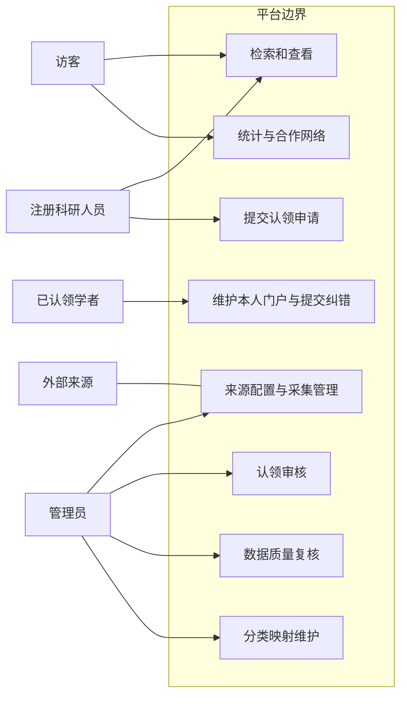
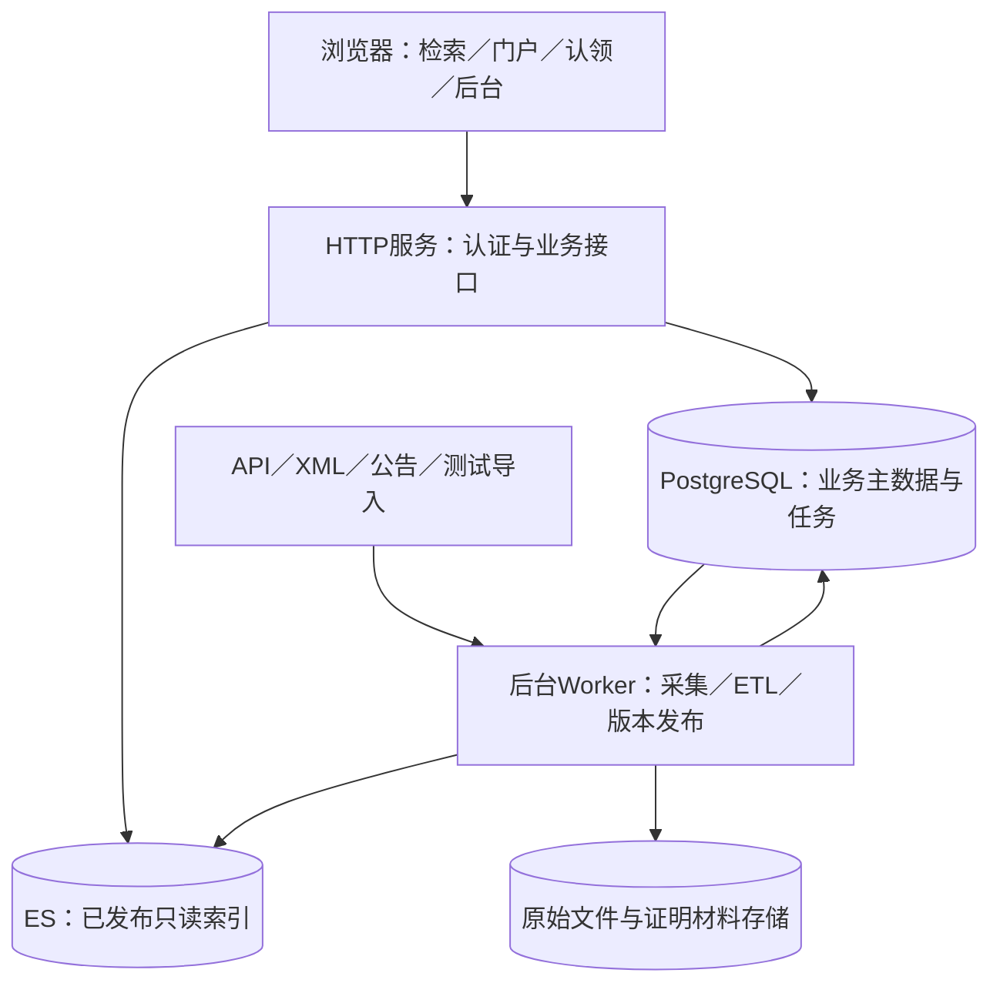
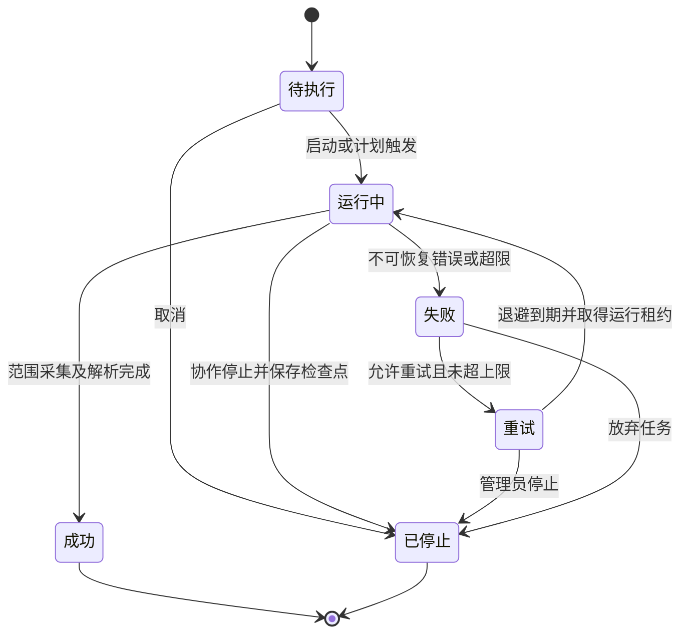
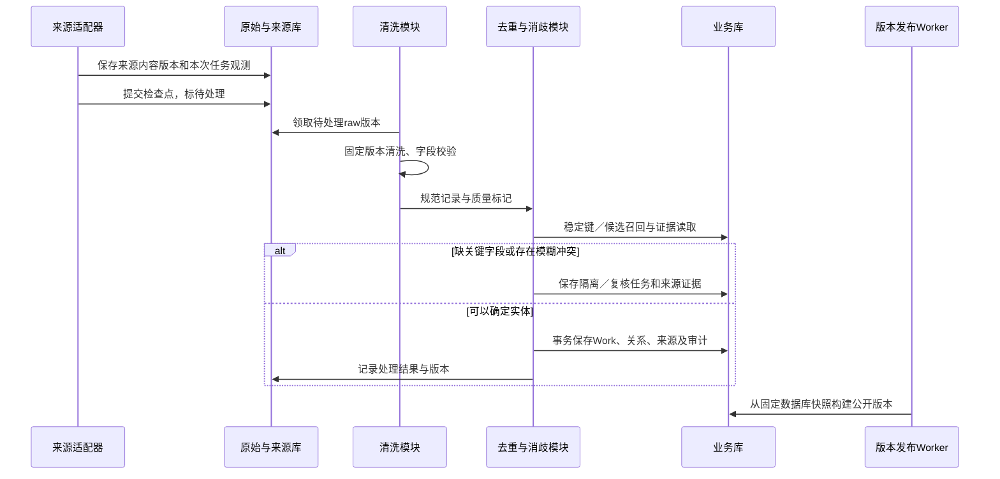
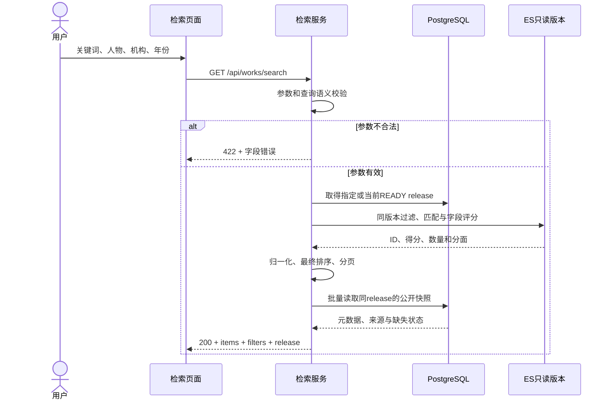
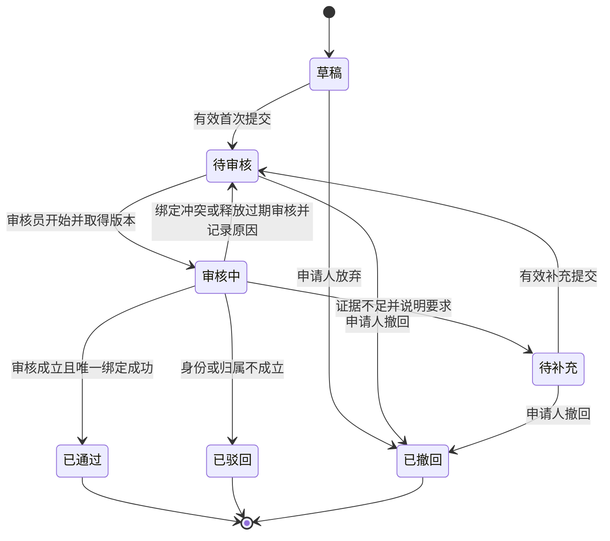

# 学术成果分享平台：详细设计与实现方案汇报

适用任务：需求调研、需求建模汇报，并解释后续实现如何履行需求。建议汇报时长：15分钟。整理日期：2026年10月7日。

本文按“为什么需要这个功能—数据如何组织—系统如何处理—异常如何处理—如何验收”展开。算法、表结构、接口和例子用于支持课堂讲解及答辩追问；文末给出15分钟讲述路线。

**成果状态说明：当前目录提供的是调研报告、SRS、SPEC和模型图片，本文是可实施的设计方案，不代表系统已经编码、接入外部数据或通过性能测试。** 下文使用三种标记：

- **【已有】**：原资料已经明确提出的需求、公式或规则。
- **【补充】**：为落实需求新增的具体设计，建议写入下一版SRS／SPEC。
- **【待验证】**：必须通过来源样例、人工标注、接入试验或性能测试确认的参数及能力。

示例中的陈宁、华城大学、成果编号及请求数据均为测试或说明样例。本文保留原始材料，不直接修改原SRS／SPEC。

## 1. 本次汇报的具体设计结论

平台采用统一成果主表加四种扩展表，人员、机构、领域和来源分别建模。采集得到的记录先保存原始版本，再清洗、去重、消歧，形成规范实体。用户查询规范实体，管理员可以回溯每个字段的来源。

认领只建立“账号—学者”的管理关系；注册、同名匹配、成果作者身份和门户管理资格分别处理。审核通过时使用数据库事务与唯一约束完成绑定，所有维护请求再检查当前绑定。

检索采用结构化条件过滤和按类型排序；统计从同一个查询范围取得规范成果集合。为了让列表、详情、统计保持一致，一万条演示规模下采用按批次发布的只读数据版本，公开查询携带版本号。

| 需要统一的原资料差异 | 本文采用的明确口径 |
| --- | --- |
| SRS第2.1节只承诺论文完整链路，另外三类仅预留 | 四类成果都完成导入、规范化、检索、详情、门户与统计路径；论文承担主要规模 |
| 数据规范与SPEC缺少科研项目 | 增加Project对象、项目字段映射、复合键去重和项目排序 |
| FR-13维护、FR-14统计、FR-16创新优先级偏低 | 维护和基础统计属于必做；至少一项创新属于验收要求 |
| SRS写“暂停”，状态与SPEC没有恢复机制 | 六状态仅支持停止；停止后新建关联任务；暂停不进入当前承诺 |
| 认领活动图有待补充，SRS状态表没有 | 增加待补充；驳回、撤回为单次申请终态，再申请生成新编号 |
| 原作者强标识规则只写“ORCID校验” | 分清格式合法、来源关联可信、申请人控制ORCID三个层次 |
| 部分报告偏重纯文本相关度，SPEC给出综合排序 | 本文明确采用SPEC综合公式，补齐归一化；需回写普通用户报告 |

上述调整是汇报建议基线，小组确认后再更新正式规范。需求阶段重点讲业务约束；本文架构、数据库与接口内容属于实现预案。

## 2. 调研结果如何转化为设计决定

### 2.1 原材料与本方案的对应

原资料都位于工作区的`scripts`目录：

| 资料 | 原资料贡献 | 本文展开的细节 |
| --- | --- | --- |
| 学术成果分享平台需求调研报告.md | 平台对比、四类来源、分类和三角色需求 | 来源接入方式、分类映射、实施范围 |
| 学术成果分享平台_普通用户需求调研报告.md | 人物确认、作者与机构条件、13项基础成果测试样例 | 关联查询、统计集合、页面和验收预期 |
| 科研人员需求分析与需求建模.md | 认领、维护、角色与业务类模型 | 权限、并发绑定、纠错审批 |
| 学术成果分享平台_数据源调研与数据密集型逻辑规范.docx | 字段优先级、相似度函数、更新与排序 | 适配器、缺失值规则、候选召回、字段版本 |
| 系统需求规格说明书（SRS）.docx | FR-01至FR-16、DR、NFR、API摘要 | 全链路设计和验收追踪 |
| 核心模块开发规范（SPEC）.docx | 六个核心SPEC | 处理事务、阈值解释、接口异常、实现检查 |

现有调查主要来自公开资料和产品分析。没有发现本组真实访谈原始回答、接入运行记录或压测数据，不能把第三方调查样本当成本组样本。后续访谈只验证尚未确认的业务决定，如认领证据是否可接受、最常用查询条件和统计解释是否易理解。

### 2.2 从具体问题到实现要求

| 调研中的具体问题 | 推导出的需求 | 设计决定 | 验收例子 |
| --- | --- | --- | --- |
| 用户知道姓名，却不能区分同名人 | 姓名用于找候选，实体ID用于查成果 | 人物候选卡展示机构、领域、代表作；选中后保存person_id | 两位陈宁分别返回软件与生物方向成果 |
| 同一论文来自两个数据库 | 不应展示两条，也不能丢来源 | Work与SourceRecord分离，多来源指向一个Work | R04、R04B归并，详情仍显示两个来源 |
| 学者换单位后旧论文归属容易错 | 当前任职与发表署名分开 | person_affiliation和contribution_affiliation分别保存 | A01现属I01，R03仍计入I03 |
| 查“A01在I01的论文”与“有A01且有I01的论文”含义不同 | 关联条件要能作用于同一作者关系 | author_scope明确，ES用nested，数据库用关联EXISTS | R06只满足后一种条件 |
| 注册后可能冒领他人门户 | 登录身份不自动产生管理权 | 独立认领申请、证据、审核和唯一绑定 | 未通过申请不能修改门户 |
| 管理员需要补证据而不是直接拒绝 | 材料补充是独立状态 | 待补充→待审核，保留每次材料版本 | 旧材料仍可查，新提交产生事件 |
| 采集接口失败或重复执行 | 可恢复、幂等、可追踪 | 检查点、内容校验值、规则版本和状态约束 | 第二次导入不新增重复成果 |
| 排名数字不能解释 | 统计需有集合、口径和明细 | 按规范work_id计数，机构使用成果关系全计数 | 8篇论文、机构计数合计9次 |
| 领域热点容易被总量增长误导 | 同时给出数量和占比 | 固定关键词映射版本，按年度计算主题占比 | 数量翻倍、占比不变时不称增长热点 |
| 研究者希望探索合作 | 网络要有真实成果证据 | 共著论文构边，BFS求最短连接路径 | 每条边点击显示共同论文 |

### 2.3 待补访谈如何记录

采用“任务实例—困难—功能选择—理由—需求编号”的记录结构。普通用户走查“陈宁的近三年静态分析论文”；科研人员走查“认领后发现一篇误归属论文”；管理员走查“采集失败、补材料、两个账号同时认领”。每类建议至少2人，人数属于计划。

访谈后为每条需求标记“支持／修订／待验证”，附匿名编号和原始回答位置。不能仅凭“希望方便”推导推荐系统；只有明确任务、数据可得性和验收方法后才加入范围。

## 3. 用户、权限与完整用例

### 3.1 角色如何实现

【补充】账号表只保存认证信息；角色由account_role保存。科研人员管理权限由当前有效portal_binding决定，不需要把“已认领学者”永久写成通用管理员角色。

| 操作 | 访客 | 登录用户 | 本门户已绑定账号 | 管理员／审核员 |
| --- | --- | --- | --- | --- |
| 搜索、详情、门户、公开统计 | 允许 | 允许 | 允许 | 允许 |
| 提交认领、看本人申请 | 要求登录 | 允许 | 按已有绑定检查 | 按账号权限 |
| 看别人认领证明材料 | 拒绝 | 拒绝 | 拒绝 | 仅授权认领审核人员 |
| 修改个人简介、研究资源链接 | 拒绝 | 拒绝 | 仅本人门户 | 有后台维护权限并审计 |
| 直接改公共作者、成果归属、DOI | 拒绝 | 拒绝 | 提交纠错申请 | 有数据审核权限并审计 |
| 采集配置、任务启动停止 | 拒绝 | 拒绝 | 拒绝 | 有采集管理权限 |
| 私人收藏、笔记（增强功能） | 要求登录 | 仅本人 | 仅本人 | 不因管理员身份默认获得读取权 |

后端从会话取得account_id，不能相信请求体传来的owner_id或is_admin。门户维护查询必须同时限定绑定账号、person_id和revoked_at为空；权限每次请求实时检查。页面隐藏按钮仅用于交互，不能代替后端授权。

### 3.2 系统用例关系

下图为用例关系的阅读示意；Mermaid使用矩形表达系统边界和能力，并非严格UML椭圆用例图。正式UML图可依据相同关系绘制。



“维护门户”必须校验有效绑定，可作为include子行为；“查看来源”是详情中的可选动作。搜索→详情→门户的先后关系用活动／时序图表达，不用include表达时间顺序。数据库和ES属于内部构件，不画成外部业务参与者。

### 3.3 核心用例规约

| 用例／SRS需求 | 前置条件与触发 | 主流程 | 异常与后置条件 |
| --- | --- | --- | --- |
| UC-S：成果查询；FR-08／09／10 | 已有公开数据版本；访客提交查询 | 校验参数→识别编号或文本→建立过滤条件→查询→排序分页→显示来源 | 参数错返回422；零结果返回200和空列表；服务失败返回503。公共数据不改变 |
| UC-H：采集管理；FR-01／02／03 | 管理员、来源有效、凭证可用 | 创建待执行任务→启动→分页获取→保存原始版本与来源记录→提交检查点 | 网络异常退避；解析坏记录隔离；不可继续进入失败；停止协作退出。保留全部已提交进度 |
| UC-E：清洗入库；FR-04／05／06／07 | 存在来源版本；规则版本固定 | 清洗→成果候选→去重→人员机构映射→选主值→质量校验→事务入库 | 缺关键字段进入隔离；模糊候选进复核；入库失败全回滚。无未经记录的覆盖 |
| UC-C：认领申请；FR-11 | 登录、目标门户可申请 | 保存草稿→上传证据→提交校验→待审核→查看进度 | 重复提交返回已有申请；材料不完整保持草稿；门户已绑定提示争议处理入口，不自动替换 |
| UC-R：认领审核；FR-12 | 授权审核员；申请待审核 | 领取审核→核对材料→补充／驳回／通过→通过时原子绑定→审计 | 状态过期返回409；唯一绑定冲突退回待审核；失败不授管理权 |
| UC-M：维护纠错；FR-13 | 当前有效本人绑定 | 简介等自维护字段直接保存；公共关系形成纠错申请→审核→修正→发布 | 绑定失效403；版本冲突409；否决保留原公共数据；不删除他人共同成果 |
| UC-T：统计网络；FR-14／16 | 固定查询条件与数据版本 | 确定成果集合→分类／年度／机构／关键词聚合→明细→网络路径 | 缺失年份单列；多机构解释全计数；计算失败503；图截断必须说明限制 |

## 4. 总体架构与技术实现

### 4.1 一期具体技术方案

【补充】推荐Vue前端、Python FastAPI后端、PostgreSQL业务库、Elasticsearch检索、文件存储原始数据。此处是课程实现建议，原文未锁定这些框架，也未验证团队已有栈；若团队已有Java或其他可用栈，保持本方案的表、接口和事务语义即可。

采用一个代码仓库、一个HTTP进程和一个后台Worker进程。按任务书划分七个逻辑服务，暂时无需七个独立部署：

| 逻辑服务 | 输入与职责 | 持久化输出 |
| --- | --- | --- |
| 认证服务 | 登录、会话、角色校验 | account、account_role、会话 |
| 数据采集服务 | 来源配置、任务调度、原始保存、结构解析 | harvest_task、raw_record、source_record |
| 数据处理服务 | 清洗、去重、消歧、选主值、质量判断 | work及关联表、provenance、review_task |
| 检索服务 | 人物识别、条件构造、排序、分页、详情 | 读取ES和公开快照 |
| 门户与认领服务 | 门户展示、申请、审核、授权、维护 | claim_application、portal_binding、correction_request |
| 统计服务 | 机构分类、年度、热点、共著图与路径 | 读取同版本成果集合 |
| 管理后台服务 | 管理页面对应API、复核、分类和审计 | 配置、复核结论、audit_event |



采集与ETL通过数据库任务表衔接。API创建待执行任务返回201和任务ID，启动请求返回202；Worker领取后执行；前端轮询任务详情。采集耗时不占用HTTP请求。来源访问密钥、证明材料和数据库连接信息不进入公开索引。

一期不引入Kafka、分布式图数据库或独立缓存集群。一万条演示规模先用数据库持久任务和应用内短缓存；是否增加组件由压测、故障恢复和吞吐需求决定。

### 4.2 长任务领取与崩溃恢复

【补充】任务表保存worker_id、lease_until、run_token、heartbeat_at。领取时短事务锁定候选任务，生成本次运行token并提交；网络请求在事务外执行。多个Worker可用`FOR UPDATE SKIP LOCKED`避免重复领取同一行，此用途符合PostgreSQL文档的队列场景。[PostgreSQL SELECT](https://www.postgresql.org/docs/current/sql-select.html)

每批数据提交时检查任务仍为运行中、run_token一致、租约有效。旧Worker恢复后token失效，不能继续提交检查点。Worker崩溃且租约超时，由恢复程序把任务记为失败，记录WORKER_LOST，再按重试规则处理；不能悄悄从运行中重新开始。

### 4.3 主数据库与检索库如何保持一致

【补充】业务写入只提交PostgreSQL，后台批次发布生成公开快照。对一万条数据先采取完整重建：

1. 创建release记录，状态BUILDING。
2. 用一致的数据库快照导出当前公开成果、人物、贡献与机构关系、领域树和分类映射，写入work_snapshot、person_snapshot及release的分类元数据；保存规则版本、截止时间与记录数。
3. 从这些固定快照生成ES索引`works_r0007`、人物索引及共著证据；不再读取会变化的主表来构建该批数据。
4. 验证总数、四类数量、关键精确编号、来源追踪和模拟验收样例；有任何失败保持旧版本可用。
5. 验证通过后，在数据库短事务将该release设为READY，并更新current_release指针。
6. API先取得release_id，再使用release记录中的具体index_name查询。无需同时原子更新数据库指针与ES别名。
7. 返回release_id，分页、详情、统计明细继续使用这个版本。旧版本保留至少覆盖查询令牌有效期；版本已清理返回410并让用户重新查询。

这样不会出现“数据库提交了，ES写失败却没有记录”的请求内双写问题。失败版本可重建；重新发布不要求重新采集。

代价是公共数据按批次生效。后台显示“已保存／待发布／已发布”，认领权限则即时读业务库生效，不等公开版本。涉及紧急隐藏的记录立即受当前权限／可见性检查；受影响的旧版本公开查询暂时标记不可用并返回503，完成重新发布后恢复，不能继续提供失效统计。普通纠错允许在下次发布生效。

这是万条规模的实现预案，不宣称全量重建已经满足性能目标；规模扩大或发布变频繁后再改成数据库事件表驱动的增量索引。

## 5. 数据模型、表结构与索引

### 5.1 原业务类图如何落到数据库

【已有】核心业务类图把成果分为论文、专利、科研项目和获奖，贡献关系保存角色和顺序，学者与机构有任职关系，成果与机构有署名关系。实现时采用父表加扩展表：

- work存公共字段；paper、patent_publication、project、award各用work_id作为主键及外键，形成一对一扩展。
- person与account分开。门户以person_id为公开ID，由人物信息和贡献关系生成；门户管理权单独保存在portal_binding。
- work_person不是两个ID的简单连接：保存角色、顺序、核实状态和来源。
- contribution_affiliation关联到具体work_person，才能表示“这个作者在这篇论文中的机构”。
- person_affiliation保存任职时间，不能拿当前机构覆盖历史署名。
- source_record描述外部记录，raw_record保存该记录的内容版本；一个Work可以有多个来源记录。

```mermaid
erDiagram
    WORK {
        int work_id PK
    }
    PAPER {
        int work_id PK, FK
    }
    PATENT_PUBLICATION {
        int work_id PK, FK
    }
    PROJECT {
        int work_id PK, FK
    }
    AWARD {
        int work_id PK, FK
    }
    PERSON {
        int person_id PK
    }
    ORGANIZATION {
        int organization_id PK
    }
    WORK_PERSON {
        int work_person_id PK
        int work_id FK
        int person_id FK
    }
    CONTRIBUTION_AFFILIATION {
        int contribution_affiliation_id PK
        int work_person_id FK
        int organization_id FK
    }
    PERSON_AFFILIATION {
        int person_affiliation_id PK
        int person_id FK
        int organization_id FK
    }
    WORK_ORGANIZATION {
        int work_organization_id PK
        int work_id FK
        int organization_id FK
    }
    FIELD {
        int field_id PK
    }
    WORK_FIELD {
        int work_field_id PK
        int work_id FK
        int field_id FK
    }
    SOURCE_RECORD {
        int source_record_id PK
    }
    WORK_SOURCE_MAP {
        int work_source_map_id PK
        int work_id FK
        int source_record_id FK
    }
    RAW_RECORD {
        int raw_record_id PK
        int source_record_id FK
    }
    ACCOUNT {
        int account_id PK
    }
    CLAIM_APPLICATION {
        int claim_application_id PK
        int account_id FK
        int person_id FK
    }
    PORTAL_BINDING {
        int portal_binding_id PK
        int account_id FK
        int person_id FK
    }

    WORK ||--o| PAPER : "论文扩展"
    WORK ||--o| PATENT_PUBLICATION : "专利扩展"
    WORK ||--o| PROJECT : "项目扩展"
    WORK ||--o| AWARD : "奖励扩展"

    WORK ||--o{ WORK_PERSON : "成果贡献"
    PERSON ||--o{ WORK_PERSON : "人员贡献"

    WORK_PERSON ||--o{ CONTRIBUTION_AFFILIATION : "署名机构"
    ORGANIZATION ||--o{ CONTRIBUTION_AFFILIATION : "机构关联"

    PERSON ||--o{ PERSON_AFFILIATION : "任职历史"
    ORGANIZATION ||--o{ PERSON_AFFILIATION : "任职机构"

    WORK ||--o{ WORK_ORGANIZATION : "机构成果角色"
    ORGANIZATION ||--o{ WORK_ORGANIZATION : "成果机构"

    WORK ||--o{ WORK_FIELD : "成果分类"
    FIELD ||--o{ WORK_FIELD : "所属领域"

    WORK ||--o{ WORK_SOURCE_MAP : "来源映射"
    SOURCE_RECORD ||--o{ WORK_SOURCE_MAP : "来源记录"

    SOURCE_RECORD ||--o{ RAW_RECORD : "内容版本"

    ACCOUNT ||--o{ CLAIM_APPLICATION : "认领申请"
    PERSON ||--o{ CLAIM_APPLICATION : "目标学者"

    ACCOUNT ||--o{ PORTAL_BINDING : "历史绑定"
    PERSON ||--o{ PORTAL_BINDING : "历史管理关系"
```



图中的绑定0..多包括已撤销历史；**当前有效绑定在账号端和人物端各最多一条**，由部分唯一索引保证。

### 5.2 成果与身份的字段设计

以下为建议字段，不是已建库结构。ID使用UUID；外部编号用text保存，避免丢失前导零。timestamptz保存时间；金额如收录用numeric并带币种，不用浮点作财务数值。

| 表 | 核心字段与类型 | 约束／索引 |
| --- | --- | --- |
| work | id UUID；type text；title_display text；title_normalized text；business_year smallint nullable；date_value text；date_precision text；abstract text nullable；visibility text；retracted boolean；version bigint；merged_into_id UUID nullable | type限定四值；题名非空；索引(type,business_year)、title_normalized；merged_into不能指自己 |
| paper | work_id UUID；doi text nullable；venue_id UUID nullable；online_date／print_date／issue_year；volume／issue／pages text；abstract_license text | work_id主键；非空规范DOI唯一；作者主值顺序保存到关系表 |
| patent_publication | work_id；authority text；publication_number text；kind_code text nullable；application_id UUID；grant_evidence_status text；grant_year smallint nullable；legal_status text；status_observed_at timestamptz | 完整authority+number+kind唯一；缺kind进复核，不靠相同申请号合并阶段文献 |
| patent_application／family | 申请表：authority、application_number、application_date；家族表：source_id、family_key、family_type；成员关系表 | 同主管机构申请号唯一；家族标识必须带来源和类型 |
| project | work_id；funder_org_id UUID；grant_number text nullable；approval_year smallint；category text；planned_start／end text；completion_status text nullable | funder+非空grant_number唯一；计划结束不推导已结题 |
| award | work_id；grantor_org_id；award_name；award_year；category；grade；award_key nullable；official_notice_url | 只有复合键全部字段有效时才生成唯一键；缺字段不把空值拼成键 |
| person | id；display_name；name_key；orcid nullable；identity_status；version | 姓名非唯一；已确认ORCID唯一；未经确认原值留在来源候选区 |
| organization | id；name；ror nullable；country_code；city；parent_id nullable；version | 已确认ROR唯一；name非唯一；保留层级与历史事件 |
| person_alias／organization_alias | entity_id；alias_display；alias_key；source_record_id；valid_from／to | 别名允许跨实体相同；不以别名全局唯一强迫合并 |
| person_source_map／organization_source_map | source_id；external_id；person_id／org_id；verification_status；mapping_version | 每来源稳定外部ID仅一条当前映射；变化需复核及审计 |
| work_person | id；work_id；person_id；role；position nullable；is_corresponding nullable；verification_status；source_record_id | unique(work_id,person_id,role)；(person_id,role,work_id)索引；角色缺失不补成通讯作者 |
| contribution_affiliation | contribution_id；org_id；source_record_id；raw_affiliation | unique(contribution_id,org_id)；org_id反向索引 |
| person_affiliation | person_id；org_id；valid_from／to nullable；date_precision；source_record_id | 时间结束不早于开始；未知时间不构造无限期任职事实 |
| work_organization | work_id；org_id；role；source_record_id | unique(work_id,org_id,role)；role区分署名、申请人、承担、获奖单位、资助、授奖 |
| field／field_mapping | id、parent_id、code、label、version；映射source_id、external_id、local_field_id、mapping_version、review_status | code按版本唯一；领域父子无环；来源分类先审核再映射 |
| work_field | work_id；field_id；origin；mapping_version | unique(work_id,field_id)；反向索引field_id |
| citation_observation | work_id；source_id；observed_at；count nullable；status | 负数拒绝；缺失count=NULL；同来源最新值用于指定口径 |

专利基础展示要求有授权证据，历史已授权与“当前有效”法律状态分别保存。机构是申请人不自动意味着所有该机构学者都是发明人；单位获奖不自动推断个人获奖。paper业务年建议正式出版issue_year优先、print年其次、online年再次，保存year_basis并在界面解释；精确发布日期未知就不捏造日期。专利基础年用授权年，项目用批准年，奖励用获奖年。

### 5.3 采集、来源、审核与发布表

| 表 | 具体保存内容 | 关键约束 |
| --- | --- | --- |
| data_source | code、类型、访问方式、允许的字段范围、许可说明、速率、配置版本、adapter版本、secret_ref、enabled | source code唯一；密钥引用不公开 |
| harvest_task | source_id、范围快照、六状态、检查点、run_token、租约、retry_count、stop_requested、计数、开始结束、error_code | 状态只走允许迁移；启动／重试做条件更新 |
| source_record | source_id、record_key、当前raw版本、first_seen、last_seen、source_updated_at | unique(source_id,record_key) |
| raw_record | source_record_id、raw_checksum、storage_path、fetched_at、content_type、parser_version、schema_version | unique(source_record_id,raw_checksum)；原始版本不可覆盖 |
| harvest_observation | task_id、source_record_id、raw_record_id、结果、时间 | 重复获取也记录本次任务观测；不强行把来源记录只绑定一个任务 |
| normalized_record | raw_record_id、rule_version、parser_version、规范JSON、质量标志、处理状态 | 相同raw+parser+rule版本幂等；规则升级允许重跑 |
| work_source_map | work_id、source_record_id、映射状态、依据、时间 | 一条有效来源成果映射到一个规范Work；保留变更历史 |
| field_provenance | work_id、field_path、selected_value、来源raw_id、选值规则、manual_lock、revision | 数组如作者列表按完整版本存，不把不同来源顺序拼接 |
| review_task | type、候选A/B、评分JSON、证据、状态、reviewer、version、结论 | 相同候选对+类型+规则版本去重；结论要有原因 |
| claim_application | id、account_id、person_id、state、材料版本、reviewer_id、reason、version、previous_id | 同账号同人物仅一条处理中的申请 |
| claim_evidence | claim_id、kind、私有文件引用／公开证据URL、checksum、验证状态、上传者、版本 | 材料不能进入公开门户JSON |
| portal_binding | account_id、person_id、claim_id、granted_at、revoked_at | 有效account唯一、person唯一；claim关联唯一 |
| correction_request | applicant、目标work／person、修改路径、旧值版本、建议值、证据、状态、结论 | 不直接覆盖公共字段；审核检查旧值版本 |
| audit_event | actor_id nullable、事件类型、对象ID、前后值摘要、规则版本、原因、request_id、时间 | 自动操作actor为空并写system身份；不给普通角色修改审计权 |
| api_idempotency | account_id、接口动作、key、request_hash、业务结果引用、response_status、expires_at | unique(account_id,接口动作,key)；先在同事务确认业务结果再返回；不同内容复用同key拒绝 |
| data_release／current_release | release_id、状态、ES索引名、快照时间、规则版本、分类型计数、当前指针 | READY才能成为当前公开版本 |
| work_snapshot／person_snapshot | release_id、实体ID、公开JSON | 主键(release_id,entity_id)；构建完成后不可变 |

### 5.4 用数据库直接保证认领唯一性

以下SQL是设计片段，前提是已有account、person、claim_application和portal_binding表及外键。有效绑定和处理中的申请使用PostgreSQL部分唯一索引，无需用“先查再写”模拟唯一性。[PostgreSQL部分唯一索引](https://www.postgresql.org/docs/current/indexes-partial.html)

```sql
CREATE UNIQUE INDEX uq_binding_active_account
  ON portal_binding(account_id) WHERE revoked_at IS NULL;
CREATE UNIQUE INDEX uq_binding_active_person
  ON portal_binding(person_id) WHERE revoked_at IS NULL;
CREATE UNIQUE INDEX uq_claim_processing
  ON claim_application(account_id, person_id)
  WHERE state IN ('PENDING', 'REVIEWING', 'NEEDS_INFO');
```

草稿可保留多个，但提交时仅允许一个有效申请。数据库约束是并发下最后一道保证；服务层提前检查只是给出更清楚的提示。

## 6. 四类来源的接入、适配和更新

### 6.1 为什么不是写一个通用爬虫

【已有】OpenAlex、DBLP、Crossref及官方公告具有不同格式与更新方式。【补充】各来源适配器负责两件事：`fetch_page(scope,cursor)`返回原始页和下一游标；`parse(raw)`生成平台统一的SourceRecord。清洗、去重和入库复用后续流程。

适配器输出固定字段：source_id、record_key、work_type、raw_ref、source_url、source_updated_at、parsed_fields、people、organizations、classification、quality_flags。不在适配器里直接合并学者或授门户权限。

| 类型／候选来源 | 获取与解析方式 | 业务字段映射 | 更新及限制 |
| --- | --- | --- | --- |
| 论文：OpenAlex主源 | 允许的API分页或本地快照；只映射适用论文类型 | id→record_key；doi→paper.doi；display_name→title；publication_year→年份；authorships→贡献及署名机构；topics→外部分类型；cited_by_count→分源观察值 | 使用来源支持的游标／更新时间；范围和类型映射固定版本；不是所有OpenAlex Work都应变成论文 |
| 论文：DBLP补充 | API或XML流式解析 | DBLP key、title、author／person标识、year、venue、ee等；按真实样例核定字段 | 流式解析避免整份XML入内存；稳定key唯一，不仅用作者名 |
| 论文：Crossref校验补全 | 对候选DOI查询登记元数据 | DOI、title、author顺序、container-title、出版日期、ISSN、license | 未查询到Crossref不能宣称DOI无效；可能属于其他注册机构 |
| 专利：CNIPA／EPO候选 | 先验证允许的数据访问／导入方式，再做JSON／XML／官方导出适配 | authority、公开号、kind、申请号、申请／公开／授权时间、发明人、申请人、CPC／IPC、法律状态及时间 | 当前目录无接入运行证据；不能把检索页面当成已获批批量API |
| 项目：NSFC／科技部公开公告 | 官方公开可访问记录或课程测试CSV；公告表格按行解析 | funder、grant_number、名称、负责人、依托／承担单位、批准年度、类别、计划期 | 项目编号保留前导零；公告更新检测；需补真实样例与访问可行性 |
| 获奖：国家／省部／学会官方公告 | HTML表格或有文本层PDF；扫描件单独标记待人工核对 | 授奖机构、奖名、年度、类别等级、项目、完成人、单位、公告URL | 页面／附件内容hash监测；行跨页、人名换行和单位分隔符要人工样例验证 |

OpenAlex的authorships属于“成果—作者”的关联，携带署名机构；其Awards指资助记录，不能仅因英文同名就映射为平台学术获奖。[署名模型](https://help.openalex.org/data/authorships/)、[资助记录模型](https://help.openalex.org/data/awards/)

### 6.2 一个统一规范化输入例子

```json
{
  "source_code": "demo_openalex",
  "record_key": "DEMO-W01",
  "work_type": "paper",
  "title": "  Static  Analysis &amp; Verification  ",
  "doi": " https://doi.org/10.1234/DEMO.X01 ",
  "publication_year": 2024,
  "authors": [
    {"source_author_id": "DEMO-A01", "name": "陈宁", "position": 1,
     "affiliations": [{"source_org_id": "DEMO-I01", "name": "华城大学"}]}
  ],
  "source_url": "https://example.org/test-record/01",
  "is_simulated": true
}
```

这个DOI只是格式示例，不能称为已登记DOI。清洗后题名显示为`Static Analysis & Verification`，比较题名为`static analysis & verification`，DOI为`10.1234/demo.x01`。人员、机构先保存来源标识并查已有映射，再参与消歧。

### 6.3 检查点为什么必须晚于数据提交

一页来源结果保存原始文件后，在事务中写raw记录、来源版本、本次观测及“下一页游标”。只有全部持久化成功才推进游标。崩溃情形：

- 原始文件已保存、事务未提交：下次重复请求或复用文件，按hash和唯一键重入；多余文件之后按引用清理。
- 事务已提交、进程未收到结果：从已提交游标继续；即使重复页也幂等。
- 先推进游标再保存记录：会漏数，因此禁止这种顺序。

分页原始包保留页标识和hash；原始单条raw_checksum使用稳定序列化的内容计算，排除本地fetched_at等观测时间。没有稳定来源ID的公告行可使用“公告标识+来源行键”追踪，但行号不是成果身份；公告修订导致行位移时需保留旧版并重新匹配成果。

### 6.4 增量更新规则

1. 同来源record_key、相同checksum：只更新last_seen并记录观测，不再生成相同处理结果。
2. checksum变化：新增raw版本，按固定parser／rule版本重跑；保留旧版本。
3. 原文未变但parser或rule升级：仍允许重新解析／清洗，不能被“内容未变”短路。
4. 来源提供更新时间：时间窗口适当重叠获取，重复由幂等消除；窗口长度是待验证参数。
5. 公告来源：保存公告与附件hash，变化则重解析；某条记录本次未出现不等同撤销，需官方撤销证据或人工复核。
6. 人工核实字段manual_lock=true：新来源矛盾进入复核，不能覆盖人工结论。
7. 发布新数据版本后才更新公开检索与统计；来源更新、采集完成和公开发布时间分别记录。

### 6.5 重试、停止与六状态机



【补充】默认单请求超时15秒、每页最多3次短重试，示例退避1／2／4秒加少量抖动；HTTP429优先遵循来源Retry-After。请求短重试不改变业务任务状态；短重试耗尽后任务进入失败，管理员重试才进入“重试”。任务级最多3次，超过上限保留失败并解释原因。参数须按来源条款和接入试验调整。

管理员停止运行任务时先设置stop_requested。Worker在每次请求前和每条批处理提交前检查，等待当前可界定的小批处理结束后转已停止；在页面显示“停止请求已接收”而不是立即假称全部进程已退出。租约失效的旧Worker不允许写新批次。

HTTP401／403、配置错误、结构整体变化不盲目重试，进入失败待处理。单条坏记录进入隔离队列并计数；示例阈值为解析失败比例超过5%或关键结构无法识别则任务失败，低比例错误可以成功但显示警告数量。阈值是待验证参数。未知总数时展示已读取／已解析条数，不伪造百分比。

采集“成功”只指约定范围的采集与解析完成；ETL处理数量、待复核数量和版本发布状态单独显示。

### 6.6 从来源记录到规范成果的处理时序



规范记录处理状态建议为PENDING、PROCESSING、COMMITTED、REVIEW_REQUIRED、QUARANTINED、ERROR；它与采集任务六状态不同。REVIEW_REQUIRED表示来源记录已保存、需要人工决策；QUARANTINED表示尚不能创建可公开成果；ERROR表示本次处理执行失败可按相同输入重跑。

规范成果、有效来源映射、字段来源、关系、审计和规范记录最终处理结果在**同一PostgreSQL事务**提交。图中不同“库”是同一数据库的逻辑表组，不是要求跨数据库事务。若来源记录尚无明确归属，保留独立候选或复核，不能为了展示完整链路强行合并。

## 7. 数据清洗：保留原值、生成比较值、记录异常

对应SPEC-DATA-01、FR-04、DR-CLN-01至07。

### 7.1 清洗的具体顺序

【已有】保留原字段，另存展示字段与比较字段。【补充】顺序固定为：解析编码→HTML实体解码→文本结构清理→Unicode规范化→空白处理→字段校验→生成比较键→分类映射→质量标记。顺序和版本保存到normalized_record，避免不同入口用不同清洗规则。

| 字段 | 具体实现规则 | 输入例子→输出 | 错误处理 |
| --- | --- | --- | --- |
| 显示题名 | NFC规范化，HTML实体解码，压缩连续空白，不删除语义符号 | `Deep  Learning &amp; AI`→`Deep Learning & AI` | 无题名隔离，不以来源URL冒充题名 |
| 比较题名 | 独立字段做宽度转换、casefold、小范围弱标点处理；保留数学和技术符号 | `Graph-Based.`→比较键`graph-based` | 不把C++等符号删成C；规则按样例回归 |
| 摘要 | 用HTML解析器移除script／style和标签，保留段落文本 | `<p>A</p><script>...</script>`→`A` | 许可不允许时不展示；解析异常保留原文位置并标记 |
| DOI | trim→识别doi前缀／标准解析URL→取主体→小写→格式校验 | `DOI:10.1234/Demo.X01`→`10.1234/demo.x01` | 不任意删尾标点；不把Crossref未收录当成无效DOI |
| ORCID | 取主体、标准分组、执行校验位验证 | 标准16位ID保留，校验错误值进异常 | 格式通过只记syntax_valid，不等于identity_verified |
| 姓名 | raw_name、display_name、name_key分开；英文比较大小写／空白／约定标点 | 中文名保留；拼音存alias而非覆盖 | 同名不合并；变音字符显示保留 |
| 机构 | 保存来源原名；依据已确认ROR或机构别名映射 | 同一学校不同写法映射同org_id | 缺国家／城市的相似名候选人工确认 |
| 日期 | 按year／month／day保存值和精度 | `2024`→value=`2024`,precision=`year` | 不改成`2024-01-01`；非法日期标记 |
| 关键词 | 按来源定义的分隔方式拆分，trim，比较键去重 | `AI; ai；LLM`→`AI, LLM` | 不把普通英文短语中的逗号无条件拆开 |
| 引用次数 | 分源保存非负整数、观察时间、known／missing | 0仍是已知0；NULL为未获取 | 不同来源不直接相加或互相覆盖 |
| 项目编号／专利号 | text保存，按来源规则标准化，保留字母与前导零 | `00123`保持`00123` | 不统一转整数；国家规则不同不得共用简单删字符规则 |
| 奖励等级／类型 | 授奖机构词表映射，原值与映射版本保留 | `一等`按该机构映射为`一等奖` | 不同奖项等级不直接换成共同价值分数 |

DOI格式校验只能判断像不像DOI；需要区分SYNTAX_VALID、RESOLVED、METADATA_MATCHED。Crossref可提供登记机构信息，但Crossref返回未找到不说明其他注册机构没有该DOI。[Crossref REST API](https://www.crossref.org/documentation/retrieve-metadata/rest-api/)

### 7.2 OpenAlex摘要需要额外处理

OpenAlex的abstract_inverted_index是词到位置的映射，应按位置重建，不是直接把JSON转字符串。[OpenAlex Works字段](https://help.openalex.org/data/works/attributes/)

说明例子：`{"Graph":[0],"learning":[1,3],"improves":[2]}`重建为`Graph learning improves learning`。实现时建立位置数组，逐词填入位置；重复位置冲突、负位置、过大位置和空洞分别标记，不能无限分配数组。恢复后的摘要仍要经过展示许可检查；字段存在不意味着允许展示全文。

### 7.3 缺失与隔离的明确规则

【补充】字段状态用known、missing、pending、not_applicable。NULL不承担所有业务解释，另存status。例如引用0为known，尚未获取为missing；项目计划结束年不代表实际完成，completion_status仍missing。

- 缺来源、成果类型不认识、题名为空：不能创建公开Work，保存原始记录并隔离。
- 缺作者、年份、机构：可以保留可展示记录并标记缺失，纳入完整率分母；身份不确定的署名先保留来源人物或独立候选。
- 缺DOI、摘要：不阻断论文基础入库；DOI缺失走模糊去重。
- 标识错误：错误标识不进入精确索引和唯一键；如果其他字段可用，记录可入库但不以该错误ID匹配。
- 无法映射领域：保留外部分类，进入“未分类”，不默认全部归计算机领域。

“99%清洗正确率”是抽样目标。不能通过删除坏数据、忽略隔离记录来制造指标；质量报告同时显示输入、隔离和公开数量。

## 8. 成果去重：四类对象分别判定

对应SPEC-DATA-02、FR-05。去重目标是“多条来源记录对应一个成果”，不是把看起来相近的研究内容压成一项。

### 8.1 论文的候选召回与评分

【已有】首先匹配规范DOI；同来源稳定key识别同来源记录。无DOI或只有一侧有DOI时，再进行候选召回：

1. 规范化题名完全相同；或者
2. 题名字符三元组相似度≥0.75，且年份差≤1；或者
3. 第一作者比较姓名相同，且题名词项Jaccard≥0.60。

第一作者、年份缺失时，该召回分支不成立；规范题名完全相同分支仍可召回。短文本不足三字符时，完整相等取1，其他使用长度可用的字符比较并标短文本，不能计算空向量后取1。中文题名词项使用固定版本的分词，英文按固定词项规则，分词版本与去重版本一同保存。

【补充】不对全部记录做两两比较。先按题名指纹、年份、第一作者键取得候选桶；近似题名在候选桶／检索召回内比较。相似候选过多时标记高歧义并复核，不能随意截断后声称去重召回完整。

字符三元组为连续三个字符构成的集合或计数向量。原资料指定题名评分采用**三元组计数向量余弦**：

`cos(A,B) = Σ A_g B_g / sqrt(Σ A_g² × Σ B_g²)`

作者集合相似度采用`Jaccard(A,B)=|A∩B|/|A∪B|`。两边都是空集合时结果是“无证据”，而不是1。作者比较优先已确认身份键，缺少身份键才用规范姓名并降证据等级。

```text
S_paper = 0.55*S_title + 0.20*S_author + 0.10*S_year
        + 0.10*S_venue + 0.05*S_pages

S_year：同年=1；差1年=0.5；差更大=0；未知=null
S_venue：相同已确认出版物ID或经审核别名=1；冲突=0；缺失=null
S_pages：相同页码范围／文章号=1；冲突=0；缺失=null

>=0.92：满足安全条件后自动合并
[0.82,0.92)：人工复核
<0.82：保持独立
```

【补充】缺失分量显示null，但计算贡献为0；固定分母，不重新分配缺失项权重。否则只有题名时很容易“题名相同→归一化1→自动合并”。这里的分数是规则分，不是概率。

自动模糊合并还要求题名、非空作者集合、年份和出版物四项可比较，且不存在不同合法DOI、文献类型或作者身份硬冲突。证据不足的高相似题名可以人工复核，即使加权分数没到0.82；这是“证据不足”复核原因，与原阈值区间分别展示。

具体计算：两个样例题名相似度0.98、作者集合完全相同、同年、同出版物，页码缺失：

`S = 0.55×0.98 + 0.20×1 + 0.10×1 + 0.10×1 + 0.05×0 = 0.939`

没有硬冲突时可自动合并；若只有相同题名，其他都缺失，得分仅0.55，禁止自动合并。若两个合法DOI不同，即使分数0.99仍保持独立，进入版本关系复核。

### 8.2 不能用传递相似性合并整群

【补充】A像B、B像C不代表A=C。模糊合并候选加入现有实体时，检查该实体所有成员的硬标识，并比较相关可比记录；只要有硬冲突或不足以确认整群，就转人工复核。小规模重复簇可以逐成员检查；代价高于仅比较一个代表，但避免误合并扩散。

精确DOI相同但题名／作者明显矛盾：将来源映射标为待复核，先不覆盖已确认主字段。精确键优先并不等于允许污染已有实体。

### 8.3 专利：公开文献、申请、家族三层

【已有】具体公开文献键为`authority + publication_number + kind_code`。

- 同一公开文献的两个来源：合并为一个patent_publication。
- 同一申请的申请公开文献与授权公告文献：两个公开文献，指向同一patent_application。
- 不同国家的同族文献：保持多个公开文献，指向带来源和类型的family。
- 缺kind_code：只形成候选，结合申请号与日期复核，不能仅凭申请号相同合并不同阶段。

基础成果与统计只纳入有明确授权证据的专利；申请公开记录放扩展范围。**授权年缺失时仍可保留有授权证据的记录，但不能把公开年当授权年。** 已授权和当前有效不是同一个状态，法律状态展示必须附来源观察时间。

原数据报告有“相同申请号、题名、申请人合并”的描述，与其阶段文献规则存在歧义。本方案将该描述限定为“确认相同公开阶段的来源记录”；不同阶段不能合并。

### 8.4 科研项目：补齐原SPEC缺口

【补充】稳定业务键为`funder_org_id + normalized_grant_number`。编号仅在资助机构／计划范围内解释，号码相同但资助机构不同保持独立。

有完整键且项目名称、负责人不冲突时合并来源；键相同但项目名、负责人或批准年冲突时，保留单一身份键并建立字段复核，不把矛盾直接覆盖。缺编号时，按“资助机构+名称比较键+批准年+负责人／承担单位”召回候选，仅人工确认合并。一期不凭自拟项目相似度阈值自动合并。

计划开始／结束、批准年和实际结题状态分开。来源只给“2023—2025”，不能推断2025年已完成。

### 8.5 获奖：复合键和相似度

【已有】完整复合键：授奖机构规范ID+奖名+年度+类别+等级+项目规范名。

```text
S_award = 0.50*S_project + 0.20*S_person + 0.15*S_org
        + 0.10*S_category + 0.05*S_year
>=0.93自动合并；[0.84,0.93)复核；<0.84保持独立
```

【补充】project用题名三元组余弦；person／org用已确认实体集合Jaccard；类别、等级都一致时category=1，仅一项一致取0.5，均不一致取0；year同年1，否则0。缺失贡献0、不重分权重。**授奖机构和奖项体系必须一致，跨年度或等级明确冲突阻断自动合并**，不能靠项目名相似吞掉不同年份获奖。

单位奖可能没有个人名单；这种缺失不能当“人员集合完全相同”。如果完整复合键一致、对象类别一致且无冲突，可按精确规则合并；否则复核。新闻转载只补来源，不推断未公布完成人。

### 8.6 合并到底写哪些数据

事务内：选定canonical_work_id→迁移／合并成果关系→更新有效来源映射→保存字段来源与规则版本→旧实体写merged_into_id→写审计事件。事务外再触发数据发布。

旧ID继续可解析：详情返回规范ID或跳转；收藏引用转向新ID并按同库唯一键去重。原raw_record不删除。人工回退根据保存的来源映射、前后关系和后续修订记录重建；有后续编辑时人工重放，不做盲目整表恢复。

所有阈值来自已有SPEC，属于拟定参数。需要同时测合并准确率和漏合并率；98%自动合并准确率不等于98%总体去重正确率。

## 9. 作者与机构消歧：匹配身份而不是姓名

对应SPEC-DATA-03、FR-06。

### 9.1 ORCID的三个层次

| 层次 | 保存的结果 | 能用于什么 |
| --- | --- | --- |
| 格式与校验位通过 | syntax_valid | 排除格式错误，建立候选 |
| 可信来源明确把ORCID关联到作者，且无身份冲突 | source_asserted／verified_link | 作者实体强标识匹配，并保留来源证据 |
| 申请人完成ORCID授权认证，取得其iD | authenticated_control | 证明当前申请人控制该ORCID，作为门户认领证据之一 |

手工输入别人ORCID不能产生管理权。ORCID官方建议通过认证流程收集iD；格式检查不证明账号控制。[ORCID认证收集说明](https://info.orcid.org/documentation/collecting-and-sharing-orcid-ids/)

来源ORCID与已确认人名、人工认领结论矛盾时，建立复核，不直接改绑。ORCID认证也不能自动认领所有同名门户；还需核对目标person与该ORCID和代表作的对应。

### 9.2 无强标识时如何计分

【已有】

```text
S_author = 0.30*S_name + 0.25*S_affiliation + 0.25*S_coauthor
         + 0.15*S_topic + 0.05*S_time
>=0.95自动合并；[0.85,0.95)复核；<0.85保持独立
```

【补充】分量定义：name完全别名匹配取1，否则使用字符比较键的三元组余弦，短名回退为字符二元组或单字符并标证据弱；affiliation在已知时间重叠的任职／署名记录中取机构ID集合Jaccard；coauthor比较除自身外的已确认共同作者ID集合Jaccard；topic比较固定分类／关键词计数向量余弦；time用两作者已知成果的[min_year,max_year]闭区间交集年数／并集年数作弱证据。年份缺失、时间无法比较、主题未知、共同作者尚未消歧等分量为null，贡献0，不归一化成高分。

自动合并安全条件：至少有机构、共同作者和主题等多维非姓名证据，且不冲突于两个不同已确认ORCID或人工身份结论；常见中文名一期默认人工确认模糊合并。机构变动本身不作为冲突，按时间比较。

说明例：两名“陈宁”，机构不重叠、共同作者不重叠、topic=0.10、time=1：

`S = 0.30×1 + 0.25×0 + 0.25×0 + 0.15×0.10 + 0.05×1 = 0.365`

保持两个person。即使只知道名字相同，也不能合并。

一期先以可信来源ID形成独立人物和候选，精确身份关联先处理，再用稳定的机构／共同作者关系评分；不要在同一批中把待合并作者互相当成已确认共同作者，产生循环增强证据。

### 9.3 机构如何处理别名和历史

ROR已确认则精确映射；无ROR时先查“规范名／别名+国家地区+城市”，网站域名作辅助，不仅做字符串相似。学校和下属院系分别存实体或层级标签，统计是否汇总到上级由明确scope控制。

单纯更名且身份连续可保留同机构并存别名有效期；合并、拆分不强行统一成一个历史实体，保存predecessor／successor关系与生效日期。旧论文仍关联当时的机构，可另提供按机构谱系汇总的明确选项。

## 10. 多来源冲突与字段主值

### 10.1 不是选一个数据库覆盖所有字段

【已有】字段分别选择权威来源：DOI／出版元数据优先登记记录，计算机会议作者顺序可由DBLP补充，主题由OpenAlex，机构身份由ROR，奖励以授奖公告为主，引用次数分源存。

【补充】每个字段按以下顺序选值：

1. 人工核实且锁定的值优先；新矛盾进入复核。
2. 仅考虑校验通过、许可允许、确属该实体的候选值。
3. 使用该字段的来源优先级，不能把通用A/B等级套到所有字段。
4. 同来源／同级且语义相同时可用有效更新时间选新版；日期是不同语义时同时保存，例如online_date与print_date。
5. 同级关键字段矛盾不自动选“更新的就一定正确”，建立冲突任务。
6. 记录selected_value、raw_id、field_path、规则版本和选值理由。

具体例：OpenAlex给题名T1、引用12；Crossref给题名T2、出版作者顺序；DOI已确认同一论文。题名按出版字段规则选T2，T1留别名；引用12继续记OpenAlex观察值，不被Crossref的另一引用口径覆盖；作者数组采用完整的已确认来源版本，不能逐人拼接导致顺序错误。

### 10.2 管理员复核页必须看得见证据

左右展示两个候选：原字段、规范字段、来源URL、采集／来源更新时间、强标识、各分量得分、缺失项、阻断条件和算法版本。操作包括“合并”“保持独立”“建立版本关系”“等待证据”。

提交结论携带review_task.version和reason。若候选已被其他管理员修订，返回409提示重新加载；复核不能用过时评分覆盖最新实体。决定和业务变更、审计记录在同事务保存。

## 11. 检索实现：条件语义、索引与排序

对应SPEC-SEARCH-01、FR-08／09／10。

### 11.1 一个查询请求怎样落到系统

```text
GET /api/works/search?query=static%20analysis&type=paper
    &person_ids=A01&year_from=2024&year_to=2025
    &org_ids=I01&author_scope=same_contribution
    &sort=relevance&page_size=10&release_id=r0007
```

A01／I01为说明ID，真实接口校验UUID。后端步骤：参数校验→固定release→解析确切编号→领域树展开→机构和人物ID校验→构造布尔过滤→文本匹配与得分→排序→分页→返回来源、有效条件与版本。姓名字符串先走人物搜索候选；选定人物后使用ID。

跨维度AND；同维度多选默认OR；多作者提供person_mode=all／any。paper查询收到award_grade等不适用参数返回422，前端切换类型时提示并移除不适用条件。空query有合法筛选时允许浏览；完全空条件按最新收录成果展示，不称为已测得的“热门”。

### 11.2 索引字段的具体结构

一篇规范成果一份ES文档，`_id=work_id`。需要检索的数组与汇总字段由同版本快照生成。

| 索引字段 | ES类型 | 用途 |
| --- | --- | --- |
| work_id、type、doi、source_codes、identifier_keys | keyword | 精确ID、类型、来源筛选 |
| title、abstract、keywords_text | text | 全文检索；题名可另保留keyword子字段 |
| author_names、venue_names、org_names | text | 名称／别名匹配 |
| business_year | integer | 类型对应年度过滤；缺失不填0 |
| field_ids、field_ancestor_ids、person_ids、org_ids | keyword数组 | 领域、人物与一般机构过滤 |
| contributions | nested | 同一个人的role、机构和顺序关系 |
| contributions.person_id／role／org_ids | keyword | 保证人物与机构属于同一贡献记录 |
| citation_count | long | 指定来源当前观察值，缺失不写字段 |
| citation_percentile、recency_score、quality_score | float | 发布时预计算的排序分量 |
| retracted、is_simulated、authors_truncated | boolean | 状态与范围控制 |
| grant_evidence_status、award_grade、cpc_codes | keyword | 类型特有筛选 |
| entity_version、release_id、year_basis | keyword／long | 版本与口径展示 |

中文文本先采用ES内置cjk analyzer，英文采用standard，题名可建多字段；DOI／编号用keyword。用50组查询检查中文术语召回与英文词形需求，再决定是否改分词器。cjk为内置分析器，不需要假定部署了额外中文插件。[Elastic语言分析器](https://www.elastic.co/docs/reference/text-analysis/analysis-lang-analyzer)

建议映射片段：

```json
{
  "mappings": {
    "dynamic": "strict",
    "properties": {
      "work_id": {"type": "keyword"},
      "type": {"type": "keyword"},
      "title": {"type": "text", "analyzer": "cjk", "fields": {
        "en": {"type": "text", "analyzer": "standard"},
        "exact": {"type": "keyword"}
      }},
      "doi": {"type": "keyword"},
      "business_year": {"type": "integer"},
      "person_ids": {"type": "keyword"},
      "org_ids": {"type": "keyword"},
      "contributions": {"type": "nested", "properties": {
        "person_id": {"type": "keyword"},
        "role": {"type": "keyword"},
        "org_ids": {"type": "keyword"}
      }}
    }
  }
}
```

这是演示必要字段的片段，创建完整索引时必须补齐上表其余字段，再开启dynamic=strict，不能用该片段直接接收完整文档。

### 11.3 为什么需要nested贡献关系

R06中A01署名I03，A03署名I01。

- 条件`person_ids包含A01 AND org_ids包含I01`成立：论文有A01，也有任意作者在I01。
- 条件“同一贡献包含person=A01、org=I01”不成立：A01自己没有署名I01。

ES普通对象数组会丢失不同元素之间的对应关系；nested用于分别查询数组对象。[Elastic nested字段](https://www.elastic.co/docs/reference/elasticsearch/mapping-reference/nested)

```json
{
  "nested": {
    "path": "contributions",
    "query": {"bool": {"filter": [
      {"term": {"contributions.person_id": "A01"}},
      {"term": {"contributions.org_ids": "I01"}},
      {"term": {"contributions.role": "AUTHOR"}}
    ]}}
  }
}
```

数据库表达同一语义时，用work_person JOIN contribution_affiliation，并在同一个EXISTS中限定person和org。不能分成两个不相关EXISTS后宣称是同一作者条件。

### 11.4 论文排序公式如何真正计算

【已有】

```text
R_text = .45*Title + .20*Abstract + .15*Keywords
       + .10*Author + .05*Venue + .05*Institution
Score_paper = .80*R_text + .10*R_citation
            + .05*R_recency + .05*R_quality
```

【补充】各分量固定在[0,1]，不能直接把无上限的BM25乘0.8，再把百分位乘0.1就声称有“80%文本权重”。

| 分量 | 可执行定义 | 缺失／边界 |
| --- | --- | --- |
| 每个文本字段 | 得到该字段的BM25值b，转换`b/(b+k_field)`；k_field>0，版本固定 | 未命中为0；k_field先用1作说明基线，用标注查询校准；不要按本页最大分重算 |
| 中文／英文多字段 | 同一语义字段取已定义语言子字段匹配分的最大值，再归一化 | 避免同一题名被两个分析器重复加分 |
| R_citation | 同一指定来源、主领域和发表年分组，log1p后计算中位并列百分位 | 未知为0；不足20个已知样本时使用更粗领域，仍不足则记不可比并取0 |
| R_recency | `exp(-max(0,as_of_year-business_year)/8)` | 未知为0；未来年标质量异常；as_of_year固定在release |
| R_quality | DOI、可展示摘要、已确认作者身份、机构标识四项的有效覆盖率均值 | 这是元数据完整度，不能表述为论文研究质量 |

引用百分位：n个已知样本，L个更小、E个相同，n≥2时取`(L+(E-1)/2)/(n-1)`；只有一个不提供可比百分位。选主领域按已确认来源主题主项，缺失归未分类桶，不能在多个领域中挑最高百分位。

举例：Title=0.90、Abstract=0.60、Keywords=0.80、Author=0.20、Venue=0、Institution=0.40。

`R_text=.405+.120+.120+.020+0+.020=.685`

若citation=.70、recency=.78、quality=.75：

`Score=.80×.685+.10×.70+.05×.78+.05×.75=.6945`

该数用于当前类型内排序，不表示“69.45%相关概率”。精确DOI命中单独作为第一排序键，不靠随意增加巨大分值。

### 11.5 评分实现路径与性能边界

【补充】一万条演示库可以先采用容易核对的精确实现：固定过滤集合后，利用ES批量检索分别取得六字段BM25得分，按work_id汇总，在服务层执行上述归一化与综合公式。匹配候选是各文本字段命中集合的并集；返回排序前遍历完整候选集合，缺字段分数为0。

数据多时用search_after分批取得命中ID和得分；由于具体release索引不可变，稳定追加work_id排序键即可，或使用PIT。不能只对前100条重排，却把结果说成全库综合公式排序。Elastic文档给出search_after／PIT分页方式。[Elastic结果分页](https://www.elastic.co/docs/reference/elasticsearch/rest-apis/paginate-search-results)

候选集合与得分可按release、标准化查询、全部过滤条件、rank_rule_version作短缓存。**此实现是否满足2秒必须实测**；如果不满足，先优化查询与缓存，再把等价公式迁入ES端。不能未经等价测试直接用`multi_match`字段boost冒充“逐字段归一化的固定公式”。

空关键词浏览不计算文本匹配，默认用明确时间规则。date_desc等指定排序优先遵循用户选择，只有相关度模式使用完整综合分；引用排序必须指定统一来源，未知值排最后、已知0保留。

### 11.6 另外三类与综合检索

【已有】专利文本权重：Title .40、Abstract .25、Applicant .15、Inventor .10、CPC .10；奖励：ProjectName .45、Person .20、Organization .15、AwardName .10、Category .10。

【补充】项目文本权重：Name .45、Leader .20、HostOrg .15、公开研究内容 .10、Program／Category .10。项目编号+资助机构精确命中优先，批准年度支持时间排序。项目权重是新增提案，需评审和查询样例验证。

同一种类型内部按其固定规则排序；type=all返回四类分组、各类总数及各自第一页，用户点“查看该类全部”进入单类型分页。跨类型原分数没有校准，不提供貌似统一的价值排名。综合数量仍按四类规范Work求和。

编号匹配与普通文本查询并行时，精确命中优先，但仍遵守用户过滤范围；例如DOI命中论文年份不在指定区间，结果为0并解释条件，不绕过筛选。专利申请号可能关联多个阶段文献，不能承诺永远只返回1条。

### 11.7 排序、分页、分面与空结果

- 相关度：exact_hit降序→score降序→business_year降序且缺失最后→work_id升序。
- 引用排序：known优先→count降序→业务年降序→work_id；引用缺失不同于0。
- 日期排序：先按实际已知业务年、月、日分段比较，缺失分段置后；精度字段展示，不制造“1月1日”的假精确日。
- page_size默认10、最大100；cursor与release、query_hash、sort绑定，修改条件后旧cursor无效。
- total是规范成果的精确命中数量；total、列表和分面使用同一有效条件。若未来设计“排除自身筛选”的分面，需另给字段与口径，当前不混用。
- year_missing_count在其他条件不变、暂不施加年份过滤的集合中计算并说明。年份缺失不混进2024—2025命中数。
- 查询成功但0条返回200；服务不可达返回503，页面不能把失败画成“未找到”。

### 11.8 检索时序：从原图展开实现



当前业务库的权限检查仍实时执行；不能把旧快照中的曾有权限当成当前授权。批量详情读取避免每条结果再发一个数据库查询。

## 12. 门户认领：材料、状态、并发与授权

对应FR-11／12，建议新增SPEC-CLAIM-01。

### 12.1 申请材料具体收什么

【补充】认领表单：目标person_id、本人姓名、机构说明、代表成果ID、可核验的公开个人页面、认证ORCID引用（如已接入）、联系方式及必要证明。公开证据必须指向目标学者；同名、同机构或一封邮件单独均不足以必然通过。

不默认收集身份证扫描件。课程演示可用模拟证明材料，明确标记is_simulated；正式使用的证据组合仍需团队及实际使用方确认。

| 检查项 | 平台自动检查 | 审核员判断 |
| --- | --- | --- |
| 会话与目标 | 登录有效、门户存在、当前绑定和重复申请 | 是否存在争议，需要走申诉而不是替换 |
| 代表成果 | ID存在，显示当前贡献关系与来源 | 代表成果是否确属申请人；缺误归属是否需要数据纠错 |
| ORCID | 来自服务端认证流程的iD，与目标来源标识对应 | 与其他身份材料是否矛盾 |
| 机构个人页 | 校验URL形式，保留提交证据 | 页面是否官方、姓名和研究经历是否匹配 |
| 文件 | 限制大小、允许类型、生成私有存储key | 是否可支持认领判断；不足则列出补充要求 |

ORCID接入时通过服务端交换授权结果，校验state，账号控制证据不能由前端提交一个iD字符串代替。来源链接只是证据地址；后端不对用户任意URL进行无约束抓取。证明文件默认私有，下载接口检查审核权限或材料所有者，不发永久公开地址。

### 12.2 申请状态与允许操作



| 当前状态 | 谁能操作 | 允许动作 | 禁止或冲突 |
| --- | --- | --- | --- |
| DRAFT草稿 | 申请人 | 修改、提交、放弃 | 无效提交不进入待审核 |
| PENDING待审核 | 申请人／审核员 | 撤回／开始审核 | 申请人不能直接更新为通过 |
| REVIEWING审核中 | 当前授权审核员 | 补充、驳回、通过、释放审核 | 当前稿不允许申请人同时修改材料；旧版本审核409 |
| NEEDS_INFO待补充 | 申请人 | 新版本材料、提交、撤回 | 补充无效保持待补充 |
| APPROVED已通过 | 查看历史 | 申请终结 | 后续撤权不改写旧申请结果 |
| REJECTED已驳回 | 申请人 | 查看原因，新建申请 | 不复用原记录跳回待审核 |
| WITHDRAWN已撤回 | 申请人 | 查看历史，新建申请 | 不恢复旧审核流程 |

每次事件保存from_state、to_state、actor、time、reason、材料版本和请求ID。审核领取过期由管理员释放回待审核并写事件，不无限锁住申请。REVIEWING→PENDING的“释放审核”属于补充恢复规则，图和表统一采用该事件。

### 12.3 审核通过必须是一个事务

【补充】不要先把申请改“通过”，再调用另一个服务绑定。推荐事务顺序如下，所有审核路径使用相同锁顺序：

```text
approve(claim_id, expected_version, reviewer, reason):
  校验reviewer具有认领审核权限
  BEGIN
    锁定claim；检查REVIEWING、版本、当前审核人
    锁定申请人的account行，再锁定目标person行
    重新查询account与person当前有效绑定
    若任一已有其他绑定：
       claim转PENDING，记录BINDING_CONFLICT和审计；COMMIT；返回409
    否则：
       INSERT portal_binding(account, person, claim)
       UPDATE claim为APPROVED、version+1、审核结论
       INSERT audit_event以及站内结果通知
  COMMIT
  返回成功结果
```

数据库仍使用5.4节唯一约束兜底。任意插入或审计保存失败整笔回滚；不能出现申请通过但授权缺失。预检查避免大部分冲突，意外唯一约束错误需回滚后读取当前绑定，再以新事务记录冲突；不在失败事务里继续写状态。

无需另写一个可以脱离绑定的“门户管理权=true”。维护权限从有效绑定派生；这样绑定保存成功与权限成立是同一事实。通知仅站内消息，失败不撤销已完成绑定；可用持久通知事件重试，不能因邮件未发送就重复审批。

### 12.4 两个账号同时认领的具体结果

账号U1、U2在门户未绑定时都提交申请C1、C2，允许保留两个不同申请人的申请。审核员同时通过：

1. C1锁到person=P1并绑定U1。
2. C2等待同一person行锁；得到锁后重新读取，发现P1已绑定U1。
3. C2回到待审核，reason=BINDING_CONFLICT，返回409，无门户权限。
4. 管理员可根据证据驳回C2或进入争议处理；不能自动替换U1。

如果U1同时申请两个门户，account行锁和有效account唯一约束保证只能成功一个。两个审核员处理同一申请时，claim行锁与expected_version保证只执行一次。重复网络请求使用Idempotency-Key：同键同内容返回先前结果；同键不同内容409。

### 12.5 认领和成果纠错不能互相替代

认领核对“谁有权管理这个人物门户”；纠错核对“哪个人物实际贡献了某项成果”。审核通过并不意味着门户中的全部成果均已核实。

已确认账号可以修改简介与自提供资源链接；作者列表、DOI、项目负责人、专利法律状态、奖励等级和公共机构关系提交correction_request。请求保存目标字段、当前版本、建议值、证据和原因；管理员确认后事务更新关系、来源与审计，再生成新公开版本。

学者移除本人误关联只撤销其work_person关系，不删除Work或其他作者。新增成果先进入来源／人工录入待审核链路，不能绕过去重。门户绑定失效后，后续维护立即403；历史已通过申请继续保留，撤权作为独立binding_revoked事件。

## 13. 统计分析：每个数字必须对应一组成果

对应FR-14，建议新增SPEC-STAT-01。

### 13.1 先定义集合，再计算指标

【补充】设F为同一release下满足公开范围、类型、领域、人物、机构、年度、关键词和状态条件的**规范work_id去重集合**。统计与明细使用相同查询条件对象，不能各自重新解释参数。

| 指标 | 具体计算 | 必须展示的口径 |
| --- | --- | --- |
| 独立成果总数 | 集合F的大小 | 四类、基础／扩展、真实／模拟、状态范围 |
| 年度趋势 | 对F按business_year分组，缺失单列 | 不同类型的业务年定义；当前年截止日期 |
| 类型分类 | 对F按type分组 | 论文、授权专利、项目、获奖独立列 |
| 机构分类排名 | 每机构按正确角色计`COUNT(DISTINCT work_id)` | 全计数；榜单是收录成果数量，不代表机构综合实力 |
| 领域分布 | 每领域统计F内独立成果 | 多领域可多次归属；父节点取子集并集，不直接相加 |
| 关键词热点 | 每主题、每年度统计含该主题的独立成果和比例 | 固定主题映射版本、覆盖率、最小样本量 |
| 共著边权 | 两person在F中共同署名的独立论文数量 | 仅论文共著、来源和缺失／截断限制 |

基础范围只收有授权证据的专利；申请公开另计。论文撤稿仍保留并展示标记，默认是否排除须固定；为匹配原普通用户AT样例，本文默认包含，用户可显式exclude_retracted=true。模拟数据不得混称真实产出，查询可选择include_simulated。

### 13.2 机构归属与全计数

四类型默认机构关系：论文的署名机构、专利申请人、项目承担／依托机构、获奖单位。资助机构与授奖机构不作为成果产出机构；一所学校获奖不能自动给其所有教师增加个人奖。

同一成果署名I01、I03：总体成果计1，各机构各计1，因此机构合计可能>总体。单机构中多位作者都署名该机构仍只计一次。按一级机构汇总时，多个下属单位归同一上级，work_id也要再去重。

排名可用并列名次，如5、5、3对应名次1、1、3，显示顺序再按机构规范名／ID稳定排序。四类排名分别展示，不把论文数、专利数、项目数和奖项等级直接加权为未经验证的“综合分”。

### 13.3 热点如何计算，而不是只画柱状图

【补充】一期使用固定受控关键词／主题映射。每篇成果同一主题只计一次；同义词按审核词表合并，原关键词保留。无关键词记录不凭空生成主题，可用已确认来源topic。

对主题k、年份y：`n(k,y)`为该年度匹配主题的独立成果数量，`N(y)`为当前过滤范围内该年全部独立成果，`share(k,y)=n/N`；N=0显示不可计算。另给keyword_coverage=有可用主题的成果／N。

例：2024年主题有20篇、年度总数100，占比20%；2025年40篇、总数200，占比仍20%。论文数量增长100%，主题占比没有增长，不能据此说该方向更热。

热点榜按当前年数量排序，趋势同时显示占比变化百分点。建议样本阈值n≥5才进入增长榜；低样本仍可查但标“样本不足”。完整年度间比较才计算变化；2026年至10月7日的数据与2025全年并排时明确“当前年未完结”，不直接用于年度增长结论。

一期不承诺主题模型或未来热度预测。创新选择合作路径，避免为热点展示增加训练系统。

### 13.4 统计与明细如何保持一致

统计响应包含release_id、normalized_filters、query_hash、counting_rule和drilldown条件。用户点击“I01论文5篇”，明细查询追加org=I01和论文类型，继续同release；结果必须正好为这5篇。

后台新批次发布后，该旧版本明细仍可用；提示有新版，可点击重新计算。缓存key包括release、完整条件、统计规则版本，不能只以“年份”作为缓存键。当前安全限制导致旧版无效时，返回明确错误，不能偷换新版而保留旧数字。

## 14. 创新功能：有证据的合作网络与最短共著路径

【已有】普通用户用例图包含最短共著路径；任务书鼓励网络过滤、路径分析。本文把“筛选+路径+边证据”作为一期创新内容，是否符合课程创新标准需评审确认。

### 14.1 节点和边如何生成

节点为person_id，不用姓名当唯一键。只对当前F中的论文取已确认作者集合，排除重复人物，每对作者按较小ID／较大ID建立无向边：

`edge_weight(u,v)=COUNT(DISTINCT work_id where u,v共同署名)`

保存／返回边的共同论文ID，供点击核查。论文有n名作者会产生n(n-1)/2个候选对；同一规范论文不能因两个来源产生两次边权。来源作者列表截断时标authors_truncated并提示网络不完整；OpenAlex当前文档说明authorships存在作者列表上限，不能把获取到的名单说成全体。[OpenAlex署名限制](https://help.openalex.org/data/authorships/)

机构筛选默认作用于论文集合：“包含该机构署名的论文形成网络”，因此图上可以出现其他机构合作者。若只显示本机构节点，另设node_scope，不混淆成果筛选与节点筛选。

### 14.2 最短路径如何计算

【补充】目标是最少共著跳数，采用标准BFS，不需要图数据库：

```text
将起点入队，visited包含起点，parent为空
循环取出节点u：
  按稳定person_id顺序遍历其邻居v
  若v未访问：设置parent[v]=u，记录该边论文证据，v入队
  遇到目标后沿parent反向重建路径
遍历结束无目标：返回当前完整筛选网络内无路径
```

复杂度O(V+E)。若只计算最短跳数，边权表示共同论文数，**不当成距离**；共同论文更多不意味着距离更长。起点等于终点返回0跳。

原普通用户样例中A01—A03有R01／R04／R06三篇，A01—A04有R03；A03到A04最短路径为A03→A01→A04，2跳，边证据分别为上述三篇和R03。

显示图可限制200节点／1000边并提示裁剪；路径计算使用完整筛选图而非已裁剪显示图。若计算达到资源上限，返回“当前范围超限，请缩小范围”，不能把截断搜索说成无路径。路径只表达已收录共著连接，不证明私人交往或未来合作意愿。

## 15. REST接口与错误契约

沿用原SRS的/api前缀。下表新增动作与参数属于补充建议，可直接用于后续OpenAPI编制。

### 15.1 核心接口清单

| 方法与路径 | 请求重点 | 成功响应／权限 |
| --- | --- | --- |
| GET /api/works/search | query、type、人物／机构范围、年份、field、sort、release、cursor | 200，items、total、facets、有效条件；公开 |
| GET /api/works/{id} | release_id | 200，公开快照、贡献、来源、缺失；合并ID说明去向 |
| GET /api/persons/search | query／orcid、当前机构、领域、release | 200，同名候选；公开 |
| GET /api/persons/{id}/portal | release、类型／年；管理状态另查当前绑定 | 200，基础信息与分类成果；公开字段 |
| POST /api/claim-applications | person_id、材料引用、submit=false／true；Idempotency-Key | 201新申请／200已有幂等结果；登录 |
| PATCH /api/claim-applications/{id} | 草稿或待补充材料、expected_version | 200保存；申请人本人 |
| POST /api/claim-applications/{id}/submit | expected_version、材料版本 | 200待审核；本人 |
| POST /api/claim-applications/{id}/withdraw | expected_version、reason | 200已撤回；本人且状态允许 |
| GET /api/me/claim-applications | 本人状态分页 | 200，当前用户ID从会话取得 |
| POST /api/admin/claim-applications/{id}/start-review | expected_version | 200审核中、version；认领审核员 |
| POST /api/admin/claim-applications/{id}/review | APPROVE／REJECT／NEEDS_INFO、reason、expected_version、Idempotency-Key | 200结果；409冲突；审核员 |
| PATCH /api/persons/{id}/profile | 简介／资源等允许字段、expected_version | 200业务保存、public_status待发布；当前本人绑定 |
| POST /api/correction-requests | 目标、字段／关系、建议值、证据、expected_entity_version | 201受理；按反馈／本人维护权限 |
| POST /api/admin/harvest-tasks | source_id、scope、config_version | 201待执行；采集管理员 |
| POST /api/admin/harvest-tasks/{id}/start | expected_version | 202启动已受理；待执行 |
| POST /api/admin/harvest-tasks/{id}/stop | expected_version | 202停止请求；允许停止的状态 |
| POST /api/admin/harvest-tasks/{id}/retry | expected_version | 202进入重试；失败且未超上限 |
| GET /api/admin/harvest-tasks/{id} | 任务ID | 200状态、游标摘要、计数、ETL／发布情况；管理员 |
| GET /api/admin/harvest-tasks/{id}/logs | cursor、level | 200脱敏日志；管理员 |
| POST /api/admin/merge-reviews/{id}/decision | MERGE／KEEP／RELATED／WAIT、reason、version | 200或409；数据审核员 |
| GET /api/statistics/overview | 与搜索相同条件、release | 200数量、口径、明细条件；公开 |
| GET /api/networks/coauthors | 论文过滤、节点范围、release | 200节点、边、证据、裁剪信息 |
| GET /api/networks/paths | source_person、target_person、过滤、release | 200路径／明确无路径；超限422 |
| POST /api/admin/data-releases | 当前数据构建版本请求 | 202发布任务ID；管理员 |

任务日志不返回密钥、完整凭证请求头或证明文件内容。internal清洗接口只允许内部调用或管理员后台，不因路径包含internal就默认安全。

### 15.2 响应样例

```json
{
  "items": [{
    "work_id": "R04", "type": "paper",
    "title": "Combining Static Analysis and Fuzzing",
    "business_year": 2025,
    "citation": {"source": "demo", "count": null, "status": "missing"},
    "source_count": 2,
    "is_simulated": true
  }],
  "total": 2,
  "release_id": "r0007",
  "query_hash": "demo-query-hash",
  "normalized_filters": {
    "type": "paper", "person_ids": ["A01"],
    "year_from": 2024, "year_to": 2025
  },
  "next_cursor": null,
  "rank_rule_version": "search-v2-proposed"
}
```

上例只是响应结构节选，items只展示其中1条，实际items长度按总数和page_size返回。生产示例需替换为合法ID。

统一错误：

```json
{
  "error": {
    "code": "INVALID_YEAR_RANGE",
    "message": "起始年度不能晚于结束年度",
    "fields": {"year_from": "应小于或等于year_to"},
    "request_id": "demo-request-01"
  }
}
```

| 状态码 | 用法 |
| --- | --- |
| 200／201 | 成功读取／新资源创建 |
| 202 | 异步动作已接收，需查询后续状态；不是任务已完成 |
| 401 | 未认证或会话失效 |
| 403 | 已认证但无本人管理／后台权限 |
| 404 | 资源不存在或按访问策略不可见 |
| 409 | 状态／版本／绑定／幂等内容冲突 |
| 410 | 查询引用的历史数据版本已过有效期 |
| 422 | 参数字段、范围或类型不适用 |
| 429 | 本平台请求限速，返回重试信息 |
| 503 | 检索／统计服务暂不可用或版本正在重新发布 |

服务端记录request_id关联任务、审核、错误和审计；响应不泄露堆栈、SQL或外部凭证。排序、过滤、动作枚举白名单校验；SQL使用参数化，客户端不能提供任意ES DSL或SQL片段。

## 16. 页面设计：用户实际看到什么、点击后发生什么

### 16.1 成果检索页

```text
顶部：学者 / 综合成果 / 论文 / 授权专利 / 项目 / 获奖
检索框：[static analysis                 ] [搜索]
条件条：人物 陈宁(A01) ×  年份 2024—2025 ×  领域 软件 ×
左侧：领域树、机构、年度、来源；切换类型显示专属条件
右侧：共2项 | 排序 相关度 | 数据版本r0007
结果卡：题名；类型和年度；作者及署名；来源数；缺失提示；详情
页尾：分页 / 下一页；当前条件与数据范围说明
```

选择同名学者弹出候选，不自动选第一个；选择人物后显示ID对应身份摘要。机构高级条件提供“该作者署名机构／论文任意署名机构”说明。改变条件重置第一页并使旧cursor失效；打开详情后返回恢复条件和滚动位置。URL保存公开查询状态，不把私密笔记放URL。

查询错误显示字段位置；0结果显示有效条件与删除条件操作；超时显示重试并保留输入。查询请求乱序时只渲染最新请求的结果，避免用户改筛选后旧响应覆盖新结果。

### 16.2 学者门户与成果详情

门户顶部：姓名、外部身份标识、当前机构与历史说明、领域、门户管理状态；下面四类标签分别显示已收录数量。维护按钮由当前绑定控制。公开“已认领”说明管理身份，不加“所有成果均真实核验”标签。

论文详情显示作者顺序、每位作者署名机构、出版日期及精度、DOI、分源引用、摘要许可状态、来源与更新时间。专利分别显示申请、公开、授权号／日期和法律状态。项目显示批准年、计划期、实际状态。奖励显示公布的个人与单位角色；没有个人名单就不补人。

来源区可展开字段差异，例如题名主值来自Crossref、主题来自OpenAlex。外链失效不删除已保存元数据；“查看来源”和“访问公开全文”分别命名。

### 16.3 认领与审核页

申请页分为目标核对、机构与证据、提交确认三块，保存草稿反馈明确。提交按钮防重复只是交互，后端仍做幂等。待补充页面显示具体缺项、审核理由和旧材料版本；已驳回显示新建申请入口。

审核页左侧申请人与材料，右侧人物、代表成果、机构历史和其他申请；底部“补充／驳回／通过”均要求理由。通过前显示即将绑定的账号和门户，冲突结果停留页面并提示重新核查，不弹出成功消息。

### 16.4 采集与质量后台

任务列表列出来源、状态、已读数、已解析数、隔离数、ETL数、待复核数、公开版本。按钮随状态变化：待执行启动；运行中停止；失败重试或停止；成功／已停止复制配置新建。

任务详情显示游标摘要、配置和规则版本、错误码、批次时间、日志。质量页按来源／类型筛选，不只给一个整体“质量高”数字；复核页展示10.2节完整证据。管理员可以从统计分母点到相关记录。

### 16.5 基本交互质量

标签与输入关联、键盘可操作、焦点可见、状态不只靠颜色表达；长标题可展开，图表提供数据表。文件提交失败保留表单内容，不能要求用户重填。登录后返回原任务，取消登录继续公开浏览。

## 17. 验收数据、预期结果与测试方法

### 17.1 复用原普通用户报告的完整小数据集

以下沿用原报告第14.2节测试数据，不虚构新的调研事实。A01、A02同名陈宁；A01当前I01，A02当前I02；A03林知远当前I01，A04周然当前I03。

| 论文 | 年度 | 作者署名 | 说明 |
| --- | --- | --- | --- |
| R01 | 2024 | A01@I01、A03@I01 | 静态分析 |
| R02 | 2025 | A02@I02 | 蛋白质折叠 |
| R03 | 2023 | A01@I03、A04@I03 | 模糊测试 |
| R04 | 2025 | A01@I01、A03@I01 | 静态分析与模糊测试；被引缺失 |
| R04B | 2025 | 同R04 | 另一来源，归并为R04 |
| R05 | 2022 | A03@I01 | 程序分析教学；被引已知0 |
| R06 | 2024 | A01@I03、A03@I01 | 分布式协议验证 |
| R07 | 缺失 | A01@I01 | 静态分析笔记 |
| R08 | 2025 | A04@I03 | 程序修复；已撤稿 |

另有PT01：授权专利、发明人A01／A04、申请人I03；PT02：申请公开扩展记录；PJ01／PJ02：两项目；AW01：个人A01／A03且单位I01，AW02：只公布单位I03。

15条来源测试记录→归并R04B后14项独立记录→基础范围排除PT02后13项：8论文+1授权专利+2项目+2获奖。**万条规模统计使用去重后的规范成果，不使用采集页数或原始来源条数凑数。**

### 17.2 关键功能必须得到这些结果

| 测试 | 操作 | 明确预期 |
| --- | --- | --- |
| T01 | 搜“陈宁” | A01与A02两个人物候选，不自动合并 |
| T02 | A01全部论文 | R01、R03、R04、R06、R07，共5篇 |
| T03 | A01、静态分析、2024—2025 | R01、R04，共2篇 |
| T04 | A01与A03共同署名 | R01、R04、R06，共3篇 |
| T05 | A01或A03任意署名 | R01、R03、R04、R05、R06、R07，共6篇 |
| T06 | A01本人署名I01 | R01、R04、R07，共3篇 |
| T07 | 有A01，且任意作者署名I01 | 再含R06，共4篇 |
| T08 | I01全部论文 | R01、R04、R05、R06、R07，共5篇 |
| T09 | 基础范围全部类型 | 13项；PT02只在扩展范围 |
| T10 | 机构论文全计数 | I01=5，I02=1，I03=3；机构合计9，论文独立总量8 |
| T11 | A04个人获奖 | 0项；不能从单位AW02推导个人奖 |
| T12 | A01—A03合作边 | 权重3；证据R01、R04、R06 |
| T13 | A03到A04路径 | A03→A01→A04，2跳；每边有证据 |
| T14 | R04两来源重复导入 | Work数量不增加；来源和本次观测仍可查 |
| T15 | 仅同题名、缺其他字段 | 不自动合并；展示证据不足 |
| T16 | 高相似但合法DOI不同 | 保持独立，可复核版本关系 |
| T17 | 两账号并发通过同门户 | 一条有效绑定；另一申请冲突且无权限 |
| T18 | 审核事务写审计失败 | 申请通过与绑定均不提交 |
| T19 | 待补充重新提交 | 新材料版本、状态待审核；历史材料保留 |
| T20 | 普通用户改公共DOI／他人门户 | 403；公共数据不变 |
| T21 | 停止正在运行的采集 | 协作退出、检查点保留，不能继续执行该终态任务 |
| T22 | 原始不变、规则版本升级 | 可重处理；旧版本可追踪 |
| T23 | 发布新版本时ES构建失败 | 旧release仍服务；新release不成为READY |
| T24 | 点I01统计5的明细 | 同release精确返回T08五篇 |
| T25 | 检索服务超时 | 503与重试，不返回伪造空列表 |

### 17.3 算法质量怎么测

| 指标 | 样本与分母 | 目标／证据 |
| --- | --- | --- |
| 清洗正确率 | 跨来源、跨类型随机500条，检查规定字段；另建异常专项集 | 已有目标99%；记录种子、字段判定规则、错误样例 |
| 自动去重准确率 | 自动合并候选中抽样，正确合并数／已复核合并数 | 已有目标98%；不是全部记录正确率 |
| 去重召回 | 人工标注重复对中被识别数／全部真重复对 | 原文无明确目标，补测并报告，不杜撰达标 |
| 作者合并准确率 | 自动作者合并样本，正确数／复核数 | 已有目标97%；同名专项单独报告 |
| 核心完整率 | 各类型题名／参与主体／业务年／来源完整的记录／全部该类型记录 | 已有目标95%；整体与分类型都给出 |
| 来源可追踪率 | 能找到有效来源映射及对应raw记录的规范Work／全部公开Work | 100%；仅有一个URL不算完整追踪 |
| 标识精确查询 | 已收录合法标识测试集，预期集合正确／全部测试 | 100%；申请号一对多按集合验收 |
| 检索质量 | 至少50组代表性查询，人工相关性判断 | 检查前10条、精确定位、类型与筛选正确性 |

样本覆盖论文／专利／项目／奖励，以及缺字段、同名、强标识冲突、同族／阶段文献和跨机构。保守不合并可能提高合并准确率而降低召回，因此两个指标必须一起看。样本不足时如实写n，不给100%样本外保证。

### 17.4 性能与可靠性怎么验收

原SRS要求一万条成果普通关键词查询2秒以内。建议将可执行口径补为：固定测试设备、组件配置、万条规范数据、至少50种代表性查询；分别报告冷启动／预热，单并发／10并发，错误率、p50、p95、最大值；正式接受何种并发及百分位由小组评审确认。

测量范围为服务端收到请求到返回完整JSON，包括查询、评分、快照读取和统计分面；浏览器绘图时间单列。不能只测ES核心查询耗时，再称整个接口达标。6字段完整评分若慢，需要优化或明确测试结论。

故障注入包括：来源429、超时、整页结构变化、坏记录；Worker在文件保存与事务提交之间崩溃；审核中断；ES发布失败；两个审核请求并发；旧数据版本过期。检查恢复后的唯一性、游标、权限与审计，而不仅看有没有错误提示。

任务书要求至少3个核心模块行覆盖率不低于80%。后续编码优先清洗、去重／消歧、排序／统计模块，提交真正覆盖分支的测试；覆盖率、质量和性能报告都属于待产生证据，本文不声称已完成。

## 18. 规范、实现与原图片的追踪

### 18.1 SPEC对应关系

| SRS | SPEC | 本文细节 | 后续代码职责 | 主要测试 |
| --- | --- | --- | --- | --- |
| FR-01／02／03 | INGEST-01 | 第6章、六状态与租约 | 来源适配、任务、原始版本、检查点 | 重复导入、短重试、停止、崩溃恢复 |
| FR-04 | DATA-01 | 第7章 | 规范字段与状态、版本清洗 | Unicode、标识、日期、摘要、缺失 |
| FR-05 | DATA-02 | 第8章 | 类型候选、去重、来源迁移 | DOI冲突、项目复合键、专利阶段、奖项 |
| FR-06 | DATA-03 | 第9章 | 人物／机构候选和证据评分 | 同名、别名、机构历史、ORCID层次 |
| FR-07 | DATA／QUALITY | 第5、10章 | 主表关系、字段来源、复核事务 | 唯一约束、关系完整、合并回退 |
| FR-08／09／10 | SEARCH-01 | 第11、15、16章 | 查询对象、nested、完整评分、版本 | T01—08、精确号、稳定分页 |
| FR-11／12 | CLAIM-01建议新增 | 第12章 | 申请状态、证据、原子绑定 | T17—20、幂等、补充、撤回 |
| FR-13 | CLAIM／QUALITY补充 | 第12.5章 | 本人维护、公共纠错审核 | 他人权限、误关联移除、版本冲突 |
| FR-14／16 | STAT-01建议新增 | 第13、14章 | 统一集合、排名、热点、BFS | T09—13、T24及图裁剪 |
| FR-15／NFR-06／07 | QUALITY-01 | 第10、17章 | 质量分母、来源审计、复核 | 自动合并样本、隔离数量、来源 |

写代码前先将“补充”条目入SPEC并评审；提交说明关联SPEC编号。业务审批和标注人员依据负责范围签名，不把AI生成设计当成访谈或实测。

### 18.2 原图应怎样讲

| 原图片 | 具体讲解点 | 本文补充 |
| --- | --- | --- |
| 普通用户用例图.png | 公开查询、统计及创新目标 | 第3章总系统职责，第14章路径规则 |
| 科研人员用例图.png | 权限继承、认领与本人维护 | 第3.1章绑定派生权限 |
| 普通用户活动图.png | 选条件、看结果、回到查询 | 第16.1章查询状态和错误恢复 |
| 作者检索活动图.png | 同名候选→人物确认→成果过滤 | 第11章实体ID与关联条件 |
| 门户认领活动图.png | 科研人员／平台／管理员分工、补材料和绑定冲突 | 第12章状态和事务 |
| 现状调研活动图.png | 文献整理与个人研究支持 | 属于增强科研工具，未挤占必做链路 |
| 核心任务类图.png | 图中标题是核心业务类图，成果子类和贡献关系 | 第5章增加来源、任务、项目细节与关联机构表 |
| 检索请求时序图.png | 页面→服务→索引→成果数据及异常分支 | 第11.8章实现时序和同版本快照 |

类图、时序图帮助解释设计，但不能代替任务书单独要求的采集与认领状态图。本文已以Mermaid提供两类状态模型；若提交系统不渲染Mermaid，可依据文本状态表在建模工具重绘。

## 19. 15分钟具体汇报路线与可讲内容

建议打开本文，依次讲下面八段。正文为答辩备查，不需要把全部表格逐行读完。八段合计15分钟。

### 第1段：业务范围与调研落点（1分钟，对应第1—3章）

“我们调研的结论落实到三个具体问题：用户需要确认学者身份，科研人员需要获得本人门户管理权，管理员需要把来源数据处理成可追踪的成果。平台覆盖论文、授权专利、项目和获奖。四类对象共用检索和门户入口，但人员角色、机构归属和年度含义不同。论文看作者和发表年，专利看发明人、申请人和授权年，项目看负责人、承担单位和批准年，获奖看公告中的个人和单位。原SRS里维护和统计优先级较低，但任务书要求必做，我们在方案中统一补齐。”

### 第2段：业务对象与数据库（2分钟，对应第5章）

“我们采用Work主表和四张扩展表，公共字段只存一份。最关键的是不能把账号、学者和门户混成一个对象：账号负责登录，Person表示科研人员，门户是人员及成果的公开视图，PortalBinding表示当前管理权限。

成果和人员之间用贡献关系，保存角色和作者顺序。人物任职历史与论文署名机构分开。用原报告R06说明：A01现在在I01，但这篇论文署名I03；A03署名I01。因此查询A01本人在I01署名的论文不能返回R06，而查询有A01且任意作者署名I01的论文应该返回。这个区别决定了数据库要有具体贡献的机构关系，检索索引要用nested，而不能只有两组独立ID数组。”

### 第3段：采集与更新（2分钟，对应第6章）

“来源先通过适配器解析。论文API、DBLP XML和奖励公告各有适配器，但输出统一结构，后续清洗、去重和入库共用。每条记录保存来源key、原始版本hash、采集时间、来源更新时间和解析规则版本。

一页数据必须先持久化，再推进游标。进程崩溃后重复这页也可以依靠唯一键和hash幂等；如果先推进游标就会漏数。原始内容没变时无需重复处理，但解析或清洗版本升级仍允许重跑。人工核实字段不会被新来源直接覆盖。

采集任务采用待执行、运行中、成功、失败、重试、已停止六状态。短暂请求失败在运行中退避，耗尽才进入失败；管理员重试走重试状态。停止是协作退出并保留检查点，终态任务不能恢复，重新执行生成新任务。成功还要与清洗完成和公开发布区分。”

### 第4段：清洗、去重与消歧（3分钟，对应第7—10章）

“清洗不是简单删空格。我们保存原值、显示值和比较值；DOI去前缀并规范小写，日期记录精度，年份不能变成假的1月1日，引用未知不能变成0。缺题名隔离，缺摘要不阻止基础入库。

论文去重优先DOI。没有强标识时按题名0.55、作者0.20、年份0.10、出版物0.10、页码0.05评分。举例题名相似0.98，作者、年份、出版物都相同，页码缺失，得分0.939，可以满足0.92阈值；只有题名相同则仅0.55，不能自动合并。缺失项不重分权重，两个合法DOI不同则阻断自动合并。

专利按公开文献、申请、家族三层，同申请的公开与授权阶段不合成一条文献。项目用资助机构加项目编号，缺编号由人工确认。奖励用授奖机构、奖项、年度、类别等级和项目复合键，年度等级矛盾不能被名称高相似覆盖。

作者消歧与去重是两件事。两名陈宁只有姓名相同，机构、共同作者和主题不同，分数很低，保留两个Person。ORCID格式正确只是格式校验，可信来源的身份关联和申请人授权控制还要分别证明。每次合并保留分量得分、来源、规则和旧实体去向，管理员可以看证据复核。”

### 第5段：检索与发布一致性（2分钟，对应第4.3、11章）

“查询先固定人物ID和过滤条件，再计算排序。跨维度AND，同维度多选OR，多作者可选共同署名或任意署名。论文使用SPEC的文本80%、引用10%、时效5%、元数据完整度5%公式，但各分量必须归一化，不能直接把无上限BM25与百分位相加。我们明确逐字段BM25变换、同领域同年份引用百分位和时间衰减，并用稳定ID作为最后排序键。

精确编号优先，仍遵守筛选。四类型得分没有跨类型校准，所以综合入口按类型分组，不提供虚假的统一排名。

数据库更新和索引更新采用批次公开版本。后台先从固定数据库快照建新索引，验证通过再更新当前版本指针。查询返回release_id，详情和统计继续使用它；新索引失败就继续旧版。这样一张统计图里的5篇和点进去的5篇来自同一数据集合。发布延迟和2秒检索性能是需要测试的约束。”

### 第6段：认领并发与成果管理（2分钟，对应第12章）

“认领有草稿、待审核、审核中、待补充、通过、驳回、撤回。补材料生成材料新版本，驳回后新申请保留原历史。审核通过是一个事务：锁申请、锁账号和人物、再检查有效绑定，写绑定、通过结果和审计，一起提交。

有效绑定对账号和人物各有一个数据库部分唯一索引。两个账号同时认领一个门户，只有一个成功，另一个回待审核记录冲突，不能产生管理权。后端每次维护都查询当前有效绑定，撤权立即生效。

认领证明的是门户管理资格，不是全部成果已核实。简介可本人维护，公共DOI、作者列表、成果归属等进入纠错审核。移除误关联只改本人贡献关系，不删除其他作者共同的成果。”

### 第7段：统计与创新（2分钟，对应第13—14章）

“统计先形成规范成果ID集合。原测试数据15条来源记录，重复R04B归并后14项，再排除申请公开PT02，基础范围是13项。论文机构全计数I01五篇、I02一篇、I03三篇，总计9次，但独立论文只有8篇，因为R06属于两个机构。这是明确口径，不是重复计数错误。

热点同时看数量与占比：20/100和40/200占比都是20%，不能只用数量翻倍说更热。缺年份、未分类和当前年不完整都单独提示。

创新是在基础共著网络上做可筛选路径和证据。节点是Person，边权是独立共同论文数。A01和A03三篇共同论文，边权3；A03到A04经A01，两跳。用BFS算最少跳数，每条边能打开论文证据。显示图可以裁剪，但路径不能在裁剪图里找不到就说全网无路径。”

### 第8段：验收与当前状态（1分钟，对应第17—18章）

“我们用小样例验证语义，用万条规范成果验证规模，用50组查询验证检索，并对并发认领、采集崩溃和发布失败做故障测试。原SPEC规定的清洗99%、去重98%、作者消歧97%都必须有抽样分母与原始错误例子。我们还要同时报告漏合并，避免只提高保守合并准确率。

当前交付是需求和详细设计，接入、编码、测试尚需执行。下一步先把项目规则、认领状态和统计规范回写SRS／SPEC，再按规范实现和产生证据。方案的每个核心结论都有字段、处理规则、接口与验收例子支撑。”

## 20. 常见追问与具体回答

| 老师可能问 | 可以直接回答 |
| --- | --- |
| 为什么账号和学者分开？ | 学者可能被来源采集但没有平台账号；注册账号也未必有管理门户。分开后认领不改变公共人物身份 |
| 相同DOI一定能盲目覆盖吗？ | 身份匹配优先，但明显冲突仍复核；来源保存、主值按字段选，不覆盖人工锁定结论 |
| 0.92阈值怎么证明？ | 来自现有SPEC，是拟定参数；用标注重复对测准确率和召回，未实测不能宣称最佳阈值 |
| 缺字段是否影响高质量？ | 影响分数与完整率，状态公开；不伪填，不丢出质量分母，允许其他可信来源补充 |
| 为什么ORCID校验通过仍要审核？ | 校验位只验证格式；认领还要证明账号控制和目标人物关联 |
| 两个管理员同时点通过怎么办？ | 申请版本锁防同申请重复，账号／人物锁防跨申请竞争，唯一索引兜底，绑定和通过事务提交 |
| 一个人换机构会重新建Person吗？ | 不会仅因此重建；人物机构历史按时间存，旧论文继续采用原署名机构 |
| ES挂了怎么办？ | 写业务事务不依赖ES；发布失败旧版保持，读服务异常明确503，不把失败伪装空结果 |
| 既然全量重建，为何还讲增量？ | 来源获取增量减少外部访问，业务实体更新幂等；万条公开读模型先批次重建，两个层次不同 |
| 机构排名是不是评价科研能力？ | 只是当前收录范围、类型、年度和口径下的成果数量，附明细，不能替代能力评价 |
| 项目和奖项从OpenAlex Awards来吗？ | 英文Awards表示资助记录，需按项目语义映射；平台获奖来自正式授奖公告 |
| 图的最短路径代表潜在合作吗？ | 只代表已收录共著连接的最少跳数，不证明关系强度或合作意愿 |
| 万条数据是真实数据吗？ | 可用公开或任务书允许的模拟数据；标记并分开统计。当前未执行导入，不能报告已有万条库 |
| 15分钟为什么不逐条讲接口？ | 讲最关键查询、认领和采集链路；详细字段、接口和测试留在正文支持追问 |

## 21. 需要回写原规范和继续验证的事项

1. SRS：补齐四类完整路径；FR-02删除未定义的暂停；FR-05／06／07增加项目；FR-13／14及至少一创新按必做；补待补充和单申请终态。
2. SPEC：增加项目去重／排序，缺失项评分、安全阻断、阈值含义、ORCID身份层次、采集租约／检查点、原子认领、统一统计集合与批次公开版本。
3. 数据源：每类保存一组真实可获取样例、字段映射、许可／访问方式记录；受限来源演示采用标注测试数据，不虚报接入完成。
4. 调研：补角色走查／访谈记录，确认认领材料、查询含义、统计解释、创新范围及公开延迟是否可接受。
5. 实现：按规范实现一条四类型导入链路，再扩充论文规模；加入人物、认领、纠错、统计与路径。
6. 证据：质量标注集、接口查询集、并发／故障测试、性能环境与报告、规范评审与代码对应表。参数通过实测后修订版本，不抹去原设计决定。

本文对原材料的支持来自各文档所列章节及图片；外部技术资料只用于核对底层机制，方案参数和取舍由本文明确标为补充或待验证。技术资料核查日期为2026年10月7日，链接已放在相关设计处。
