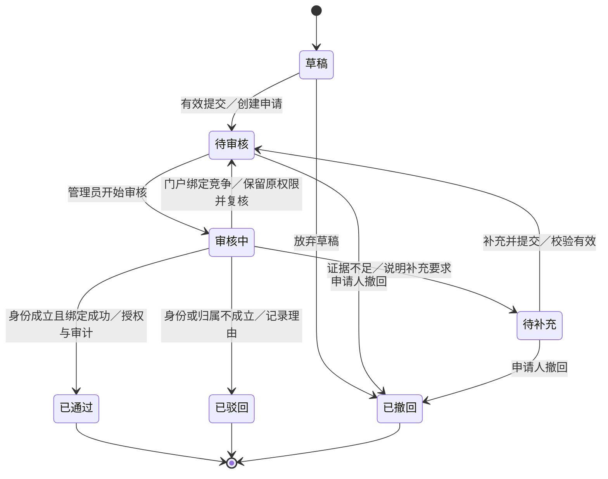
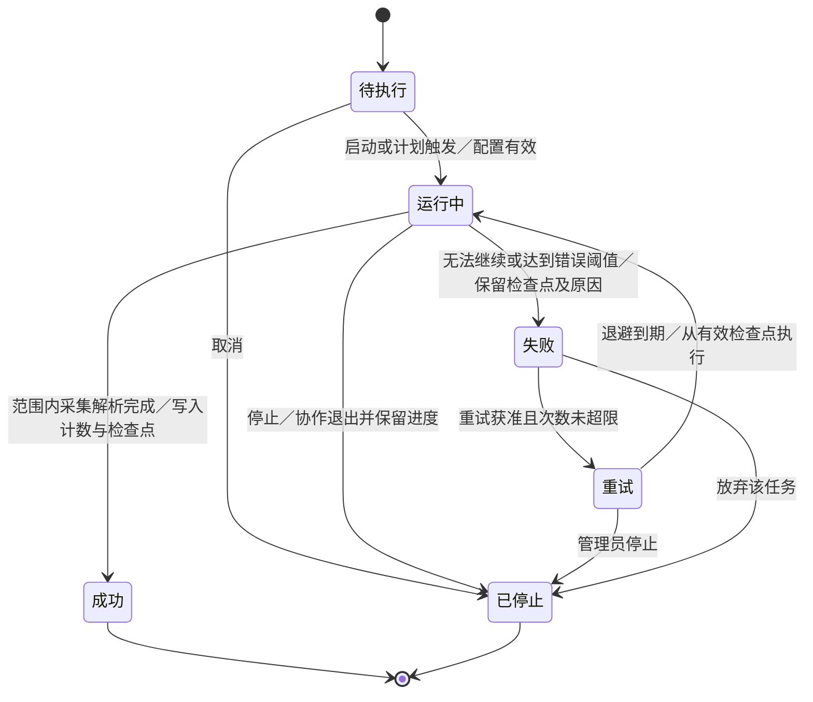

# 学术成果分享平台：需求调研与需求建模总体方案

课程：《软件系统分析与设计》｜汇报时长：15分钟｜整理日期：2026年10月7日

## 1. 汇报结论与阶段定位

平台围绕四类成果（论文、授权专利、科研项目、获奖），形成“多源采集—清洗与消歧—分类检索—学者门户—认领审核—成果维护—统计分析”的业务闭环。普通用户获得可核查的科研信息，科研人员维护可信的个人门户，管理员保障数据与身份的可信度。

本次汇报对应任务书第二部分的“需求调研”和“需求建模”。已有业务类图、检索时序图等作为需求分析的预研材料使用，不将其视为任务书要求的状态图，也不宣称完成了后续架构、构件、实现或部署阶段。

现有资料属于公开资料调研与需求设计成果。没有在目录中发现本小组实际访谈逐字记录、问卷回收数据、评审签字记录、接口压测报告或数据采集运行结果。因此，典型画像是分析场景，引用的第三方调查人数不是本小组样本；性能、质量指标是验收目标，不是实测结果。

本补充文件和PPT提出统一口径，原有调研报告、SRS、SPEC及图片保留原样。补充模型和修订建议仍需小组评审并回写正式SRS/SPEC，不能将“制作了汇报”表述为“已通过课程评审”。

## 2. 材料清单与任务书对应

任务书物理第5—6页（正文第3—4页）明确要求调研方案、数据源、分类、用户诉求、边界优先级，以及总用例图、认领活动图、两类状态图、SRS和核心SPEC。

| 材料编号 | 现有材料（现位于scripts目录） | 汇报用途 | 核对结果 |
|---|---|---|---|
| M01 | 学术成果分享平台需求调研报告.md | 总体定位、10个平台对比、四类数据源、分类、三角色诉求 | 已有方案；时间安排及本小组访谈证据需补 |
| M02 | 学术成果分享平台_普通用户需求调研报告.md | 多维检索、同名候选、来源核查、统计明细、个人工具 | 基础与增强功能需按统一优先级收敛 |
| M03 | 科研人员需求分析与需求建模.md | 门户认领、权限、成果纠错、业务规则、场景 | 明确公开资料研究性质；包含认领补材料逻辑 |
| M04 | 学术成果分享平台_数据源调研与数据密集型逻辑规范.docx | 接入、清洗、去重、消歧、排序、增量更新 | 论文、专利、奖励较完整；项目链路缺口明显 |
| M05 | 系统需求规格说明书（SRS）.docx | FR、DR、NFR、接口、状态与验收基线 | 必做范围、暂停、认领状态和项目对象需修订 |
| M06 | 核心模块开发规范（SPEC）.docx | 6个SPEC及规范—需求对应 | 增补项目、认领、统计规范；细化评分缺失值规则 |
| G01/G02 | 普通用户用例图.png／科研人员用例图.png | 分角色用例证据 | 不能替代覆盖采集管理与审核的总用例图 |
| G03 | 门户认领活动图.png | 提交、校验、补充、审核、绑定、审计 | 与科研人员文档一致；需同步SRS状态表 |
| G04/G05 | 普通用户活动图.png／作者检索活动图.png | 用户检索路径与同名选择 | 展示公开检索和身份确认的职责区别 |
| G06 | 现状调研活动图.png | 科研资料整理与研究现状场景 | 属于科研支持场景，非本阶段采集任务状态图 |
| G07/G08 | 核心任务类图.png／检索请求时序图.png | 业务对象、查询交互的预研 | 属于后续需求分析支撑，原类图未覆盖采集任务等全部对象 |

## 3. 需求调研方案与证据链

### 3.1 调研目标

确认四类成果的可得性、三类角色的核心目标、分类和统计口径、认领的身份与权限边界；将每条候选需求映射到用例、规则、SPEC与验收场景。

### 3.2 调研方法

1. 任务书研读：提取必做功能、交付物和评审点。
2. 同类平台对比：已有报告比较ResearchGate、ORCID、WoS Researcher Profile、Google Scholar、DBLP、知网、万方、百度学术、Semantic Scholar、OpenAlex等10个对象。汇报提炼可借鉴的功能机制，不重复未经核实的营收、规模、价格或算法细节。
3. 数据源核查：按成果类型列出访问方式、字段样例、稳定标识、更新方式、限制及来源记录。
4. 用户任务分析：以“找成果、核对学者、认领门户、治理数据”为主线，形成场景与用例。
5. 后续实地验证：访谈对象、原始回答、时间、反馈与需求变更单独保存。

### 3.3 建议补充的时间安排（非已完成记录）

| 相对时间 | 工作 | 输出 |
|---|---|---|
| D1—D2 | 核对任务书、资料来源和同类产品对比 | 调研问题表、来源登记表 |
| D3—D4 | 各类来源样例及分类映射验证 | 四类成果样例、字段映射、可行性记录 |
| D5 | 三类角色访谈或走查 | 访谈记录、场景修订；建议每类至少2人，属于采样计划 |
| D6 | 统一FR编号、优先级、模型与SPEC | 修订版SRS、SPEC、追踪矩阵 |
| D7 | 小组评审与汇报演练 | 问题清单、修改记录、评审结论 |

普通用户访谈：如何找某作者的近年成果？如何分辨同名学者？怎样核对排名与专利信息？科研人员访谈：接受哪些身份验证方式？如何处理误归属和遗漏成果？哪些字段应允许自改？管理员访谈：哪些错误需要人工复核？停止后如何处理进度？审核依据、冲突处理和日志应展示什么？

### 3.4 调研到需求的推导

| 调研线索 | 需求结论 | 模型与规则 | 可验证结果 |
|---|---|---|---|
| 多来源记录可能重复、字段冲突 | 统一成果实体与来源追踪 | 清洗、去重、字段来源规则 | 同一批数据重复接入不增加重复成果 |
| 同名学者与机构变更 | 身份候选与消歧，保留机构历史 | 学者检索与人工复核 | 姓名相同不能直接归并 |
| 门户管理需防冒领 | 提交证据、审核、唯一绑定 | 认领活动与状态模型 | 未通过审核不能获得管理权限 |
| 用户需要解释统计结果 | 统计范围、口径、更新时间与明细 | 统计用例、SPEC-STAT-01 | 总体统计可追踪到成果集合 |
| 管理员需处理采集失败 | 失败原因、可控重试、停止与审计 | 采集任务状态模型 | 每次状态迁移有事件和记录 |

## 4. 三类角色与系统边界

| 角色 | 核心目标 | 基础功能 | 权限边界 |
|---|---|---|---|
| 普通用户／访客 | 找到并核实成果和学者 | 分类检索、详情、公开门户、统计、合作网络 | 仅公开数据；个人工具需登录 |
| 科研人员 | 维护本人可信门户与成果 | 申请认领、查看反馈、维护本人信息、提交纠错 | 注册不等于认领；绑定成功才授予本人门户管理权 |
| 平台管理员（含数据审核职责） | 保证任务可控、身份可信、数据可追踪 | 来源配置、采集管理、认领审核、质量复核、分类维护 | 后台权限校验，操作审计；不得默认读取私人笔记 |

账号是登录身份；学者实体是被展示的科研人员；学者门户是其公开视图。三者不可混为一谈。注册用户可以具备科研人员申请资格，已认领学者继承公开查询与已注册权限。外部数据源是系统边界外的协作参与者；数据库、检索引擎等内部实现组件不应画成业务参与者。

## 5. 四类数据源、分类与更新方案

| 类型 | 一期候选来源 | 最小字段 | 稳定识别与更新 | 仍需的接入证据 |
|---|---|---|---|---|
| 论文 | OpenAlex主源，DBLP补充；Crossref校验 | 来源ID、题名、年份、作者、来源地址；DOI可缺失 | DOI／来源ID；游标、更新时间、快照与内容校验值 | 接口／快照样例，许可与频率登记 |
| 授权专利 | 国家知识产权局公开服务；EPO OPS补充候选 | 公开号、申请号、文献种类、授权证据、发明人、申请人、日期 | 主管机构+公开号+文献种类；按公开与状态变化更新 | 可访问样例与允许的获取方式；不能把公开页面等同批量授权 |
| 科研项目 | NSFC公开项目查询／公告、科技部公开公示 | 资助机构、项目编号、名称、负责人、承担单位、批准年度、来源 | 资助机构+项目编号；公告／编号增量与内容校验 | 需补合法可获取的项目样例、字段映射和接入可行性记录 |
| 获奖 | 国家科技奖励目录、CCF／中国电子学会、省级官方公告 | 授奖机构、奖项、年度、等级、项目、完成人、单位、来源 | 授奖机构+奖项+年度+类别等级+项目；公告变化 | 公告／PDF解析样例、复合键与冲突样本 |

论文先支撑万条规模，专利、项目和奖励先完成可复现的小样本链路，再扩充。四类成果在本期共享范围内都要有可用路径；“论文先做”是顺序，不是删除另外三类。任务书允许公开或模拟数据；受访问限制的类型可先用明确标记的模拟样本演示，不能将模拟数据称为真实采集。

本地采用稳定的“领域—学科—方向”层级方案，保留外部分类原ID、标签、版本及映射关系。跨学科成果可关联多个领域，未分类记录单独展示并计入总量。本地分类是课程方案，不宣称与NSFC学部、国家学科标准、OpenAlex分类逐级等价。

更新频率按来源特点配置；论文可按日／周、专利按周、项目及奖励按公告监测，属于建议参数。必须保存source_record_id、source_url、fetched_at、source_updated_at、raw_checksum、parser_version及field_provenance。重复接入保持幂等；人工核实字段与自动更新冲突时保留人工结论并进入复核。

项目约束：优先官方API和数据下载；网页获取前核对访问条款与可用方式，不绕过登录和访问控制；元数据、摘要、全文各自管理许可。认领证明材料仅供授权审核，不在公开门户展示。

## 6. 统一需求优先级

| 等级 | 内容 | 统一决定 |
|---|---|---|
| P0／M：课程基础必做 | 四类成果采集或明确的模拟导入、清洗与来源追踪、领域分类、成果及学者检索、详情与门户、认领审核、本人维护与纠错、采集管理、数据治理、基础专家关系网络、机构分类排名、领域热点 | 不能因为SRS现写P1就取消成果管理或基础统计；必须回写统一SRS |
| P0：课程创新交付 | 至少一项创新功能 | 建议选可筛选且可查共同成果的合作网络，并增加最短共著路径；最短路径已出现在普通用户用例图中，是否满足创新要求需课程评审 |
| P1／S：一期增强 | 收藏、导出、专题库、阅读笔记、引用追踪、研究资源链接 | 按团队能力选取，不挤占必做功能 |
| P2／C：后续可选 | 个性化推荐、讨论、主题订阅、高级预测 | 不在本次基础验收中承诺全部实现 |
| 后期业务 | 成果交易、付费全文、专利转让、支付结算 | 仅描述长期方向，不进入当前实现范围 |

创新的“合作网络”不能仅重复背景中已有的基础网络。应明确增量：路径分析、筛选与证据回溯；任何路径只表达共著连接，不表示现实合作意愿。

## 7. 统一用例模型（新增汇总）

| 编号 | 用例 | 主要参与者 | 权限／关键规则 |
|---|---|---|---|
| UC-01 | 检索和查看成果／学者 | 访客、注册用户、科研人员 | 公开数据；类型、领域、机构、年份过滤 |
| UC-02 | 浏览学者门户 | 访客、科研人员 | 四类成果、同名区分、来源与更新时间 |
| UC-03 | 查看统计与合作网络 | 访客、科研人员、管理员 | 统计包含口径、范围与明细；高级路径为创新 |
| UC-04 | 提交门户认领 | 注册科研人员 | 登录、材料、目标门户与重复申请校验 |
| UC-05 | 审核认领申请 | 管理员 | 证据核验、补充／驳回／通过、唯一绑定及审计 |
| UC-06 | 维护本人门户与成果 | 已认领学者 | 本人权限；公共字段修改经审核；不删公共成果 |
| UC-07 | 配置来源与管理采集任务 | 管理员，外部数据源协作 | 创建、启动、停止、失败重试、日志 |
| UC-08 | 执行采集、清洗与入库 | 管理员触发，外部数据源协作 | 来源保存、规范化、去重、消歧、索引更新 |
| UC-09 | 数据质量复核与纠错 | 管理员；用户发起反馈 | 候选评分、来源证据、合并／保持独立、审计 |
| UC-10 | 管理领域分类 | 管理员 | 本地分类、外部映射、版本维护 |

用例图用于表达参与者和系统能力。include仅用于必需的共用子行为，例如“维护本人门户”包含“校验门户管理权限”；可选浏览来源、网络路径分析可作为extend，不能用include／extend表达“先搜索再打开详情”的时间顺序。注册用户与访客、已认领学者与注册科研人员用参与者泛化表达权限继承。统一总用例图在PPT第9页，分角色原图在附录保留。

## 8. 门户认领活动与状态模型（统一补充）

活动图按科研人员、平台、管理员三条泳道解释：选择本人门户—提交材料—校验申请—身份与归属核验—必要时补材料—通过／驳回—原子绑定与授权—审计通知。绑定竞争时保留原权限并返回待审核复核，不得“申请显示成功但门户属于别人”。

规则：同一申请人和门户最多一条处理中的申请；重复提交返回已有申请。一账号最多绑定一个本人门户，一门户最多一个管理账号。审核通过、唯一性检查、绑定、授权、结果记录必须全部成功或全部撤销。已驳回／已撤回是本次申请的终态，再申请创建新记录并引用旧记录，保留历史；已通过后的权限撤销采用独立业务，不改写历史。初次提交校验未通过时保留草稿并说明原因，不生成虚假审核状态。初次／补充材料结构校验失败不改变原状态。

## 9. 数据采集任务状态模型（新增）

按任务书六种状态统一命名：待执行、运行中、成功、失败、重试、已停止。原SRS的“重试中”映射为“重试”。暂不承诺暂停，因为现有状态机没有暂停及恢复语义；停止后重新执行创建新任务，并关联原任务与配置。成功指该采集任务约定的采集／解析工作完成，不意味着全部数据质量指标、索引可见性或整个系统验收已达标；清洗、入库和索引进度需另行标记。部分记录异常可进入隔离队列，是否导致任务失败必须由SPEC给定错误阈值。

每次转换保存任务ID、前后状态、事件、操作者、时间、重试次数、游标和原因。重复启动拒绝；重试不能直接绕过失败状态；重试上限和退避参数在SPEC中明确，达到上限保留失败状态供人工处理。

## 10. 核心数据密集型规则与SPEC

### 10.1 现有SPEC与补充范围

| SPEC | 现有覆盖 | 本次建议补充 |
|---|---|---|
| SPEC-INGEST-01 | 任务、来源记录、日志、内容校验 | 四类来源，游标检查点，统一六状态，停止／重试上限，采集成功边界 |
| SPEC-DATA-01 | 文本、DOI／ORCID／ROR、姓名、机构、日期、词表 | 科研项目字段，原值与比较值分离；缺失值不补假值 |
| SPEC-DATA-02 | 论文、专利公开文献、奖励去重 | 项目去重；DOI冲突与缺失证据处理；版本关系 |
| SPEC-DATA-03 | 作者机构消歧、候选与人工复核 | 区分格式合法ORCID、来源身份关联、账号控制证明；机构历史 |
| SPEC-SEARCH-01 | 分类型排序、精确标识、筛选与分页 | 项目排序、确定性并列排序、归一化和跨类型可比性 |
| SPEC-QUALITY-01 | 质量指标、复核、审计 | 抽样方法、类型分层、分母、版本及回退 |
| SPEC-CLAIM-01（建议新增） | M03与G03已有业务规则，独立SPEC未发现 | 身份、状态、唯一绑定、事务、并发冲突、审计及权限 |
| SPEC-STAT-01（建议新增） | M02／M03已有统计描述，独立SPEC未发现 | 类型口径、全计数、时间范围、热点、合作网络与明细一致性 |

### 10.2 清洗与来源追踪

保留原始值及展示值，另建比较字段。文本按NFC规范化与空白处理，比较字段另做大小写／全半角转换；DOI去前缀并规范小写；ORCID／ISSN校验位验证；日期保存精度，不能把“2024年”伪造成“2024-01-01”。姓名和作者顺序分开保存。缺失、确认零值、待核实、不适用分别表达；摘要缺失不阻止基础论文入库。

### 10.3 去重与消歧

| 对象 | 首选判定 | 现有候选评分阈值 | 约束 |
|---|---|---|---|
| 论文 | 同一合法DOI优先，同一来源ID幂等 | 自动≥0.92；复核[0.82,0.92) | 不同合法DOI不得仅因标题相似合并；预印本／正式版保留版本关系 |
| 专利 | 主管机构+公开号+文献种类 | 主要精确键判定 | 同一申请不同公开阶段保持关联记录；专利家族不等于一个公开文献 |
| 项目（补充） | 资助机构+项目编号 | 暂不承诺未经校准的自动评分 | 编号缺失时名称、负责人、单位、年度仅召回候选，人工确认 |
| 获奖 | 授奖机构、奖项、年度、类别等级与项目复合键 | 自动≥0.93；复核[0.84,0.93) | 单位／完成人冲突需保留证据并复核 |
| 作者 | 可靠来源ORCID关联、来源作者ID；账户绑定另行验证 | 自动≥0.95；复核[0.85,0.95) | 同名只能召回；两个明确不同ORCID不自动合并 |
| 机构 | ROR，别名及地域／域名辅助 | 名称候选人工确认 | 机构变更和人员任职携带时间范围 |

现有评分公式（来自M06，属于规范参数而非实测性能）：

- 论文：0.55×题名+0.20×作者+0.10×年份+0.10×出版源+0.05×页码。
- 作者：0.30×姓名+0.25×机构+0.25×共同作者+0.15×主题+0.05×时间。
- 奖励：0.50×项目名称+0.20×完成人+0.15×单位+0.10×类别+0.05×年份。

需回写SPEC的边界：每个分量定义、值域、缺失处理、候选范围、冲突强标识优先于评分、批量合并的传递关系及审计。缺失证据不能默认得1分；自动合并至少满足规定的有效证据组合，证据不足进入复核。阈值经标注样本评估后再调整，保留算法版本。

### 10.4 检索排序统一口径

不同筛选维度采用AND，同一维度多选采用OR；领域默认包含子领域并提示。精确DOI／公开号／项目编号按类型命中优先，机构及作者查询使用实体ID，姓名文本不冒充已确认身份。默认题名相关性优先，并列按年份降序、成果ID升序；缺失年份置后。

保留M06的论文候选公式：Score=0.80×R_text+0.10×R_citation+0.05×R_recency+0.05×R_quality，R_text包含题名0.45、摘要0.20、关键词0.15、作者0.10、来源0.05、机构0.05。实施前必须定义各分量归一化，引用按同领域同年份和来源处理，不能把原始被引次数直接与文本分数相加。M03的“默认文本相关度”与M06复合排序需通过评审选择并记录版本；建议先保证精确命中与标题优先，未验证的复合评分不作为已达标结论。

项目检索补充：支持项目名称、编号、负责人、单位、资助类别、年度与领域。精确编号结合资助机构；无精确命中时标题优先，其他字段加权待固定查询集校准。all类型优先分组展示，分类型得分未经校准前不承诺统一分值可比较。page_size默认10、最大100（沿用M06）；页码越界、年份错误、空结果与服务失败分别处理。

### 10.5 统计与创新功能

总体成果按统一ID去重，列表与统计使用相同过滤与数据版本。机构采用全计数：一项成果在每个关联机构各计一次，因此机构总和可大于总体成果数量；页面必须说明这一点。领域允许多标签，领域分组和不必等于总体。缺失年份和未分类独列；当年度显示截止日期。

论文计数按统一论文实体；专利默认按有授权依据的申请实体汇总，公开文献和家族口径另列；项目按资助机构+项目编号识别；奖励按奖励实体计数，完成人／完成单位不能分别制造多条奖励。排名只表达平台收录范围内、给定类型及时间的数量分布，不等价于科研质量评价。

合作网络节点是已消歧学者，边权为筛选范围中两人共同署名的不同论文数量，每条边可查支撑论文。基础网络为必做，按领域／机构／年份筛选、最短共著路径与路径边证据作为创新增量。热点以相同范围中的主题成果数及年度变化表达，不将数量直接宣称为创新质量。

## 11. 建议的可验收SRS基线

| 指标 | 目标及测法 | 性质 |
|---|---|---|
| 数据规模 | 最终阶段成果总量≥10,000条，四类都有可演示路径，真实／模拟来源明确 | 任务书最终验收要求；当前材料无入库实测 |
| 检索性能 | ≥10,000条、20并发、预热后连续5分钟，普通检索P95≤2秒；冷启动单列 | 综合M03/M05的建议验收目标，设备需记录 |
| 统计性能 | 同一测试环境，统计查询建议P95≤5秒 | 建议目标，非已实现 |
| 数据质量 | 核心字段完整率≥95%、来源可追踪率100% | M05/M06目标；按类型定义适用必填字段与分母 |
| 清洗与自动合并 | 清洗抽样500条正确率≥99%；自动去重准确率≥98%；作者自动合并准确率≥97% | M06目标；分来源／类型抽样与人工标注 |
| 精确标识检索 | 固定查询集≥50组，精确标识命中正确率100% | M06目标；测试含不存在和冲突编号 |
| 权限与绑定 | 非本人修改拒绝；并发认领仅一个账号绑定；已通过前无管理权限 | 业务约束，应给出成功及失败用例 |
| 恢复与幂等 | 重复采集不增重复实体；失败保存原因与进度；停止后无继续写入副作用 | 采集与数据治理验收 |
| 文档交付 | 调研报告、SRS、SPEC、总用例、活动与两状态图、PPT、支撑材料及评审记录 | 当前阶段交付清单，评审结论仍待完成 |

## 12. 需求—用例—SPEC—验收追踪矩阵

统一仍使用SRS的FR-01至FR-16，研究人员FR01等局部编号必须加前缀（例如R-FR01），避免不同文档同编号指向不同需求。

| 统一需求 | 任务书依据 | 用例／模型 | SPEC | 验收场景 |
|---|---|---|---|---|
| FR-01至03 来源与采集 | 二（一）2、二（二）3 | UC-07/08、采集状态图 | INGEST-01 | 来源停用拒绝；失败、重试、停止；记录可回溯 |
| FR-04至07 清洗与成果库 | 一（一）1、二（二）4 | UC-08/09 | DATA-01/02/03、QUALITY-01 | 重复DOI、项目编号、不同ORCID、来源冲突 |
| FR-08至10 检索与门户 | 一（一）2/3 | UC-01/02、G04/G05/G08 | SEARCH-01 | 交叉筛选、同名候选、四类详情、精确标识 |
| FR-11/12 认领与审核 | 一（一）2、二（二）2/3 | UC-04/05、G03、认领状态图 | CLAIM-01（补） | 补材料、驳回、重复申请、并发唯一绑定 |
| FR-13 本人维护 | 一（一）2 | UC-06 | CLAIM-01、QUALITY-01 | 非本人拒绝；公共修订审核；保留公共实体 |
| FR-14 基础统计 | 一（一）4 | UC-03 | STAT-01（补） | 列表统计一致、机构全计数、边对应论文 |
| FR-15 数据治理 | 二（一）2 | UC-09/10 | QUALITY-01 | 复核明细、字段来源、审计与回退 |
| FR-16 创新 | 四（二）2 | 合作网络路径分析 | STAT-01（补） | 筛选后最短共著路径、无路径提示、支撑成果 |

## 13. 评审前必须修订的冲突与缺口

| 问题 | 影响 | 处理意见 |
|---|---|---|
| M05将一期定位为论文完整链路，另外三类仅预留 | 与任务书四类成果背景要求不一致 | 改为论文优先、四类均有可演示路径 |
| FR-13成果维护、FR-14统计列P1；FR-16至少一创新列P2 | 容易将必做解释为可删 | 基础部分及至少一个创新提高为必交付，增强另列 |
| M04/M06缺项目采集、扩展对象、去重、排序 | 项目类型只有接口枚举而无落地规则 | 补项目对象、来源样例、资助机构+编号规则及查询 |
| SRS说暂停，但状态模型及SPEC没有暂停 | 操作和状态不闭合 | 统一为停止并创建新任务；确需暂停时再整体增加暂停／恢复语义 |
| G03与M03有待补充，SRS缺待补充；SRS驳回后复用旧申请 | 反馈不一致、审核历史不清 | 加待补充；驳回后新建申请并关联旧记录 |
| 总用例图、采集状态图缺少独立成图 | 需求建模交付物不全 | 使用本次新增总图与两状态图，并在评审后归档 |
| 评分缺失字段、归一化、强ID冲突和跨类型比较未完整定义 | 阈值无法稳定复现、错误合并风险 | 补输入输出、边界、固定样本和版本，不承诺未校准效果 |
| 无本小组实访、源访问样例和课程评审记录 | 无法证明用户验证／接入／评审已完成 | 补真实记录；汇报如实说明验证计划 |
| 类图／时序图与状态图混用 | 阶段成果容易误判 | 类图和时序图标为需求分析预研，不顶替状态图 |

## 14. 15分钟汇报组织与后续交付

PPT主讲20页，另有8页原模型图附录。主讲依次讲任务与证据、调研结论、范围、统一模型、核心规范、验收与待办；附录只在答疑使用。讲稿与每页备注一致，主讲建议计时合计900秒。

建议四组责任（岗位分工，不指定尚未提供的姓名）：总体与普通用户负责人维护调研方案、总用例与需求编号；科研人员负责人维护认领和权限；数据管理员负责人完善来源、项目链路与任务状态；整合负责人同步SRS/SPEC、追踪矩阵并组织评审。下一阶段再基于这份已评审需求进入类图／时序、架构、数据库、接口与CodeArts工程实践。

评审提交包需包含：原调研材料、统一后的SRS与SPEC、模型源文件、PPT及讲稿、来源与样例、追踪矩阵、问题关闭记录、评审意见。当前生成的汇报包提供总体方案与补充模型，正式原Word文档的修改和课程评审需要随后完成。

## 15. 原模型图索引

以下原图完整保留在PPT附录，也可直接打开源文件：

- [普通用户用例图](../scripts/普通用户用例图.png)
- [科研人员用例图](../scripts/科研人员用例图.png)
- [普通用户活动图](../scripts/普通用户活动图.png)
- [作者检索活动图](../scripts/作者检索活动图.png)
- [门户认领活动图](../scripts/门户认领活动图.png)
- [现状调研活动图](../scripts/现状调研活动图.png)
- [核心业务类图（源文件名：核心任务类图）](../scripts/核心任务类图.png)
- [检索请求时序图](../scripts/检索请求时序图.png)

## 16. 来源与核查说明

课程要求以用户给定任务书为准；M01—M06、G01—G08是汇报内容的直接依据。2026年10月7日额外核对了下列官方说明，仅用于修订接入和认证建议；没有重新验证原报告全部价格、规模与产品细节。

- [OpenAlex认证说明](https://help.openalex.org/api/authentication/)：基础无密钥查询与持有密钥的访问方式需按当前官方配置登记，不沿用未经核对的额度。
- [OpenAlex快照说明](https://help.openalex.org/access/snapshot/)：快照提供数据获取路径；实际增量、删除与更新时间处理需按来源发布方式验证。
- [DBLP元数据许可](https://dblp.org/faq/1474677.html)：元数据采用CC0；元数据许可不代表链接全文的许可。
- [ORCID标识收集说明](https://info.orcid.org/documentation/collecting-and-sharing-orcid-ids/)：可与用户交互时，通过认证流程收集iD，不把手填号码或校验位正确当作本人控制证明。
- [NSFC项目申请与资助页面](https://www.nsfc.gov.cn/p1/3281/3286/3296/xmsqyzz.html)：提供资助项目查询入口；仅发现入口不等于已经证明可批量采集，需补接入实验。
